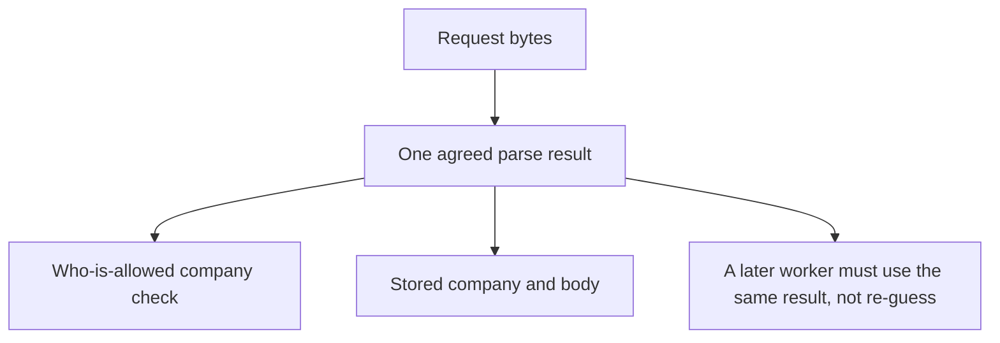

# A parser map someone else can test

**Kind:** design-exercise
**Loop step:** 2 Model

## Could someone else name the checks from your map?

A boxes-and-arrows "client → API → database" sketch is the kind of diagram every team already has, and it is nearly useless for this module's purpose because it does not name **which reader** produces the company identifier used for the who-is-allowed check, or **which reader** produces the company identifier written to storage. Two arrows both labeled "parse JSON" can hide two genuinely different pieces of code with two genuinely different duplicate-key policies, and a diagram that draws them as one box has already lost the information this module's whole property depends on.

The system for this exercise is companies, memberships, notes, and a **local JSON ingest practice** — the same fixture Lesson 01 introduced. There is no GraphQL product, no live proxy, no PostgreSQL `jsonb` claim, and no Unicode attack corpus anywhere in this exercise; every object below is synthetic.

## Picture: one parse result, many consumers



If the ACL check and the storage step take different arrows out of the `Bytes` box — meaning they each run their own parse rather than consuming one shared result — the map has already predicted that `test_duplicate_tenant_keys_are_one_meaning` will fail, before you have run a single command. That predictive power is the actual test of whether a map is doing real work: a map that cannot predict which test will fail is decoration.

## Step 1: name every reader on the ingest path

| Reader | What it consumes | What it emits | Trust status this week |
|---|---|---|---|
| Client `JSON.stringify` / browser encoder | Hostile JavaScript values, chosen by whoever controls the client | Bytes on the wire | Untrusted — the client is never on the trusted side of this map |
| An optional proxy or CDN that re-encodes | Bytes | Possibly different bytes, if the proxy normalizes Unicode or re-serializes | Deferred to a later topic; still treated as hostile until proven otherwise |
| First-key scan in the broken files | Text | The first `"tenant"` string it finds | Must not be what the who-is-allowed check trusts, precisely because it disagrees with the next row |
| CPython `json.loads` | Text | The last duplicate value, by CPython's own documented behavior | The practice's storage-path reader |
| The agreed parse result object | — (this is the output, not a reader) | A single `tenant` value and a single `body` value | What both the ACL check and persistence are allowed to trust, once it exists |
| PostgreSQL `jsonb` | Text or already-parsed JSON | Its own duplicate-key and escaping rules, which are Postgres's choice, not CPython's | Leftover risk for a later topic — do not assume it matches CPython's behavior without checking |
| A future worker re-parsing stored text | Stored bytes | A second, potentially different meaning | Revisit this row the moment any worker is actually introduced |

The client, the app, the model that wrote a request, or a prompt that generated one — all of these are hostile inputs in this map, full stop. What the map actually trusts is the **single agreed parse result**, not a vague reference to "the backend" as if backend code were uniformly trustworthy by virtue of not being the client.

## Step 2: bind objects at the security cut

| Piece | This system |
|---|---|
| Who | The poster (company A or company B); the ACL checker; the storage writer; a later reader |
| What | Raw request bytes; the parse result; the ACL-derived tenant; the stored tenant; the note body |
| Actions | `ingest_note`, `parse`, `persist`, `read_body` |
| Paths | The HTTP body, this week; a worker re-parse and a `jsonb` cast, later |
| What you trust | A single parse result, consumed identically by both the ACL check and persistence |
| What you do not trust | Duplicate keys; overlong or unexpected encodings; any company label the client itself supplied without independent confirmation |
| Time | The same bytes, parsed tomorrow by a library version that may have changed its own duplicate-key behavior |
| Secrecy cell affected | Notes leak because two readers disagreed about meaning, not because a login check was missing |

## Step 3: write cells the practice can fail

| Who | What | Action | Decision |
|---|---|---|---|
| poster tA | Clean, unique-key JSON | ingest | Allow; `acl_tenant == stored_tenant == tA` |
| poster tB | Duplicate company keys | ingest | Deny, or accept only if every reader independently agrees |
| a worker | Re-parse stored bytes | persist-or-export | Allow only if the re-parsed meaning still matches the original agreed result |
| reader tA | A stored body | read | A who-is-allowed check on its own; agreement at ingest time does not grant a cross-company read later |

The worker row is worth sitting with even though this module's fixture has no queue at all: a missing row for "what happens when a worker reads this data again" is exactly how a delayed, machine-to-machine transfer of trust quietly appears in a real system — nobody wrote "workers may bypass the ACL check," it simply was never written down that they may not, and the omission is discovered only when a worker actually ships. Write the hole down now, even with no code behind it yet. A table with a blank cell where a decision belongs is not neutral, it is a silent "yes" waiting to be discovered the hard way, and naming the cell "not yet decided, revisit when a worker is designed" is strictly more honest than omitting the row entirely.

## Step 4: a list of messy objects, not a bug-list

Write at least four rows a peer could directly turn into practice fixture files. Fake identifiers only, and no shortcuts to a named vulnerability class as a substitute for describing the actual object.

1. Duplicate `"tenant"` keys — the messy two-company object Lesson 01 introduced.
2. Unique keys, honestly naming company A — the clean object, which must remain acceptable after any fix.
3. A missing company field entirely — this must be denied, not silently treated as an empty or default company.
4. The same bytes, parsed later by a second library version — a look-again trigger, explicitly not claimed as fixed by this practice, since nothing in this fixture exercises a second library version.

Do not add public JSON-bomb payloads or live Unicode weaponization to this list. Those are out of scope for this course entirely, not merely extra credit someone might add later.

## Worked example: filling in a row from the fixture, not from imagination

Applying the seven-piece template from Step 2 to the vulnerable fixture's own ambiguous object gives:

```text
who:      poster tB (attempts to write a body under company B's own identity)
what:     '{"tenant":"tA","body":"secret","tenant":"tB"}' -- the raw bytes
action:   ingest_note(text)
decision: vulnerable/parse_note.py returns accepted=True, acl_tenant="tA",
          stored_tenant="tB" -- two different companies, one accepted object
evidence: labs/2.1/2.1-parser-boundaries vulnerable/parse_note.py; the first-key
          regex reads "tA", json.loads's last-key-wins reads "tB"
harm:     company A's who-is-allowed policy now governs access to a body that
          was, by the storage layer's own reading, company B's
trigger:  any duplicate "tenant" key reaching ingest_note at all
```

Run the same template against the fixed fixture's behavior on the identical bytes, and only the `decision` and `harm` rows change: `decision` becomes `accepted=False`, and `harm` becomes "none — the disagreement is caught before anything is stored." Everything else about who, what, and the action stays exactly the same, which is the point: the fix does not change what bytes arrive or who sent them, only what the system does once it notices they disagree.

## Practice

Open `parse_note.py` under `labs/2.1/2.1-parser-boundaries`. After the fix, the first-key regex scan is gone — the fixed reader retires it entirely rather than patching it, and asks CPython's own parser for every occurrence of the tenant key via `object_pairs_hook`, scoped to the hook's last invocation (always the root object, since nested objects resolve first). The restore is agreement-or-refuse, applied to every occurrence the real parser reports at the top level, not "make the scan behave like real JSON" and not "compare only the first and the last value and call that agreement," which Lesson 03 shows is not the same claim.

## Use it somewhere new

GraphQL variables and a REST body can both name `patient_id`. Add both grammars to your map before you claim "we validate JSON" — a claim scoped to one grammar says nothing about whether the other grammar's reader agrees with it.

## What can still go wrong

Honest, unique-key JSON still needs a separate who-is-allowed check after parsing. Parser agreement answers "what does this mean," and that is a strictly different question from "who is allowed to cause this effect" — agreement is a precondition for a correct authorization decision, not a substitute for making one.

A map that stops at "the readers agree" and treats that as the whole security story would be repeating exactly the mistake Lesson 01 warned against with canonicalization versus validation: agreement is canonicalization's job, and it has to happen before validation and authorization ever run, but finishing canonicalization does not mean validation and authorization are now unnecessary. They are two separate rows in this map's Step 2 template, not one row that canonicalization quietly discharges for free.

## What this page is not doing

Do not run this exercise, or any part of this map, against a public API, a real clinic, or any live target. Answer keys are not on this site; they live only in `content/assessment/keys/2.1.md`.
