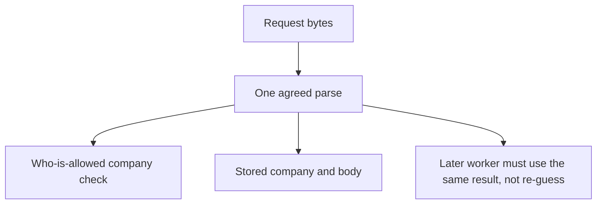

# A parser map someone else can test

**Kind:** design-exercise
**Loop step:** 2 Model

## Could someone else name the checks from your map?

A boxes-and-arrows “client → API → database” sketch is not this lesson. A parser map names **which reader** produces the company used for the who-is-allowed check and **which reader** produces the company written to storage.

This week: companies, memberships, notes, and a **local JSON ingest practice**. No GraphQL product, no live proxy, no PostgreSQL `jsonb` claim, no Unicode attack corpus.

## Picture: one parse result, many consumers

If ACL and store take different arrows out of `Bytes`, the map already predicts `test_duplicate_tenant_keys_are_one_meaning` will fail.

## Step 1: name every reader on the ingest path

| Reader | What it consumes | What it emits | This week |
|---|---|---|---|
| Client `JSON.stringify` / browser encoder | Hostile JS values | Bytes on the wire | Untrusted |
| Optional proxy or CDN that re-encodes | Bytes | Possibly different bytes | Later (next topic); still hostile |
| First-key scan in the broken files | Text | First `"tenant"` string | Must not be what you trust for who is allowed |
| CPython `json.loads` | Text | Last duplicate wins | Practice store reader |
| Agreed parse result object | — | `tenant`, `body` | What you trust if both ACL and persist use it |
| PostgreSQL `jsonb` | Text or JSON | Its own duplicate/escape rules | Leftover / later; do not assume it matches CPython |
| Future worker re-parse of stored text | Stored bytes | A second meaning | Look again when workers arrive |

The client, the app, the model, or the prompt is hostile. What you trust is the **agreed result**, not “the backend.”

## Step 2: bind objects at the security cut

| Piece | This system |
|---|---|
| Who | Poster (company A or B); ACL checker; storage writer; later reader |
| What | Raw bytes; parse result; ACL tenant; stored tenant; note body |
| Actions | `ingest_note`, `parse`, `persist`, `read_body` |
| Paths | HTTP body now; worker re-parse and `jsonb` later |
| What you trust | Single parse result used for both ACL and persist |
| What you do not trust | Duplicate keys, overlong or unexpected encodings, client-supplied company labels |
| Time | The same bytes parsed tomorrow by a new library version |
| Secrecy cell | Notes leak because two readers disagree, not because login is missing |

## Step 3: write cells the practice can fail

| Who | What | Action | Decision |
|---|---|---|---|
| poster tA | CLEAN unique-key JSON | ingest | allow; `acl_tenant == stored_tenant == tA` |
| poster tB | duplicate company keys | ingest | deny, or accept only if both readers agree |
| worker | re-parse stored bytes | persist-or-export | allow only if meaning matches the original result |
| reader tA | stored body | read | who-is-allowed check; ingest agreement does not grant a cross-company read |

A missing worker cell is how delayed-machine transfer appears. Write the hole even if this week has no queue.

## Step 4: a list of messy objects, not a bug-list

Write at least four rows a peer could turn into practice files. Fake identifiers only.

1. Duplicate `"tenant"` keys (the messy two-company object).
2. Unique keys, honest company A (the clean object).
3. Missing company field (fail closed).
4. Same bytes later parsed by a second library (look-again trigger; not claimed fixed by this practice).

Do not add public JSON bombs or live Unicode weaponization. Those are out of scope, not extra credit.

## Practice

Draw the map so someone else could name the checks without opening the answer-key folder. Open `parse_note.py` in `labs/2.1/2.1-parser-boundaries`. Label the first-key scan and `json.loads` as two readers even in the repaired tree — the fix is agreement-or-refuse, not pretending the scan became JSON.

## Use it somewhere new

GraphQL variables and a REST body both name `patient_id`. Add two grammars to the map before you claim “we validate JSON.”

## What can still go wrong

Honest unique-key JSON still needs a who-is-allowed check. Parser agreement is not authorization.

## What this page is not doing

Answer keys are not on this site.
