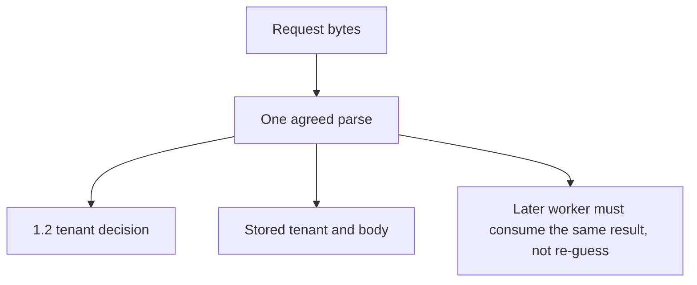

# 2.1-LO-02 — A parser-boundary map a second engineer can test

**Kind:** design-exercise
**Loop step:** 2 Model
**Standards:** Saltzer and Schroeder (1975, seminal), especially least common mechanism and complete mediation; OWASP ASVS 5.0.0 (final) `v5.0.0-1.1.1`, `v5.0.0-2.2.1`, and `v5.0.0-2.2.2`; `v5.0.0-1.5.3` labeled Level 3; RFC 8259 JSON (STD 90, final).

## Can a second engineer name pytest cases from your map?

A boxes-and-arrows “client → API → database” sketch is not this lesson. A parser-boundary map names **which interpreter** produces the tenant used for the 1.2 decision and **which interpreter** produces the tenant written to storage.

SecureCollab Phase 1 freeze: tenants, memberships, notes, and a **local JSON ingest fixture**. No GraphQL product, no live proxy, no PostgreSQL `jsonb` claim, no Unicode exploit corpus.

## Mental model: one parse result, many consumers

If ACL and store take different arrows out of `Bytes`, the map already predicts `test_duplicate_tenant_keys_are_one_meaning` will fail.

## Step 1: name every interpreter on the ingest path

| Interpreter | What it consumes | What it emits | Phase 1 treatment |
|---|---|---|---|
| Client `JSON.stringify` / browser encoder | Hostile JS values | Bytes on the wire | Untrusted |
| Optional proxy or CDN that re-encodes | Bytes | Possibly different bytes | Deferred to 2.2; still hostile |
| First-key regex in the vulnerable fixture | Text | First `"tenant"` string | Must not be ACL TCB |
| CPython `json.loads` | Text | Last duplicate wins | Lab store parser |
| Agreed parse result object | — | `tenant`, `body` | TCB if both ACL and persist use it |
| PostgreSQL `jsonb` | Text or JSON | Its own duplicate/escape rules | Residual / later; do not assume it matches CPython |
| Future worker re-parse of stored text | Stored bytes | A second meaning | Review trigger for 7.4 |

Open design: the client, APK, model, or prompt is hostile. The TCB is the **agreed result**, not “the backend.”

## Step 2: bind objects at the security cut

| Piece | This system |
|---|---|
| Subjects | Poster (Tenant A or B); ACL checker; storage writer; later reader |
| Objects | Raw bytes; parse result; ACL tenant; stored tenant; note body |
| Actions | `ingest_note`, `parse`, `persist`, `read_body` |
| Channels | HTTP body now; worker re-parse and `jsonb` later |
| TCB | Single parse result used for both ACL and persist |
| Untrusted | Duplicate keys, overlong or unexpected encodings, client-supplied tenant labels |
| State / time | The same bytes parsed tomorrow by a new library version |
| 1.1 cell | Confidentiality from disagreement, not from missing authentication |

## Step 3: write cells the lab can fail

| Subject | Object | Action | Decision |
|---|---|---|---|
| poster tA | CLEAN unique-key JSON | ingest | allow; `acl_tenant == stored_tenant == tA` |
| poster tB | duplicate tenant keys | ingest | deny, or accept only if both interpreters agree |
| worker | re-parse stored bytes | persist-or-export | allow only if meaning matches the original result |
| reader tA | stored body | read | 1.2 cell; ingest agreement does not grant cross-tenant read |

A missing worker cell is how delayed-machine transfer appears. Write the hole even if Phase 1 has no queue.

## Step 4: ambiguity catalogue, not a CVE list

Write at least four rows a peer could turn into fixtures. Synthetic identifiers only.

1. Duplicate `"tenant"` keys (lab AMBIGUOUS).
2. Unique keys, honest Tenant A (lab CLEAN).
3. Missing tenant field (fail closed).
4. Same bytes later parsed by a second library (review trigger; not claimed fixed by this lab).

Do not add public JSON bombs or live Unicode weaponization. Those are non-goals, not extra credit.

## Practice

Draw the map so a second engineer could name pytest cases without opening the keys file. Point at `labs/2.1/2.1-parser-boundaries` file `parse_note.py`. Label the first-key scanner and `json.loads` as two interpreters even in the fixed tree—the fix is agreement-or-reject, not pretending the regex became JSON.

## Transfer

GraphQL variables and a REST body both name `patient_id`. Add two grammars to the map before you claim “we validate JSON.”

## Residual risk

Honest unique-key JSON still needs 1.2 mediation. Parser agreement is not authorization.

## Non-goals

Top 10 items as the definition of security. Keys stay out of lessons.
