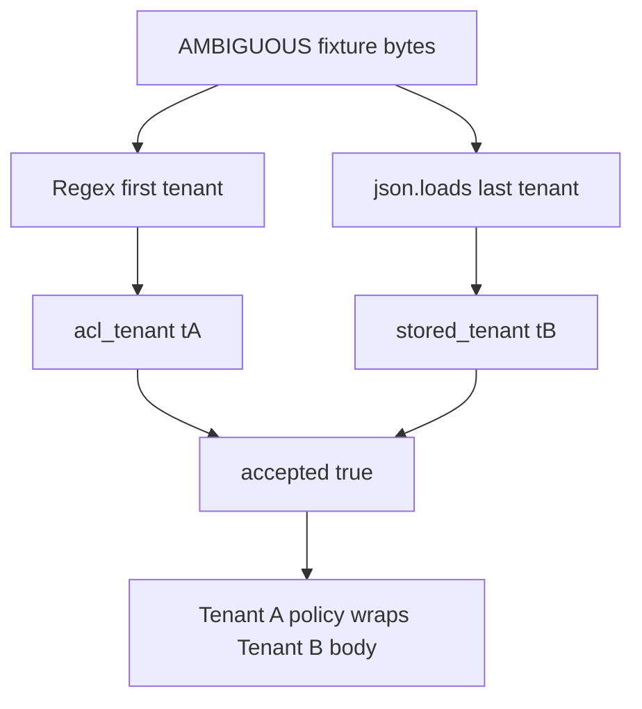

# 2.1-LO-03 — Observe the split parse, do not trophy it

**Kind:** mechanism-lab
**Loop step:** 3 Break
**Standards:** Saltzer and Schroeder (1975, seminal) fail-safe defaults; OWASP ASVS 5.0.0 (final) `v5.0.0-1.1.1` and `v5.0.0-2.2.2`; RFC 8259 JSON (STD 90, final).

## Authorized scope

`labs/2.1/2.1-parser-boundaries` only. Do not target other hosts. Do not paste weaponized payloads into notes. The AMBIGUOUS blob is the course fixture, not a public exploit.

**Forbidden outcome:** parser differential — ACL tenant disagrees with stored tenant.

## Mental model: lock in the cause before the assertion



The vulnerable tree demonstrates **cause** (two interpreters), not a trophy exploit. Preconditions: duplicate tenant keys in one object; split parse.

## What to read in the fixture

`vulnerable/parse_note.py` uses a first-key scanner for ACL and `json.loads` for storage, then returns `accepted: True` even when they disagree. CPython last-wins on duplicates is the store meaning. The regex is not a JSON parser; it is a second grammar that happens to look at similar text.

You do not need a new payload. The test module already binds:

- CLEAN unique-key JSON for Tenant A — must remain acceptable.
- AMBIGUOUS duplicate `"tenant"` keys — must not yield two meanings.

## Root cause vs impact

| Slice | Lab |
|---|---|
| Root cause | Two interpreters, two meanings of the same bytes |
| Preconditions | Duplicate tenant keys; ACL on first, store on last |
| Impact | tB body stored as if it were tA, or ACL sees tA while disk sees tB |
| Not the lesson | A scanner name, CWE mnemonic, or “JSON is broken” |

## Practice

Run tests against `vulnerable/` (they **must fail** on the forbidden outcome). Record the test name `test_duplicate_tenant_keys_are_one_meaning`.

```text
python3 -m pytest labs/2.1/2.1-parser-boundaries/tests --impl vulnerable
```

Do not “fix” the test to pass. The failure *is* the evidence that the property is currently false.

## Transfer

GraphQL and REST both ingest the same note: two grammars. Predict a disagreement without running anything outside this directory.

## Non-goals

No live-target instructions. Synthetic data only.
