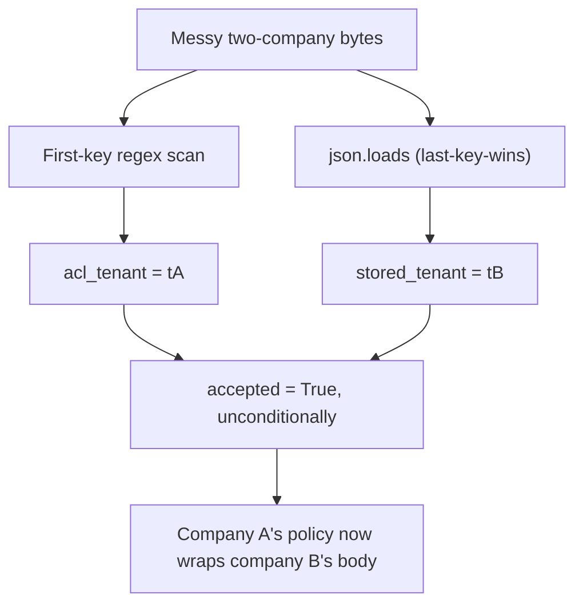

# Practice: two readers disagree on the company

**Kind:** mechanism-lab
**Loop step:** 3 Break

## Try it

The practice is not a website you attack, and there is no exploit payload anywhere in it. Note ingest here is a first-key regex scan for the who-is-allowed check, and `json.loads` for storage. The two readers already disagree on the fixture's own messy object — this is not a JSON-spec nitpick, it is the module's actual property failing in fourteen lines of Python.

> The same request bytes must yield one company meaning for both the who-is-allowed check and the stored row. If two readers would disagree, ingest refuses.

Run this only inside `labs/2.1/2.1-parser-boundaries/`. No other hosts, no attack recipes pasted into notes anywhere in this exercise; the messy two-company object is a course practice fixture, not a public exploit kit, and restoring the broken and repaired folders from git afterward returns everything to a clean state. All data throughout is fake.

Watch **ACL tenant disagree with stored tenant**, and watch it happen without either individual reader doing anything wrong by its own contract.

## Picture: lock in the cause before the check



Two readers parse the exact same bytes here — there is no exploit recipe to follow, only two pieces of correct code disagreeing. Duplicate company keys sit in one object; the two parsers split on what that object means, and `ingest_note` never notices.

## What to read in the broken files

`vulnerable/parse_note.py` uses a first-key regex scan for the ACL decision and `json.loads` for storage, then returns `accepted: True` even when the two readers disagree — the disagreement is computed and then simply discarded. CPython's own last-wins behavior on duplicate keys is what produces the store-side meaning; nobody configured this deliberately, it is just what the standard library does. The regex scan is not a JSON parser at all; it is a second, unrelated grammar that happens to look at similar-looking text and extract a value from it.

The check module already binds two cases you must not break while fixing the third:

- Clean, unique-key JSON for company A — this must remain acceptable after any fix.
- Messy, duplicate `"tenant"` keys — this must not be allowed to yield two different meanings that both get used.

There is a third case worth reading closely once you understand the first two: a three-key object where the first and last occurrences happen to be identical while a middle occurrence disagrees. Read `vulnerable/parse_note.py`'s logic against `{"tenant":"tA","body":"x","tenant":"tC","tenant":"tA"}` before running anything, and predict what `acl_tenant` and `stored_tenant` will each be. The regex scan finds the first occurrence, `"tA"`. CPython's `json.loads` keeps the last occurrence, also `"tA"`. Both readers report `"tA"`, they agree with each other, and the object gets accepted — even though a third claim of `"tC"` was made partway through and silently overwritten by nobody's decision. The disagreement never disappeared; it was simply never looked at, because comparing only the first value to the last value never asks about the middle one.

## Why it happens vs what it costs

| Slice | For this practice |
|---|---|
| Why it happens | Two readers, two meanings, of one byte sequence, and nothing checks whether they match |
| What's already wrong | Duplicate company keys exist in the input; the ACL check reads the first, storage reads the last, and a check comparing only those two endpoints misses a disagreeing value in between |
| What it costs | Company B's body gets stored as though it were company A's, or the reverse — a secrecy failure that required no authentication bypass at all |
| Not the lesson | A scanner's vulnerability-class name, a bug-list nickname, or the claim "JSON is broken" as if the specification itself were the defect |

## Counterexample: fixing the obvious case does not fix the real one

Suppose a well-intentioned fix compared only `_first_tenant(text)` against `_last_tenant(text)` and refused when they differed — this closes the two-key case from Lesson 01 completely. Run that exact fix against the three-key middle-mismatch object above: first and last both read `"tA"`, the comparison finds no disagreement, and the object is accepted, silently losing the `"tC"` claim in the middle. A fix that only compares two of three claims is not "mostly fixed" — it is unfixed for exactly the input this counterexample constructs, and it would ship with every test from Lesson 01 passing.

## Practice

Read the two anti-fake tests (`test_checker_rejects_a_different_ambiguous_object` and `test_checker_accepts_a_different_unambiguous_object`) before running anything, and explain in your own words why each one constructs a JSON string that appears nowhere else in the test file, rather than reusing `AMBIGUOUS` and `CLEAN`. If a repaired implementation only special-cased those two exact strings — for instance, by comparing the input text against them literally rather than actually reading the tenant keys — the original two tests would still pass, and only these two would catch the difference. That gap between "passes the tests I already had" and "correctly implements the rule those tests were meant to check" is the entire reason an anti-fake test exists as its own category, separate from a normal-case or forbidden-outcome test.

Run both commands this session:

```text
python3 -m pytest labs/2.1/2.1-parser-boundaries/tests --impl vulnerable
python3 -m pytest labs/2.1/2.1-parser-boundaries/tests --impl fixed
```

Five of the eight checks on the broken files **must fail**; this lesson names two of them specifically, because they are the ones whose cause this lesson has just traced: `test_duplicate_tenant_keys_are_one_meaning` and `test_middle_duplicate_is_not_silently_dropped`. Record both failing names, and for each one, write the specific input that causes it — not merely "duplicate keys," but the exact object. Do not "fix" either check to make it pass; a test that seems wrong is a finding to write down, not a reason to weaken it.

## Use it somewhere new

GraphQL and REST can both ingest the same clinic appointment. A GraphQL request's `variables` field is itself ordinary JSON sent over the same wire — not a new grammar, but the same one this lesson has been about, carrying a different name. Predict, without running anything outside this directory, what a middle-value disagreement would look like if that `variables` JSON object carried three occurrences of a duplicated `patient_id` key before GraphQL's own coercion collapsed them to one value. Write down, specifically, which two occurrences a naive endpoints-only check would compare, and what third occurrence it would silently discard — the same shape of gap this lesson's counterexample constructs, in the payload GraphQL client libraries serialize rather than the one this fixture's own tests use.

## What this page is not doing

No live-target steps anywhere in this exercise, and no real data of any kind — every identifier here is fake. Fixing the practice by deleting or loosening a failing test is never an acceptable response to a red result; a test that seems wrong is itself a finding worth writing down and discussing, not an obstacle to route around on the way to a green run.
