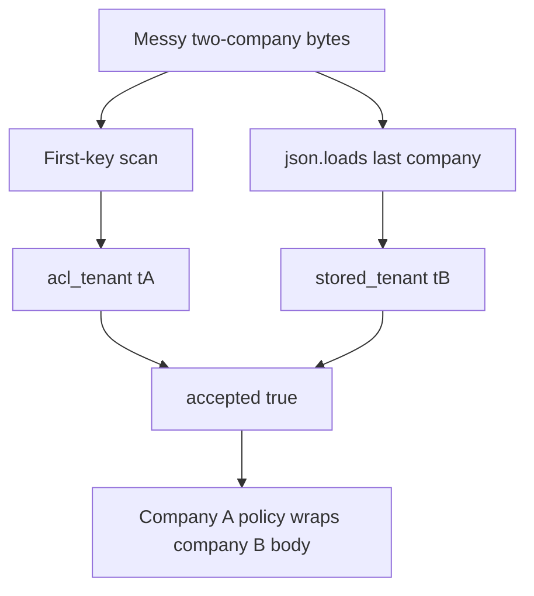

# Practice: two readers disagree on the company

**Kind:** mechanism-lab
**Loop step:** 3 Break

## Try it

The practice is not a website you attack. This is a local model of note ingest. A first-key scan for who is allowed, and `json.loads` for storage. Two meanings of the same bytes are **a failed rule**, not a JSON nit.

> The same request bytes must yield one company meaning for both the who-is-allowed check and the stored row. If two readers would disagree, ingest refuses.

## Where you may practice

Stay inside `labs/2.1/2.1-parser-boundaries/`. No other hosts. Do not paste attack recipes into notes. The messy two-company object is the course practice, not a public exploit.

Restore the broken and repaired folders from git when you are done. Fake data only.

Do not paste this exercise onto a public API, employer ingest, or live clinic portal.

What must not happen: **ACL tenant disagrees with stored tenant**.

## Picture: lock in the cause before the check



The broken files show **cause** (two readers), not an exploit recipe. What has to be true first: duplicate company keys in one object; split parse.

## What to read in the broken files

`vulnerable/parse_note.py` uses a first-key scan for ACL and `json.loads` for storage, then returns `accepted: True` even when they disagree. CPython last-wins on duplicates is the store meaning. The scan is not a JSON parser; it is a second grammar that happens to look at similar text.

You do not need a new payload. The check module already binds:

- CLEAN unique-key JSON for company A — must remain acceptable.
- Messy duplicate `"tenant"` keys — must not yield two meanings.

## Why it happens vs what it costs

| Slice | Practice |
|---|---|
| Why it happens | Two readers, two meanings of the same bytes |
| What has to be true first | Duplicate company keys; ACL on first, store on last |
| What it costs | tB body stored as if it were tA, or ACL sees tA while disk sees tB |
| Not the lesson | A scanner name, a bug-list nickname, or “JSON is broken” |

## Practice

Run checks against the broken files (they **must fail** on two meanings). Record the check name `test_duplicate_tenant_keys_are_one_meaning`.

```text
python3 -m pytest labs/2.1/2.1-parser-boundaries/tests --impl vulnerable
```

Do not “fix” the check to pass.

## Use it somewhere new

GraphQL and REST both ingest the same note: two grammars. Predict a disagreement without running anything outside this directory.

## What this page is not doing

No live-target steps. Fake data only.
