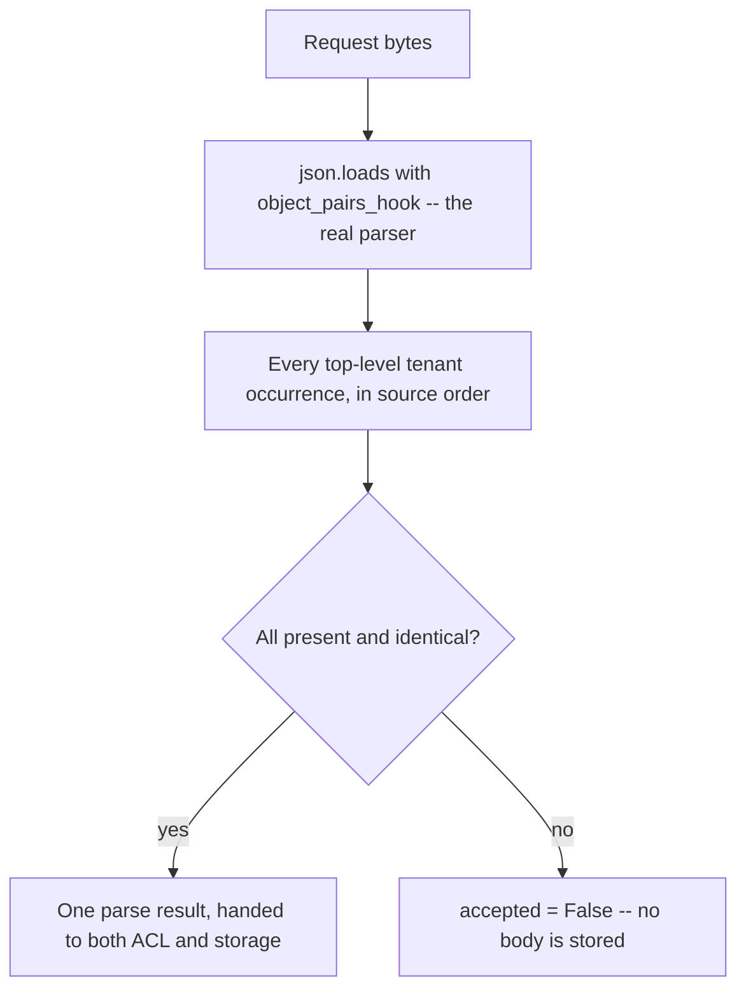

# Restore one meaning, or refuse the object

**Kind:** design-exercise
**Loop step:** 4 Build

## The rule

A denylist of last week's bad strings does not bind this object's meaning to anything, and turning off a security scanner's warning binds it even less — both leave the underlying disagreement between readers exactly as unresolved as it was before. "Trust the framework" is still a slogan even when the framework in question is well-regarded and widely used, because no framework you did not write has any way of knowing that *this* field, in *this* request, is the one whose meaning must be shared between an authorization decision and a storage write.

What actually has to change: the object must **have exactly one company meaning**, established once, before the who-is-allowed check ever runs. There are two structurally sound ways to get there. Refuse ingest outright whenever any occurrence of a duplicated key disagrees with another. Or restructure the system so only one reader ever produces a value that anything downstream consumes — retiring every second, approximate reader rather than checking its output more carefully.

## Picture: deny when the copies disagree, using the one real reader



The fix shipped in `fixed/parse_note.py` does not keep the vulnerable file's two readers around and check them against each other more carefully. It retires the second reader entirely: there is one call into `json.loads`, and the only question asked of it is "list every occurrence of `tenant` at the top level of this object." A production system might instead choose any strict JSON library configured to raise on a duplicate key outright, which is the same idea in a different shape — on uncertainty, the system does nothing rather than guessing. Guessing which key "the user probably meant" is not a third fail-safe option; it is a coin flip wearing a security control's clothing.

## What the repaired files must show

| After the fix | Must be true |
|---|---|
| Clean, unique-key JSON | `accepted` is `True`; the ACL tenant and the stored tenant are both `tA` |
| Messy, two duplicate keys | `accepted` is `False`, because the two occurrences genuinely differ |
| Messy, three occurrences, endpoints matching, middle differing | `accepted` is `False` — checking only the first and last occurrence is not the same claim as checking that every occurrence agrees, and the fix has to check all of them |
| No tenant field present at all | `accepted` is `False` — an absent claim is not the same as an agreed-upon one |
| A tenant key nested inside a different field, with no top-level tenant field | `accepted` is `False` — an occurrence anywhere in the document is not the same claim as an occurrence at the top level of the note object |
| Body, on any refusal | Not persisted as a note under any company |

On uncertainty, **deny**, in every one of these cases without exception. Do not repair a disagreement by keeping the last key on the reasoning that "that is what Python's stdlib does" — CPython's behavior is a documented implementation detail of the standard library, not a security decision anyone made on this system's behalf, and treating an implementation detail as though it were a deliberate policy is exactly the confusion Lesson 01's four-word table exists to prevent.

## Three candidate fixes, compared honestly — because the second one shipped, briefly, and was wrong too

This module's own fix did not arrive correct on the first attempt, and tracing all three attempts is more instructive than presenting only the one that survived.

**Candidate A — compare only the first occurrence to the last, using the vulnerable file's own two readers.** This closes the two-key case completely: with exactly two duplicate values, first and last are the only two values there are, so comparing them is comparing everything. It fails on any object with three or more occurrences of the same key where the first and last happen to coincide while a middle value disagrees — Lesson 03's counterexample constructs exactly this input, and Candidate A accepts it, silently discarding the middle claim.

**Candidate B — collect every occurrence with a second regex, and require the full set to have exactly one value.** This closes Candidate A's gap: checking the full set rather than two positions correctly catches a middle-value disagreement. It is still wrong, in a way that took a second, different kind of input to expose: a regex matching only quoted-string values (`"tenant":"([^"]*)"`) cannot see a non-string occurrence at all — `{"tenant":1,"tenant":"tA"}` has an occurrence the regex is blind to, so "collect every occurrence" silently believed there was only one when there were genuinely two. A regex is always an approximation of a grammar, however carefully written; it can never substitute for running the grammar's own parser.

**Candidate C (the fix that shipped) — retire the second reader, and ask the real JSON parser for every occurrence via `object_pairs_hook`.** This closes Candidate B's gap, because it is not approximating JSON's own duplicate-key handling with a second technology at all — it is asking CPython's own parser, which by construction sees every occurrence regardless of value type or key escaping. This candidate then exposed a *third* kind of gap, caught only by an adversarial, independent read rather than by any input the module's own authors had tried: `object_pairs_hook` fires at every nesting depth in the document, not only at the top level, so an early version of this candidate treated a `tenant` key buried inside an unrelated nested field as though it were the note's own top-level claim — accepting a note with no top-level tenant field at all, using a company id scraped from a nested object the submitter fully controlled. The fix that shipped restricts collection to the hook's *last* invocation, which is always the root object, because every nested object is fully resolved before the root's own pairs are handed to the hook.

Three attempts, three different technologies producing the ambiguity check, three different kinds of input needed to find each one's gap. None of the three authors — including this module's — found all of them by reasoning alone; each gap surfaced only once someone constructed the specific input that exposed it. That is itself a transferable lesson: a fix for "check every occurrence" is not verified by re-running the tests that motivated it, but by asking what kind of occurrence the checking mechanism itself might still be unable to see.

## What this is not

- A full accessibility or usability claim — this rule concerns machine-to-machine parsing, not a human-facing control.
- A crypto claim. Canonicalizing which value counts as "the" tenant does not encrypt anything, and it says nothing about confidentiality in transit.
- A WAF-style string filter for the literal text `tenant` appearing twice, which fails against whitespace variation, a Unicode escape sequence, or a payload split across two `Content-Type` boundaries.
- Normalizing display names as a stand-in for binding company identifiers — a cosmetic fix to a different field entirely.
- A claim that client-side validation participates in the control at all. The trusted service layer is where this check must run; nothing the client asserts about its own input changes that.

## Practice

Write out who, what, the action, and the specific check that must hold true after the fix, in the same seven-piece shape Lesson 02's worked example used. Then run:

```text
python3 -m pytest labs/2.1/2.1-parser-boundaries/tests --impl fixed
```

All nine tests must pass. If the middle-duplicate, non-string, or nested-tenant tests fail, the fix likely implements Candidate A or an incomplete version of Candidate C.

## Use it somewhere new

GraphQL and REST both ingest the same clinic appointment. A GraphQL request's `variables` field is itself JSON, sent over the same wire as a REST body — not a second grammar, but the same one this lesson has been about. The fix transfers as "one meaning, checked across every top-level occurrence, or refuse," not as "sanitize quotes" or "add a regex denylist for repeated field names."

## What can still go wrong

Honest, unique-key JSON still needs a separate who-is-allowed check; this fix does not provide one and was never meant to. A future `jsonb` database column is a new reader until someone actually checks whether its duplicate-key behavior matches what this fixture assumes — do not assume agreement across a technology boundary this fixture has not tested.
