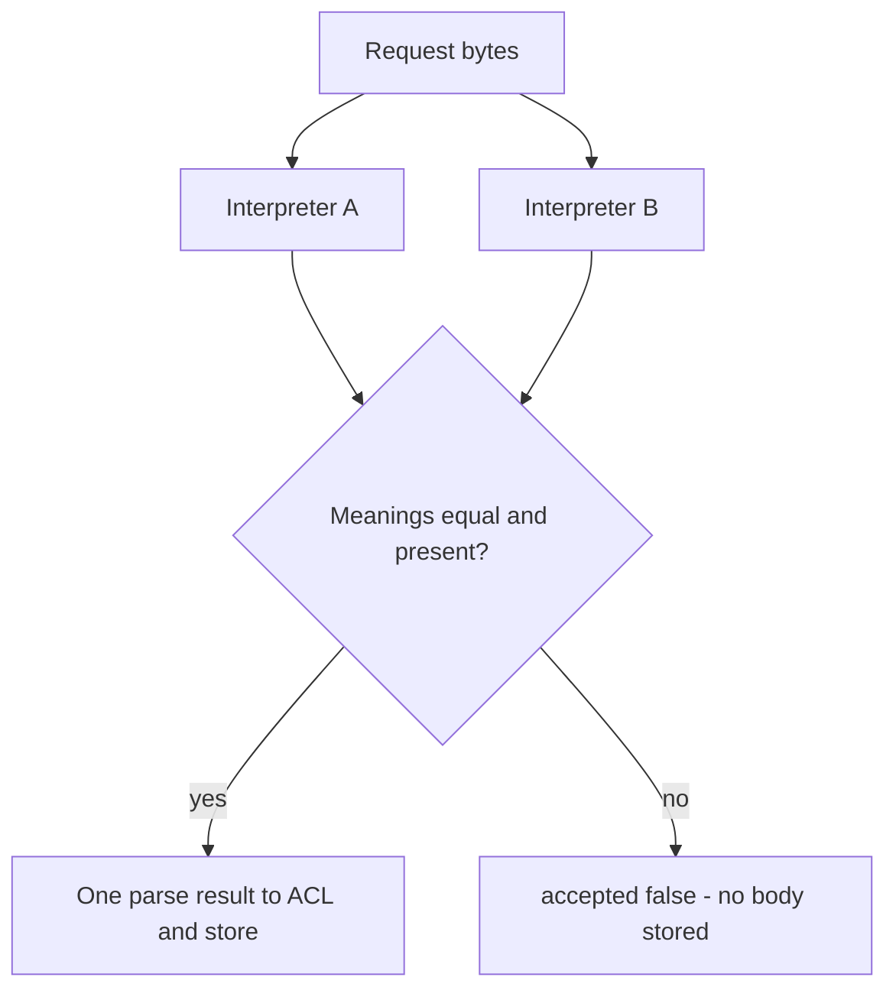

# 2.1-LO-04 — Restore one meaning, or refuse ingest

**Kind:** design-exercise
**Loop step:** 4 Build
**Standards:** Saltzer and Schroeder (1975, seminal) fail-safe defaults and economy of mechanism; OWASP ASVS 5.0.0 (final) `v5.0.0-1.1.1`, `v5.0.0-2.2.1`, and `v5.0.0-2.2.2`; RFC 8259 JSON (STD 90, final).

## Structural means the predicate is true

Reject duplicate keys, or compare `acl_tenant == stored_tenant` and deny on mismatch. Structural means the object actually has one tenant meaning before 1.2 mediation runs—not a denylist of yesterday’s string, not a scanner suppression, not “trust the framework.”

## Mental model: fail closed on disagreement



The lab’s fixed tree still *has* two interpreters. It restores the invariant by **refusing** when they disagree. A production design may instead use a single strict parser that errors on duplicate keys. Both are fail-safe. Guessing which key “the user meant” is not.

## Why this restores the cell

| After the fix | Must be true |
|---|---|
| CLEAN unique-key JSON | `accepted` is true; ACL and store are `tA` |
| AMBIGUOUS duplicate keys | `accepted` is false, **or** ACL and store are identical |
| Body on reject | not persisted as a note |

Fail-safe: on uncertainty, **deny**. Do not repair by keeping the last key because “that is what Python does.”

## What this is not

Pydantic v2 defaults are not “duplicate keys impossible.” stdlib `json` keeps the last key. A WAF string filter for “tenant twice” fails on whitespace and Unicode escapes. NFC-normalizing display names does not bind tenant ids.

ASVS `v5.0.0-2.2.2`: client-side validation is not the control. The trusted service layer must enforce the predicate.

## Practice

Name subject, object, action, and the predicate that must be true after the fix. Run `--impl fixed` (must pass):

```text
python3 -m pytest labs/2.1/2.1-parser-boundaries/tests --impl fixed
```

## Transfer

GraphQL and REST both ingest the same note — two grammars. The fix is still “one meaning or reject,” not “sanitize quotes.”

## Residual risk

Honest unique-key JSON still needs 1.2 mediation. A future `jsonb` column is a new interpreter until proven otherwise.
