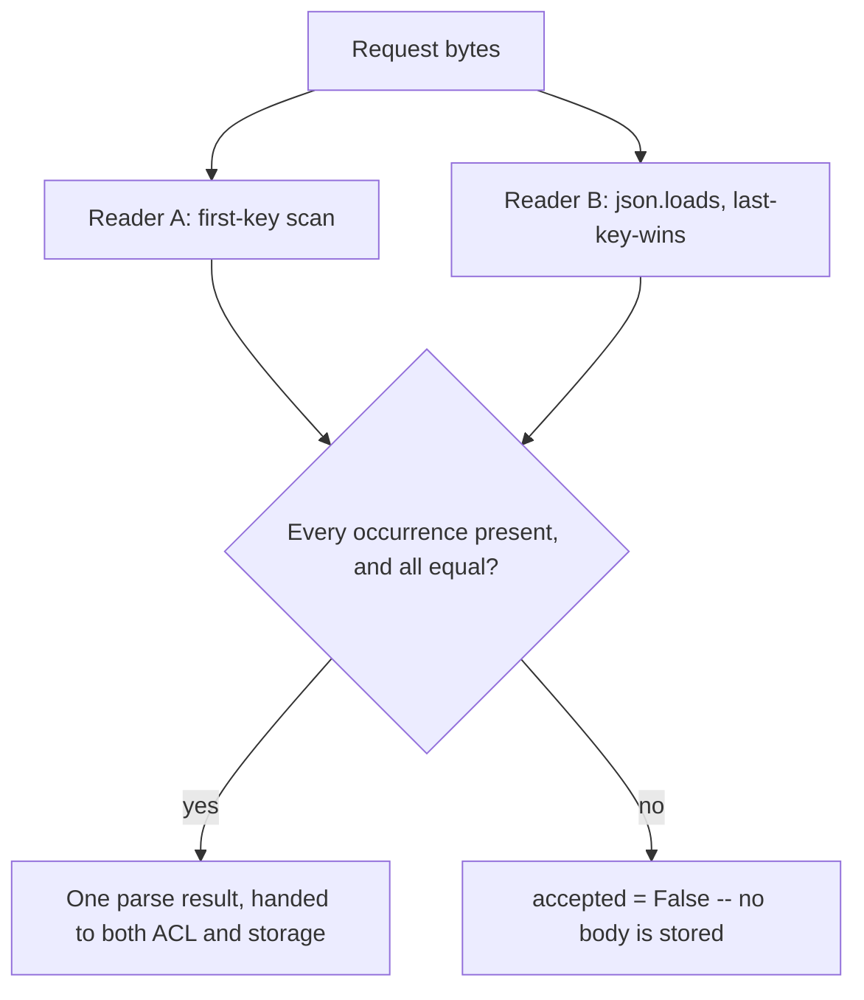

# Restore one meaning, or refuse the object

**Kind:** design-exercise
**Loop step:** 4 Build

## The rule

A denylist of last week's bad strings does not bind this object's meaning to anything, and turning off a security scanner's warning binds it even less — both leave the underlying disagreement between readers exactly as unresolved as it was before. "Trust the framework" is still a slogan even when the framework in question is well-regarded and widely used, because no framework you did not write has any way of knowing that *this* field, in *this* request, is the one whose meaning must be shared between an authorization decision and a storage write.

What actually has to change: the object must **have exactly one company meaning**, established once, before the who-is-allowed check ever runs. There are two structurally sound ways to get there. Refuse ingest outright whenever any duplicate key's occurrences disagree with each other. Or restructure the system so only one reader ever produces a value that anything downstream consumes — meaning the regex scan and `json.loads` stop being two independent sources of truth and become, at most, one canonical parse plus a cross-check against it.

## Picture: deny when the copies disagree



The repaired files still *have* two readers in them — the fix does not delete the regex scan or replace `json.loads` with something else. What changes is that the repaired files **refuse** whenever those two readers, checked against every occurrence rather than only the first and the last, disagree. A production system might instead choose a single strict parser configured to raise an error on any duplicate key, discarding the two-reader structure entirely. Both approaches are fail-safe in the sense this course means by that term: on uncertainty, the system does nothing rather than guessing. Guessing which key "the user probably meant" is not a third fail-safe option; it is a coin flip wearing a security control's clothing.

## What the repaired files must show

| After the fix | Must be true |
|---|---|
| Clean, unique-key JSON | `accepted` is `True`; the ACL tenant and the stored tenant are both `tA` |
| Messy, two duplicate keys | `accepted` is `False`, because the two occurrences genuinely differ |
| Messy, three occurrences, endpoints matching, middle differing | `accepted` is `False` — checking only the first and last occurrence is not the same claim as checking that every occurrence agrees, and the fix has to check all of them |
| No tenant field present at all | `accepted` is `False` — an absent claim is not the same as an agreed-upon one |
| Body, on any refusal | Not persisted as a note under any company |

On uncertainty, **deny**, in every one of these cases without exception. Do not repair a disagreement by keeping the last key on the reasoning that "that is what Python's stdlib does" — CPython's behavior is a documented implementation detail of the standard library, not a security decision anyone made on this system's behalf, and treating an implementation detail as though it were a deliberate policy is exactly the confusion Lesson 01's four-word table exists to prevent.

## Two candidate fixes, compared honestly

A competent engineer reading Lesson 03's failing test would likely propose comparing the first occurrence against the last, since that is the shape of the module's original two-key example and it is the smallest change that makes that specific test pass.

**Candidate A — compare only the first occurrence to the last.** This closes the two-key case completely: with exactly two duplicate values, first and last are the only two values there are, so comparing them is comparing everything. It fails, however, on any object with three or more occurrences of the same key where the first and last happen to coincide while a middle value disagrees — Lesson 03's counterexample constructs exactly this input, and Candidate A accepts it, silently discarding the middle claim. The fix would ship with every test written *before* that counterexample existed passing cleanly, which is precisely why the middle-duplicate test exists as its own case rather than being treated as covered by the original two.

**Candidate B (the restore) — collect every occurrence and require the full set to have exactly one value.** This subsumes Candidate A: with only two occurrences, checking that the full set has one value is identical to comparing first against last. With three or more, it correctly catches a middle-value disagreement that Candidate A's endpoints-only comparison cannot see. `fixed/parse_note.py` implements Candidate B specifically because Candidate A's gap is not a theoretical concern — a real JSON payload with more than two occurrences of a repeated key is not an exotic construction; it is exactly the shape a hand-edited request, or a request built by concatenating two JSON fragments, would naturally take.

## What this is not

- A full accessibility or usability claim — this rule concerns machine-to-machine parsing, not a human-facing control.
- A crypto claim. Canonicalizing which value counts as "the" tenant does not encrypt anything, and it says nothing about confidentiality in transit.
- A WAF-style string filter for the literal text `tenant` appearing twice, which fails against whitespace variation, a Unicode escape sequence, or a payload split across two `Content-Type` boundaries.
- Normalizing display names as a stand-in for binding company identifiers — a cosmetic fix to a different field entirely.
- A claim that client-side validation participates in the control at all. The trusted service layer is where this check must run; nothing the client asserts about its own input changes that.

## Practice

Write out who, what, the action, and the specific check that must hold true after the fix, in the same seven-piece shape Lesson 02's worked example used. Then run:

```text
python3 -m pytest labs/2.1/2.1-parser-boundaries/tests --impl fixed
```

All six tests must pass. If the middle-duplicate or anti-fake tests fail, the fix likely implements Candidate A rather than Candidate B.

## Use it somewhere new

GraphQL and REST both ingest the same clinic appointment — two grammars, each its own reader. The fix transfers as "one meaning, checked across every occurrence, or refuse," not as "sanitize quotes" or "add a regex denylist for repeated field names."

## What can still go wrong

Honest, unique-key JSON still needs a separate who-is-allowed check; this fix does not provide one and was never meant to. A future `jsonb` database column is a new reader until someone actually checks whether its duplicate-key behavior matches what this fixture assumes — do not assume agreement across a technology boundary this fixture has not tested.
