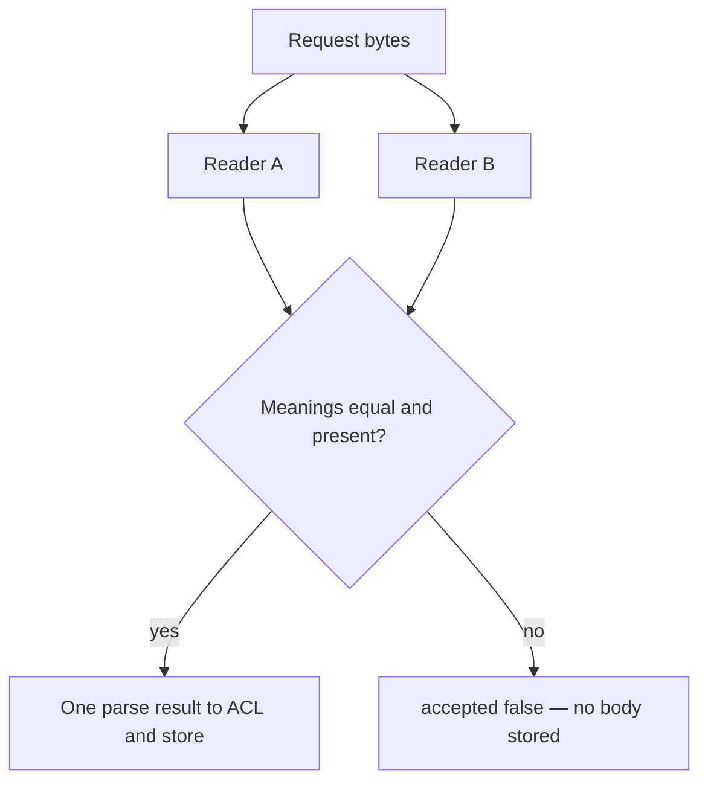

# Restore one meaning, or refuse the file

**Kind:** design-exercise
**Loop step:** 4 Build

## The rule

A list of last week’s bad strings does not bind the schema. Turning off the scanner does not bind it either. “Trust the framework” is still a slogan.

What has to change: the object **actually has one company meaning** before the who-is-allowed check runs. Refuse duplicate keys, or compare `acl_tenant == stored_tenant` and deny on mismatch.

## Picture: fail closed on disagreement



The repaired files still *have* two readers. They restore the rule by **refusing** when those readers disagree. A production design may instead use a single strict parser that errors on duplicate keys. Both are fail-safe. Guessing which key “the user meant” is not.

## What the repaired files must show

| After the fix | Must be true |
|---|---|
| CLEAN unique-key JSON | `accepted` is true; ACL and store are `tA` |
| Messy duplicate keys | `accepted` is false, **or** ACL and store are identical |
| Body on refuse | not persisted as a note |

Fail closed: on uncertainty, **deny**. Do not repair by keeping the last key because “that is what Python does.”

## What this is not

- Pydantic v2 defaults are not “duplicate keys impossible.”
- stdlib `json` keeps the last key.
- A WAF string filter for “tenant twice” fails on whitespace and Unicode escapes.
- NFC-normalizing display names does not bind company ids.
- Client-side validation is not the control. The trusted service layer must enforce the check.

## Practice

Name who, what, action, and the check that must be true after the fix. Run `--impl fixed` (must pass):

```text
python3 -m pytest labs/2.1/2.1-parser-boundaries/tests --impl fixed
```

## Use it somewhere new

GraphQL and REST both ingest the same note — two grammars. The fix is still “one meaning or refuse,” not “sanitize quotes.”

## What can still go wrong

Honest unique-key JSON still needs a who-is-allowed check. A future `jsonb` column is a new reader until proven otherwise.
