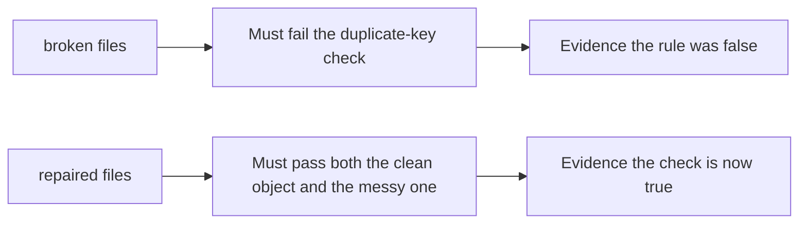

# Fail on the broken files, then pass on the repaired ones

**Kind:** verification-lab
**Loop step:** 5 Verify

## If you cannot test it, it is still a slogan

Happy-path HTTP 200 is not evidence. The check must be **false** on the broken files and **true** on the repaired files, against a named “what must not happen.”

## Picture: broken files must fail the duplicate-key check

A check that only counts passing cases can pass while two readers still disagree. This check asks whether two company meanings still count as a passing control. Broken must fail that question. Repaired must pass it.



If both pass, the check is not looking at ACL tenant vs stored tenant. If both fail, the fix is not structural or the check is wrong.

## Four modes, even for a parse

| Mode | Must show |
|---|---|
| Normal | CLEAN unique-key JSON is accepted with `acl_tenant == stored_tenant == tA` |
| Wrong input / abuse | Messy duplicate keys: refused **or** both tenants identical |
| When things break | Uncertainty does not persist a body under a guessed company |

The file is `labs/2.1/2.1-parser-boundaries/tests/test_parser.py`. The checks are `test_unambiguous_json_is_accepted` and `test_duplicate_tenant_keys_are_one_meaning`. The second is a **what-must-not-happen** check: last-key-wins `acl_tenant != stored_tenant` is not allowed to count as a passing control.

```text
python3 -m pytest labs/2.1/2.1-parser-boundaries/tests --impl vulnerable
python3 -m pytest labs/2.1/2.1-parser-boundaries/tests --impl fixed
```

Run from `labs/2.1/2.1-parser-boundaries` if a repo-root collection picks up `site/`. Map each check to a cell from the map page. Do not paste keys. An environment error is not security evidence.

| Slice | This practice |
|---|---|
| Required rule | duplicate keys → one meaning or refuse |
| Why it happens | two readers, one byte string |
| Trigger | messy duplicate `tenant` keys |
| How you stop it | refuse, or compare ACL and store |
| Not claimed | Pydantic last-key; GraphQL live target; who-is-allowed for unique keys |

## What the checks do not prove

- PostgreSQL `jsonb` agreement
- GraphQL variable parsing
- Unicode identifier spoofing
- Authorization for an honest unique-key object (that is the who-is-allowed topic)

Record those as leftover risk or later topics, not as silent passes.

## Practice

Run both implementations this session. If the broken files do not fail, the practice is miswired — fix the wiring, not the check. Write the fail/pass pair next to the ingest cell from the map page.

## Use it somewhere new

GraphQL and REST both ingest the same note. A check that only asserts status 200 on `/graphql` is not parser-agreement evidence. A live GraphQL target is out of scope.

## What this page is not doing

Do not add live traffic. Do not log the messy object. Answer keys stay out of this file.
