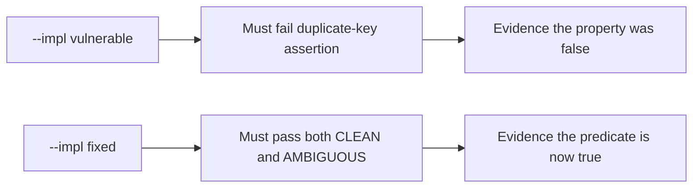

# 2.1-LO-05 — Evidence is a failing test, then a passing pair

**Kind:** verification-lab
**Loop step:** 5 Verify
**Standards:** OWASP ASVS 5.0.0 (final) `v5.0.0-2.2.1`; RFC 8259 JSON (STD 90, final).

## An invariant that cannot fail a test is still a slogan

Happy-path HTTP 200 is not this module’s evidence (see 9.3). The oracle is the local pair against a named forbidden outcome.

## Mental model: vulnerable must fail: duplicate-key assertion

The failing observation on `--impl vulnerable` is **duplicate-key assertion**. A passing collection count is not this cell.



| Case | Must show |
|---|---|
| Normal | CLEAN unique-key JSON is accepted with `acl_tenant == stored_tenant == tA` |
| Negative / abuse | AMBIGUOUS duplicate keys: rejected **or** both tenants identical |
| Failure default | Uncertainty does not persist a body under a guessed tenant |

Lab tests: `test_unambiguous_json_is_accepted` and `test_duplicate_tenant_keys_are_one_meaning` in `labs/2.1/2.1-parser-boundaries/tests/test_parser.py`. `test_duplicate_tenant_keys_are_one_meaning` is a **forbidden-outcome** test: last-key-wins `acl_tenant != stored_tenant` is not allowed to count as a passing control.

```text
python3 -m pytest labs/2.1/2.1-parser-boundaries/tests --impl vulnerable
python3 -m pytest labs/2.1/2.1-parser-boundaries/tests --impl fixed
```

Run from `labs/2.1/2.1-parser-boundaries` if a repo-root collection picks up `site/`. Map each test to a matrix cell from LO-02. Do not paste keys. An environment error is not security evidence.

| Slice | This lab |
|---|---|
| Required property | duplicate keys → one meaning or reject |
| Root cause | two interpreters, one byte string |
| Trigger | AMBIGUOUS duplicate `tenant` keys |
| Prevention | reject or compare ACL and store |
| Not claimed | Pydantic last-key; GraphQL live target; 1.2 for unique keys |

## What the tests do not prove

- PostgreSQL `jsonb` agreement
- GraphQL variable parsing
- Unicode identifier spoofing
- Authorization for an honest unique-key object (that is 1.2)

Record those as residuals or later modules, not as silent passes.

## Practice

Execute both implementations this session. If vulnerable does not fail, the lab is miswired—fix the wiring, not the assertion. Write the fail/pass pair next to the LO-02 ingest cell.

## Transfer

GraphQL and REST both ingest the same note. A test that only asserts status 200 on `/graphql` is not parser-agreement evidence. A live GraphQL target is out of scope.

## Non-goals

Do not add live traffic. Do not log the AMBIGUOUS blob. Keys stay out of this file.
