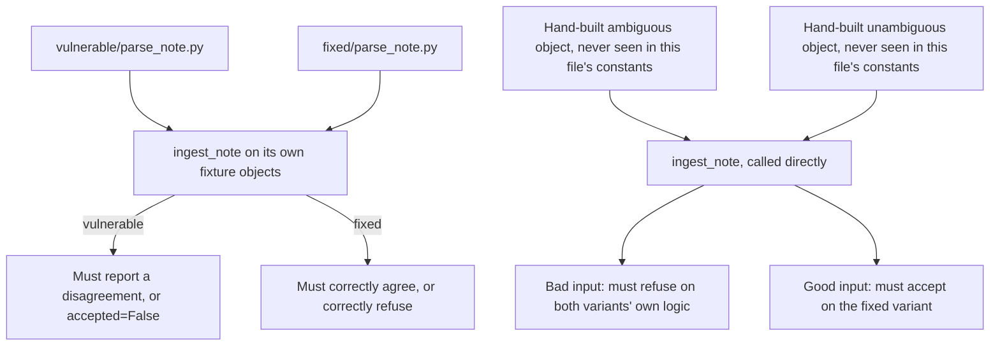

# The broken files must fail for the right reason

**Kind:** verification-lab
**Loop step:** 5 Verify
**Standards:** OWASP ASVS 5.0.0 **V1.5.3** (Level 3 — different parsers for the same data type must parse consistently, which is exactly what these six tests check between the ACL-time and store-time readers), **V1.1.1** (canonicalization happens once, before validation, not after). IETF RFC 8259 §4 (uniqueness of object member names is a "should," not an enforced guarantee every reader honors).

## Check it

HTTP 200 on a clean object does not finish this module's check, and neither does confirming that `ingest_note` returns a dictionary with the expected keys. Last-key-wins, and the quieter endpoints-only comparison Lesson 03 constructs a counterexample against, both have to fail on the broken files and pass on the repaired ones — and the check has to fail for the security reason the module names, not for an incidental one like a malformed input crashing the parser before the real comparison ever runs.

## Picture: broken files must fail, for the right reason

Asserting only that `ingest_note` runs without raising an exception is a much weaker claim than asserting it returns a result this specific rule accepts, and the gap between those two claims is exactly where a fake fix hides.



The right side of the diagram is the anti-fake pair, and it exists for the same reason Lesson 03's counterexample exists: if a "fixed" implementation special-cased the exact `AMBIGUOUS` and `CLEAN` strings this test file happens to define, the left side alone would pass without the underlying rule actually being implemented. Constructing fresh input the checker has never seen closes that hole.

## What the check has to show

| Mode | Must show for this topic |
|---|---|
| Normal | A clean, unique-key object is accepted, with the ACL and stored tenants matching |
| Boundary — two occurrences | A two-key disagreement is refused, or the two readers happen to agree |
| Boundary — three occurrences | A middle value that disagrees while the first and last coincide is still refused — checking only the endpoints is not the same claim as checking every occurrence |
| Malformed input | An object with no tenant field at all is refused, not silently treated as an empty or default company |
| Abuse / different objects | A checker built against this test file's own two constants must still correctly judge objects it has never seen |
| When things break | Uncertainty about which value is correct never results in a body being persisted |

Six tests live in `labs/2.1/2.1-parser-boundaries/tests/test_parser.py`: the normal case, the module's stated forbidden outcome, the middle-duplicate boundary, the missing-field malformed case, and the two-test anti-fake pair. None of them opens a network socket, reads a file, or depends on which machine runs them — every one is a direct call to `ingest_note` with a hand-written string.

## Worked example: tracing why the middle-duplicate test needed to exist

Run `python3 -m pytest labs/2.1/2.1-parser-boundaries/tests --impl vulnerable -v` and read the failure for `test_middle_duplicate_is_not_silently_dropped` rather than skipping to the summary line. The input is `{"tenant":"tA","body":"x","tenant":"tC","tenant":"tA"}`. Trace it through the vulnerable reader by hand: the regex scan for `_first_tenant` finds the first match in the raw text and stops, returning `"tA"`. CPython's `json.loads` for `_last_tenant` builds the full dictionary, and because Python dicts keep the last assignment to a repeated key, the resulting `tenant` value is also `"tA"` — the middle `"tC"` was overwritten by the third and final occurrence in the source text before `json.loads` ever returned. Both readers report `"tA"`. They agree. `ingest_note` returns `accepted: True`. Nothing about this is a bug in either reader; both did exactly what their documentation says they do, and the disagreement still happened — it happened in a place neither reader was even asked to look.

Now trace the same input through the fixed reader. `_all_tenant_occurrences` returns every match the regex finds across the whole string: `["tA", "tC", "tA"]`. Turning that list into a set gives `{"tA", "tC"}`, which has two elements rather than one, and the fixed logic refuses whenever that set's size is anything other than exactly one. The fix did not need to change what either individual reader does on its own terms; it needed to ask a different, more complete question of the same raw text — a question about every occurrence, rather than a question about only the two occurrences a first-versus-last comparison happens to look at.

This is worth restating plainly, because it is the actual lesson the trace above was building toward: both readers reported the identical value, `"tA"`, and by any comparison that only inspects what each reader individually returns, that agreement looks total. The disagreement was never in what the two readers reported to each other; it was in a third claim the raw bytes made that neither reader's own summary preserved. A verification strategy that only compares two readers' final answers, without asking whether either answer already discarded information on the way there, will never catch this class of gap — which is exactly why the fixed implementation inspects the raw occurrences directly, rather than trusting either reader's own notion of what it has already summarized.

## What the checks do not prove

- Agreement between CPython's JSON handling and PostgreSQL's `jsonb` column type — untested by this fixture, and explicitly not assumed.
- GraphQL variable parsing, or agreement between a GraphQL reader and a REST reader for the same logical field.
- Unicode lookalike or normalization-based identifier spoofing.
- Authorization for an honest, unique-key object — that is a separate who-is-allowed question this module deliberately does not test, because parser agreement and authorization are different claims.

## Practice

```text
python3 -m pytest labs/2.1/2.1-parser-boundaries/tests --impl vulnerable
python3 -m pytest labs/2.1/2.1-parser-boundaries/tests --impl fixed
```

Run from `labs/2.1/2.1-parser-boundaries` directly if running from the repository root causes a collection error picking up unrelated files under `site/`. Map each of the four failing tests on the vulnerable run to a specific row in Lesson 02's design table. A setup error that prevents the tests from running at all is not evidence that the rule holds — if you cannot get a clean run, the practice is miswired, and the wiring is what needs fixing, never the assertions.

## Use it somewhere new

GraphQL and REST both ingest the same clinic appointment. Asserting HTTP 200 on a `/graphql` endpoint is not evidence of parser agreement between that endpoint and a parallel REST path — it only shows the GraphQL server accepted the request, which says nothing about whether a REST reader of the same logical field would reach the same conclusion. Write, in words rather than code, what a middle-duplicate-style test would look like for a GraphQL request whose `variables` JSON carries three occurrences of a duplicated `patient_id` key — three claims about one field, in the same JSON grammar as this lesson's three-occurrence object, arriving through a `variables` field instead of a note body. Do not test this against a live GraphQL target.

## What this page is not doing

Do not add live network traffic anywhere in this exercise, and do not log the messy object's contents as part of "improving" a test. Answer keys are not on this site; they live only in `content/assessment/keys/2.1.md`.
