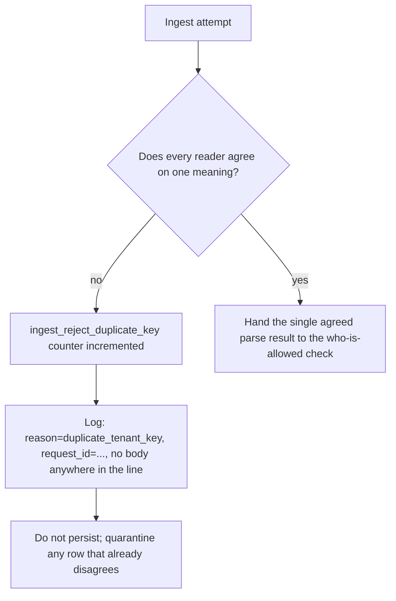

# Notice disagreement without logging the body

**Kind:** operations-exercise
**Loop step:** 6 Operate

## Fixing it once is not enough

A new JSON library version, a worker that re-parses stored bytes for a different purpose, or a database column that casts text to `jsonb` on its own schedule can each reintroduce two meanings for bytes that were already believed to have exactly one. None of these three causes is "we forgot Lesson 04's fix" — the ingest path Lesson 04 fixed can be perfectly correct today and still be reopened by a component that did not exist when that fix shipped. This lesson is about what has to hold true after the fixed ingest path is already in production: notice a disagreement when one occurs, contain it, and recover, all without ever logging a secret or a note body in the process of doing so.

## Picture: signal without the blob



A log pipeline, however well-instrumented, does not by itself pick which JSON reader a system trusts — instrumentation records what already happened, it does not decide what should happen, and a team that treats a well-populated dashboard as evidence the underlying disagreement problem is solved has confused observability with correctness.

## Signals that do not become a second leak

| Outcome | For this topic specifically |
|---|---|
| Notice | A parse-error or duplicate-key metric, incremented on every refusal; a local corpus of intentionally messy objects run periodically against the check |
| What the log line holds | The `ingest_reject_duplicate_key` count; a `request_id`; a reason code — and **never** the note body, which would turn a deny event into exactly the kind of leak the deny event exists to prevent |
| Recover | Quarantine any row whose ACL-time meaning and stored meaning disagree; never "repair" a quarantined row by picking one of the disagreeing values, since picking one is a guess wearing a recovery procedure's clothing |
| Leftover, still | Honest, unique-key JSON still needs a separate who-is-allowed check this operate step does not provide |

FastAPI will keep parsing whatever JSON library it was configured to use, regardless of how good the operate-side dashboards look. PostgreSQL's `jsonb` type will keep whichever key its own casting rules prefer if a value is cast into that column type, and that preference is Postgres's choice, not a decision this module's fixture makes on its behalf. Messy, disagreeing keys do not get to persist two companies' worth of data under one deny log line — and the deny line itself never includes the blob that was refused, precisely because the log's job is to prove *that* a refusal happened, not to preserve *what* was refused for later inspection.

## Worked example: a metric without a quarantine playbook still leaves a gap

Suppose a team ships the counter and the log line exactly as described above, and stops there, treating "we now notice disagreement" as equivalent to "we now handle disagreement." Trace what happens if a worker, introduced after this operate step shipped, stores a row *before* the disagreement check runs — perhaps because the worker calls a different code path that bypasses `ingest_note` entirely. The metric increments correctly the next time the *original* ingest path sees a disagreeing object. But the row the worker already wrote is still sitting in storage, disagreeing with whatever the ACL check believes about it, and no metric anywhere fired for that specific row, because the worker's code path was never wired to the same instrumentation. Noticing is not the same claim as having a playbook for what to do about every path that can write a row, and a metric on one path says nothing about a second path the metric was never connected to.

Unicode lookalike keys — two visually similar characters that render identically but compare as different strings — are a leftover risk this operate step does not close either; they would produce a genuine, correctly-detected disagreement under this module's own check, but resolving *why* two visually identical fields are being treated as different values is a design question this fixture's simple refuse-on-disagreement rule does not need to answer to remain correct. A green dashboard, in every one of these cases, does not make duplicate keys into one meaning — it only means nobody has yet looked at the gap the dashboard was never built to see.

## Why the recover step refuses to guess, even under operational pressure

An incident where the duplicate-key metric spikes is exactly the moment a team is tempted to reach for a fast resolution — restore service quickly by picking whichever value seems more plausible, ship the fix, move on. Resist this specifically because the entire property this module teaches is that picking a value is a guess, not a decision, regardless of how confident anyone feels about which value is "obviously" correct under time pressure. A quarantined row that sits unresolved for a day is a known, bounded cost: one company's note is inaccessible until a human resolves the ambiguity by hand, with full context, outside of the automated path. A quarantined row that gets "repaired" by an on-call engineer picking a value at 2 a.m. is an unbounded cost, because the automated system has now demonstrated that its refuse-on-disagreement rule is negotiable under pressure, and the next disagreement will arrive with the same pressure attached to it.

## Practice

Write the exact deny log line this system would emit for the module's own ambiguous fixture object:

```text
ingest_denied reason=duplicate_tenant_key request_id=req_7c3a practice=2.1-parser-boundaries
```

Then name, specifically, what including `body=`, the raw JSON text, or a note excerpt in that same line would cost — not in the abstract, but in terms of who could read that log and what they would then know that they should not.

## Use it somewhere new

GraphQL and REST both ingest the same note. Design either two separate refuse-metrics, one per grammar, or one shared ingest identifier carrying a `grammar=` field that distinguishes which reader raised the alarm — and state explicitly why one shared path with a distinguishing field is operationally safer than two independent metrics that a future engineer might reasonably assume are measuring the same thing. Two independent metrics invite exactly the failure this lesson's worked example already described: a second path that writes data without ever being wired to the instrumentation the first path relies on, discovered only after something has already gone wrong on that second path.

## What this page is not doing

Answer keys are not on this site; they live only in `content/assessment/keys/2.1.md`. This lesson does not walk through setting up a production log aggregator, a specific metrics vendor, or an alerting threshold — those are implementation choices for a real deployment, downstream of the actual security decision this module teaches, which is what the log line contains and what it must never contain.
