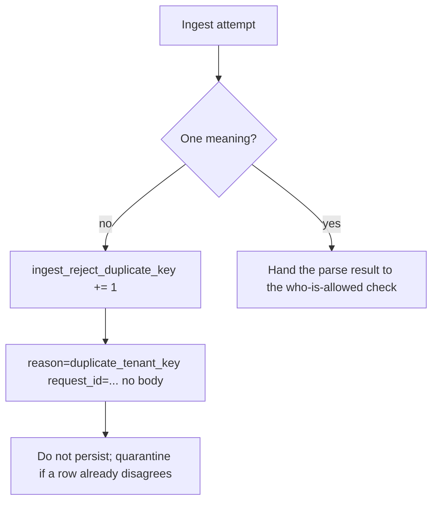

# Notice disagreement without logging the body

**Kind:** operations-exercise
**Loop step:** 6 Operate

## Fixing it once is not enough

A new JSON library, a worker re-parse, or a `jsonb` cast can bring two meanings back. Do not log secrets or note bodies.

## Picture: signal without the blob



A log pipeline does not pick which JSON reader you trust.

## Signals that do not become a second leak

| Outcome | This topic |
|---|---|
| Notice | Parse-error / duplicate-key metric; a local corpus of messy objects |
| What the line holds | `ingest_reject_duplicate_key` count; `request_id`; reason code — **never** the note body |
| Recover | Quarantine rows whose ACL and store disagree; do not guess a company |
| Leftover | Honest unique-key JSON still needs a who-is-allowed check |

FastAPI will still parse whatever JSON library you wired. PostgreSQL `jsonb` will keep one key if you cast. Messy keys do not persist two companies, and the deny log never includes the blob.

A metric without a quarantine playbook still leaves a disagreeing row if a worker stored first. Unicode lookalike keys are leftover risk. Honest unique-key JSON still needs who-is-allowed. A green dashboard does not make duplicate keys one meaning.

| Slice | This practice |
|---|---|
| Notice | `ingest_reject_duplicate_key` |
| Signal | reason code and `request_id`; never note body |
| Recover | Do not persist; quarantine if a row already disagrees |
| Leftover | `jsonb` as a new reader; GraphQL aliases |

## Practice

```text
ingest_denied reason=duplicate_tenant_key request_id=req_7c3a practice=2.1-parser-boundaries
```

If the line includes `body`, note text, or a raw JSON blob, do not write it.

## Use it somewhere new

GraphQL and REST both ingest the same note. Two refuse metrics, or one shared ingest id with a `grammar=` field — pick one and say why one shared path is safer than two.

## What this page is not doing

Answer keys are not on this site.
