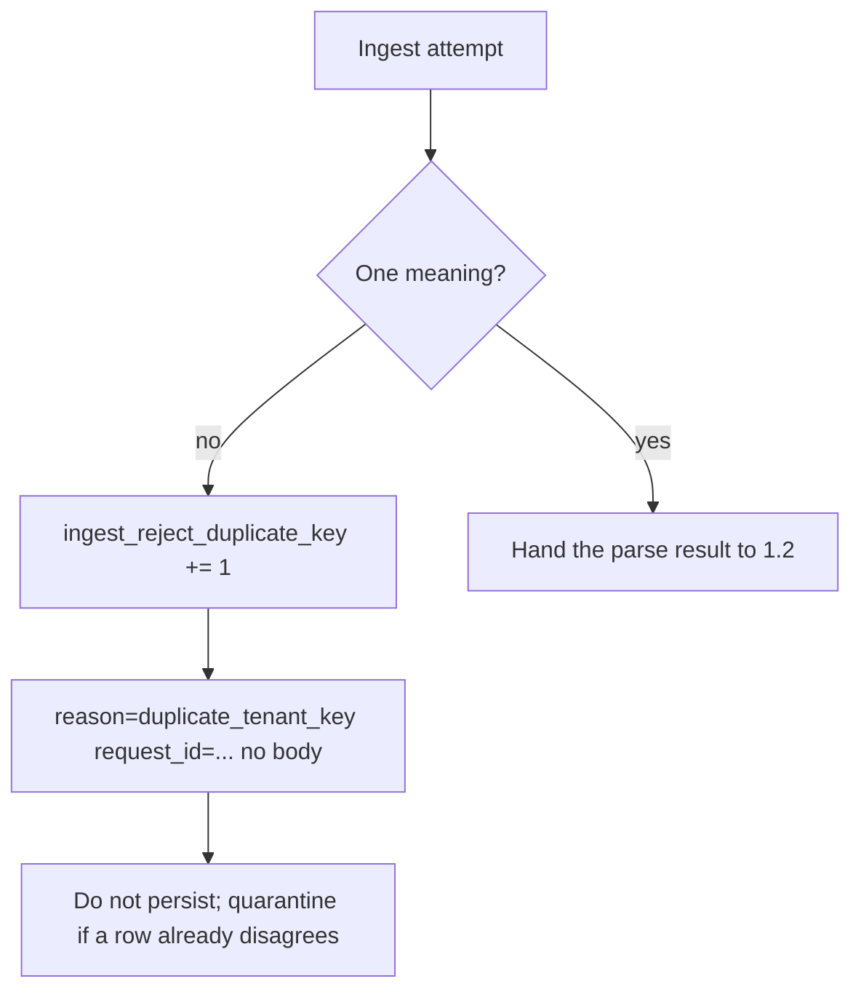

# 2.1-LO-06 — Detect disagreement; never log the body

**Kind:** operations-exercise
**Loop step:** 6 Operate
**Standards:** NIST CSF 2.0 (final) DE/RS/RC as *outcome labels*, not proof; OWASP ASVS 5.0.0 (final) `v5.0.0-2.2.2`; Module 3.1 / 5.1 privacy of logs.

## Prevention is not absolute

A new JSON library, a worker re-parse, or a `jsonb` cast can reintroduce two meanings. Pair detect and recover. Do not log secrets or note bodies.

## Mental model: signal without the blob



| Outcome | This module |
|---|---|
| Detect | Parse-error / duplicate-key metric; CI differential corpus |
| Signal (no bodies) | `ingest_reject_duplicate_key` count; `request_id`; reason code |
| Revoke / recover | Quarantine rows whose ACL and store disagree; do not guess a tenant |
| Residual | Honest unique-key JSON still needs 1.2 mediation |

CSF 2.0 Detect / Respond / Recover name *outcomes*. They do not prove ASVS. A SIEM product name is not the property.

## Practice

Write one log line you would accept in review. Tie it to `labs/2.1/2.1-parser-boundaries`. Example shape (synthetic ids only):

```text
ingest_denied reason=duplicate_tenant_key request_id=req_7c3a fixture=2.1-parser-boundaries
```

Reject any line that includes `body`, note text, or a raw JSON blob.

## Transfer

GraphQL and REST both ingest the same note. Two reject metrics, or one shared ingest id with a `grammar=` field—pick one and justify least common mechanism.

## Non-goals

SIEM product names are not the property. Keys stay out of lessons.
