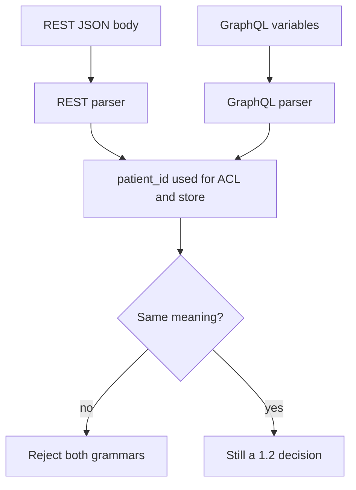

# 2.1-LO-07 — Transfer: two grammars, one patient identifier

**Kind:** transfer-challenge
**Loop step:** 7 Transfer
**Standards:** Saltzer and Schroeder (1975, seminal) least common mechanism; OWASP ASVS 5.0.0 (final) `v5.0.0-1.1.1` and Level 3 `v5.0.0-1.5.3` labeled advanced; RFC 8259 JSON (STD 90, final).

## Change the channel; keep the invariant shape

Do not answer with a Top 10 / CWE Top 25 / scanner as the definition of security.

**Prompt:** GraphQL and REST both ingest the same clinic appointment.

**Product sketch:** Clinic booking. A JSON object (REST) and a GraphQL variable map can both carry `patient_id`. Duplicate keys, aliased fields, or a proxy that re-encodes Unicode can make the ACL patient disagree with the stored patient.

Rewrite the SecureCollab sentence for this product. Your answer must include:

1. attacker capabilities (who can POST or query);
2. trust assumptions (which parser is TCB; the client is not);
3. a forbidden outcome (disagreement, not “injection”);
4. a test idea that would fail if the cell were false (local fixture only);
5. residual risk (honest unique keys still need authorization; coercion/support paths if a human confirms);
6. whether a human path must meet WCAG 2.2 (only if a person must complete a control; parser disagreement itself is not a WCAG problem).

## Mental model: each grammar is an interpreter

## What graders reject

| Reject | Why |
|---|---|
| Tool or awareness-list name as the property | 1.1 |
| Framework default as the guarantee | Pydantic / `JSON.parse` / GraphQL library defaults |
| Live-target plan or real patient ids | Lab policy |
| “Sanitize quotes” as the structural fix | Wrong slice |

## Practice

One page. No keys. The lab `labs/2.1/2.1-parser-boundaries` stays the only running system you may break. Multipart filename encoding (two parsers on the same bytes) is an acceptable alternate sketch pointing at 6.4—still local, still synthetic.
