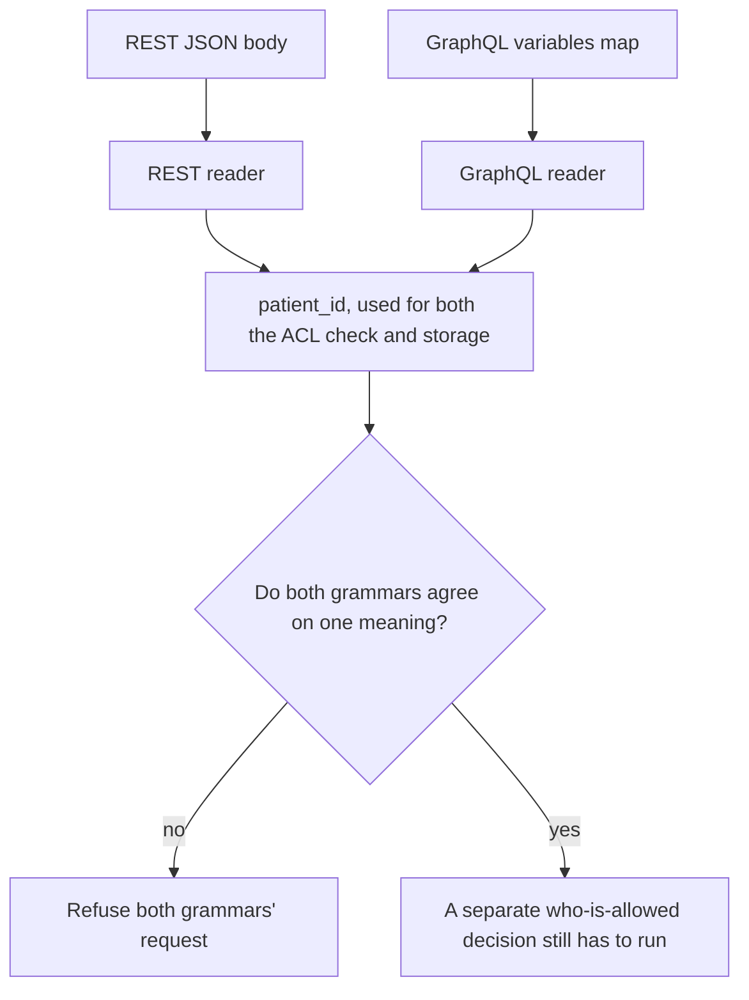

# Same idea on clinic REST and GraphQL

**Kind:** transfer-challenge
**Loop step:** 7 Transfer

## Use it somewhere new

You get a **clinic booking** API. A JSON object, reached over REST, and a GraphQL variable map can both carry `patient_id` for the same logical appointment. Duplicate keys within either grammar, aliased fields within a GraphQL query, or a proxy that re-encodes Unicode along the way can each make the ACL-time patient disagree with the stored patient, using exactly the same underlying mechanism this module built around a notes app's `tenant` field.

## Picture: each grammar is a reader

`patient_id` plays the same role in this scenario that `"tenant"` played throughout the rest of this module — a value multiple readers each independently extract from the same underlying data, where nothing before this module's rule guarantees those extractions agree. Two grammars are two readers, in exactly the sense Lesson 02's reader table used that phrase. The who-is-allowed decision still has to run *after* one agreed meaning exists; agreement is not authorization, and this transfer does not change that ordering.

| Notes app | Clinic sketch |
|---|---|
| A poster sending a note | Someone who can either `POST` a new appointment or query an existing one |
| `"tenant"` on a JSON note | `patient_id`, present on both the REST body and the GraphQL variables map |
| ACL tenant versus stored tenant | ACL patient versus stored patient |
| The who-is-allowed leftover named throughout this module | Unchanged: honest, unique keys still need an authorization decision this transfer does not provide |



## Write this for a clinic REST and GraphQL scenario

GraphQL and REST both ingest data about the same clinic appointment, through two different grammars that were built at different times by, plausibly, different teams.

Your answer must include, each stated specifically rather than gestured at:

- **who might try:** anyone who can `POST` a REST body or submit a GraphQL query with variables — the two are different mechanisms for reaching the same underlying effect, and a threat model that only considers one of them has silently assumed the other does not exist;
- **what you trust:** name specifically which reader's output the who-is-allowed check and the storage step are both required to consume, exactly as Lesson 02's model named the single agreed parse result for the notes app;
- **what must not happen:** the failure is disagreement between the two grammars' readings of `patient_id`, not "injection" or any other named vulnerability class that would misdirect attention away from the actual mechanism;
- **a check that would fail if the rule were false:** REST and GraphQL must agree on `patient_id` in a **local** practice fixture you build yourself — never against a live clinic API, and never with a real patient identifier anywhere in the fixture;
- **leftover risk:** honest, unique keys on both grammars still leave a separate who-is-allowed decision unaddressed; a human-confirmed path (a clinician confirming an appointment change, say) may also carry a coercion residual analogous to the one an earlier module named for account recovery;
- **whether a human path must meet the accessibility baseline this course has used elsewhere:** only if an actual person must complete a control to finish the transaction — parser disagreement between two backend grammars is not, itself, an accessibility question, and treating it as one would be a category error in the other direction from the one this module has spent seven lessons correcting.

## Worked example and counterexample: two GraphQL "fixes" that are not the same fix

Suppose a clinic's engineering team responds to a disagreement report by adding a resolver-level check that compares the GraphQL query's `patient_id` variable against the REST body's `patient_id` field before either write proceeds, refusing when they differ. Trace it: this is a direct transfer of Lesson 04's Candidate B — collect every occurrence across both grammars, and refuse unless the full set has exactly one value. It closes the gap correctly, in the same shape as the notes-app fix, applied to two grammars instead of two Python functions.

```text
worked:         rest.patient_id == graphql.variables["patient_id"] required before write
                -> disagreement across grammars is refused, same as within one grammar
counterexample: query { book(id: $pid) @skip(if: false) alias1: patient(id: $pid) ... }
                -> a query alias lets the SAME variable be referenced multiple times
                   under different result-field names, and a check comparing only
                   "the" REST value against "the" top-level GraphQL variable never
                   inspects whether every aliased reference used the same value
```

Now the counterexample. A different team "fixes" the same report by checking only that the top-level `$patient_id` variable declaration is present and non-empty, reasoning that GraphQL variables are strongly typed and therefore cannot be ambiguous the way a JSON object's duplicate keys can be. Trace this one too: GraphQL's alias mechanism lets a single query reference the same field multiple times under different result names, and nothing in the language specification requires that every aliased reference actually resolve using the identical value a client claims — a maliciously or carelessly constructed query can supply what looks like one variable at the top level while a nested, aliased fragment resolves against a different value entirely, depending on how the resolver code is wired. This "fix" checks that a value exists, which is validation, and mistakes that for canonicalization, which asks whether every reference to that value in the whole request agrees. It transfers the wrong half of this module's lesson: it improves the object's shape without ever asking whether every reader-visible occurrence of `patient_id` says the same thing.

## What is not good enough

| Reject | Why |
|---|---|
| A tool name or a famous-bug-list category offered as the rule | Naming a category is not the same claim as naming this scenario's specific forbidden outcome |
| A framework default offered as the whole promise | Pydantic's model validation, `JSON.parse`, and a GraphQL library's own variable-coercion defaults all run *after* whichever reader already collapsed any duplicates — none of them can retroactively restore information already discarded |
| A live-target plan, or any real patient identifier, anywhere in the answer | Forbidden by this course's laboratory policy without exception |
| "Sanitize quotes" offered as the structural fix | This addresses the wrong slice of the problem entirely — quoting has nothing to do with which of two readers' answers a system trusts |

If a REST body "looks unique" on its own while a parallel GraphQL query keeps two `patient_id` aliases referring to different values, the rule has already failed, regardless of how clean either grammar looks in isolation. A WAF-style quote filter and a citation to the JSON specification's own uniqueness recommendation do nothing to put one meaning into both grammars — neither one is even aimed at the actual gap. Clean, unique keys on both grammars may be accepted; messy or disagreeing keys on either grammar must refuse, or the two grammars' readers must be shown to agree before anything is accepted. The local analogue this course provides is `test_duplicate_tenant_keys_are_one_meaning` and its companion `test_middle_duplicate_is_not_silently_dropped`, exercised against a practice fixture — never against a live health record system.

A diagram of grammars, on its own, is a later architecture-review artifact, and drawing one does not, by itself, make duplicate keys resolve to one meaning; the diagram only becomes useful once it is paired with an actual refuse-or-agree check like the one this module built.

## Practice

Show two readers operating on the same underlying bytes for this new scenario, in the same diagram style Lesson 01 and Lesson 02 used for the notes app. Keep the answer keys closed while you work through this. `labs/2.1/2.1-parser-boundaries` remains the only system you may actually execute code against; everything above is a written exercise. A multipart filename encoding scenario — a browser's reader and an API's reader disagreeing about the same uploaded filename's bytes — is an acceptable alternate sketch if you would rather work through an upload path than a booking API; it points toward a later course topic on file uploads, and it is still local, still fake data, and still subject to every rule stated above.

## What this page is not doing

Do not use real clinics, real patient identifiers, or live GraphQL targets anywhere in this exercise.
