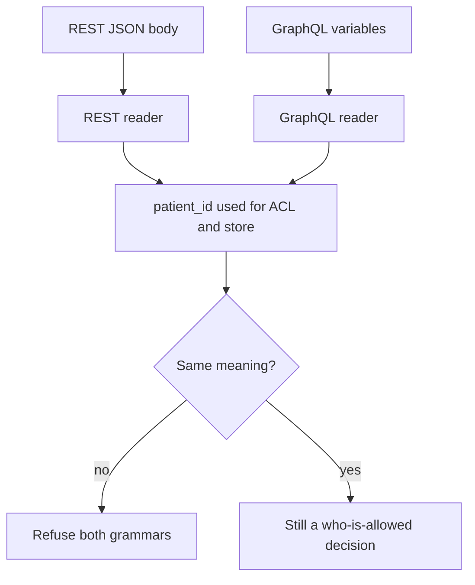

# Same idea on clinic REST and GraphQL

**Kind:** transfer-challenge
**Loop step:** 7 Transfer

## Use it somewhere new

You get a **clinic booking** API. A JSON object (REST) and a GraphQL variable map can both carry `patient_id`. Duplicate keys, aliased fields, or a proxy that re-encodes Unicode can make the ACL patient disagree with the stored patient.

## Picture: each grammar is a reader

`patient_id` is the `"tenant"` key in both grammars. Two grammars are two readers. Who-is-allowed still runs after one meaning exists.

| Notes app | Clinic sketch |
|---|---|
| Poster sending a note | Someone who can POST or query an appointment |
| `"tenant"` on a JSON note | `patient_id` on REST and on GraphQL variables |
| ACL tenant vs stored tenant | ACL patient vs stored patient |
| Who-is-allowed leftover | Honest unique keys still need authorization |

## Write this for a clinic REST and GraphQL

GraphQL and REST both ingest the same clinic appointment.

- who might try (who can POST or query);
- what you trust (which reader is trusted; the client is not);
- what must not happen (disagreement, not “injection”);
- a check idea that would fail if the rule were false (local practice only);
- leftover risk (honest unique keys still need authorization; coercion/support paths if a person confirms);
- whether a human path must meet the web accessibility baseline (only if a person must finish a control; parser disagreement itself is not an accessibility problem).

## What is not good enough

| Reject | Why |
|---|---|
| A tool or famous-bugs-list name as the rule | You still have not named the outcome |
| Framework default as the promise | Pydantic / `JSON.parse` / GraphQL library defaults |
| A live-target plan or real patient ids | Course rules |
| “Sanitize quotes” as the structural fix | Wrong slice |

If REST “looks unique” while GraphQL variables keep two `patient_id` aliases, the rule is gone. A WAF quote filter and a JSON-spec citation do not put one meaning into both grammars. CLEAN unique keys may accept, messy keys refuse or agree. The local analogue is `test_duplicate_tenant_keys_are_one_meaning` — on a practice object, not a live health record.

A diagram of grammars is a later architecture bar. It is not this check.

## Practice

Write one page. Leave the keys closed. The practice `labs/2.1/2.1-parser-boundaries` stays the only running system you may break. Multipart filename encoding (two readers on the same bytes) is an acceptable alternate sketch pointing at a later upload topic — still local, still fake data.

## What this page is not doing

Do not use real clinics, real patient identifiers, live GraphQL targets.
