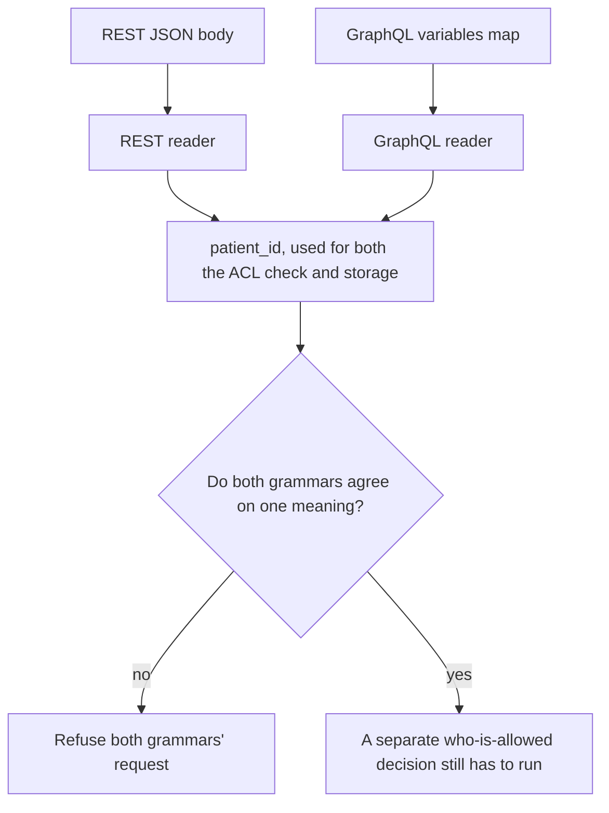

# Same idea on clinic REST and GraphQL

**Kind:** transfer-challenge
**Loop step:** 7 Transfer

## Use it somewhere new

You get a **clinic booking** API. A JSON object, reached over REST, and a GraphQL `variables` payload — itself ordinary JSON, sent over the same wire — can both carry `patient_id` for the same logical appointment. Duplicate keys within either JSON payload, or a proxy that re-encodes Unicode along the way, can each make the ACL-time patient disagree with the stored patient, using exactly the same underlying mechanism this module built around a notes app's `tenant` field. GraphQL's variable coercion does not remove this risk; it only moves the JSON payload that carries it from a request body to a `variables` field.

## Picture: each grammar is a reader

`patient_id` plays the same role in this scenario that `"tenant"` played throughout the rest of this module — a value multiple readers each independently extract from the same underlying data, where nothing before this module's rule guarantees those extractions agree. Two grammars are two readers, in exactly the sense Lesson 02's reader table used that phrase. The who-is-allowed decision still has to run *after* one agreed meaning exists; agreement is not authorization, and this transfer does not change that ordering.

| Notes app | Clinic sketch |
|---|---|
| A poster sending a note | Someone who can either `POST` a new appointment or query an existing one |
| `"tenant"` on a JSON note | `patient_id`, present on both the REST body and the GraphQL variables map |
| ACL tenant versus stored tenant | ACL patient versus stored patient |
| The who-is-allowed leftover named throughout this module | Unchanged: honest, unique keys still need an authorization decision this transfer does not provide |



## Write this for a clinic REST and GraphQL scenario

GraphQL and REST both ingest data about the same clinic appointment, through two different grammars that were built at different times by, plausibly, different teams.

Your answer must include, each stated specifically rather than gestured at:

- **who might try:** anyone who can `POST` a REST body or submit a GraphQL query with variables — the two are different mechanisms for reaching the same underlying effect, and a threat model that only considers one of them has silently assumed the other does not exist;
- **what you trust:** name specifically which reader's output the who-is-allowed check and the storage step are both required to consume, exactly as Lesson 02's model named the single agreed parse result for the notes app;
- **what must not happen:** the failure is disagreement between the two grammars' readings of `patient_id`, not "injection" or any other named vulnerability class that would misdirect attention away from the actual mechanism;
- **a check that would fail if the rule were false:** REST and GraphQL must agree on `patient_id` in a **local** practice fixture you build yourself — never against a live clinic API, and never with a real patient identifier anywhere in the fixture;
- **leftover risk:** honest, unique keys on both grammars still leave a separate who-is-allowed decision unaddressed; a human-confirmed path (a clinician confirming an appointment change, say) may also carry a coercion residual analogous to the one an earlier module named for account recovery;
- **whether a human path must meet the accessibility baseline this course has used elsewhere:** only if an actual person must complete a control to finish the transaction — parser disagreement between two backend grammars is not, itself, an accessibility question, and treating it as one would be a category error in the other direction from the one this module has spent seven lessons correcting.

## Worked example and counterexample: two GraphQL "fixes" that are not the same fix

Before tracing either fix, name the mechanism precisely, because getting it wrong here is exactly the kind of mistake this transfer exercise is designed to catch. The GraphQL specification coerces each declared variable's value **once per operation** — every reference to `$patient_id` within one query uses the identical value, by construction, because the client supplied exactly one value for that variable name and the server substitutes it wherever the name appears. A variable cannot disagree with itself the way a JSON object's duplicate key can, because nothing in GraphQL parses "the same variable, twice, with two different values" the way `json.loads` parses two `"tenant"` keys. The real transfer target is one level up: the `variables` object a GraphQL client sends alongside a query is *itself* ordinary JSON, sent as part of the HTTP request body — and ordinary JSON can have duplicate keys, exactly as this module's `tenant` field can. `{"patient_id":"p1","patient_id":"p2"}` inside a `variables` payload is the same defect this module has taught for eight lessons, wearing a GraphQL client library's serialization instead of a REST body's.

Suppose a clinic's engineering team responds to a disagreement report by adding a check that parses the raw `variables` JSON the same way `fixed/parse_note.py` parses a note body — collecting every occurrence of `patient_id` via `json.loads`'s `object_pairs_hook`, and refusing unless the full set has exactly one value — then separately requires that value to match the REST body's `patient_id`. Trace it: this is a direct transfer of this module's actual fix, applied to a second JSON payload (`variables`) instead of the note body, plus a cross-grammar comparison. It closes the gap correctly.

```text
worked:         variables_json = '{"patient_id":"p1","patient_id":"p2"}'
                -> collect every occurrence the same way fixed/parse_note.py does
                -> two distinct values found -> refuse, before ever reaching a resolver
counterexample: a check that only inspects the GraphQL variable *by name* at the
                top of the query -- "$patient_id is declared and non-empty" --
                never re-parses the raw variables JSON as JSON, so it cannot see
                that the client-supplied JSON payload itself had two entries for
                that key before the GraphQL layer coerced it down to one value
```

Now the counterexample. A different team "fixes" the same report by checking only that the top-level `$patient_id` variable is declared and non-empty in the query's variable definitions, reasoning that GraphQL's own coercion already guarantees one value per variable, so there is nothing further to check. Trace this one too: the reasoning about coercion is correct as far as it goes — once GraphQL has coerced `$patient_id` to a single value, every *use* of that variable inside the query does share that one value. What the reasoning misses is that the coercion step itself consumed a `variables` payload that arrived as JSON, over the same wire, sent by the same untrusted client that could put duplicate keys in a note body. GraphQL's own runtime, on receiving `{"patient_id":"p1","patient_id":"p2"}`, calls some JSON decoder to parse it — and that decoder resolves the duplicate exactly the way any other JSON decoder does, silently, before GraphQL ever sees "one value." Checking that the *declared variable* looks fine is validation performed after canonicalization already happened invisibly; it never asks whether the canonicalization step's own input was ambiguous. This is the same validation-versus-canonicalization confusion Lesson 01's four-word table named, transferred to a place where "GraphQL is strongly typed" makes it feel like it shouldn't apply — and it applies anyway, because the ambiguity lives in the JSON transport underneath the type system, not in the type system itself.

## What is not good enough

| Reject | Why |
|---|---|
| A tool name or a famous-bug-list category offered as the rule | Naming a category is not the same claim as naming this scenario's specific forbidden outcome |
| A framework default offered as the whole promise | Pydantic's model validation, `JSON.parse`, and a GraphQL library's own variable-coercion defaults all run *after* whichever reader already collapsed any duplicates — none of them can retroactively restore information already discarded |
| A live-target plan, or any real patient identifier, anywhere in the answer | Forbidden by this course's laboratory policy without exception |
| "Sanitize quotes" offered as the structural fix | This addresses the wrong slice of the problem entirely — quoting has nothing to do with which of two readers' answers a system trusts |

If a REST body "looks unique" on its own while the `variables` JSON accompanying a parallel GraphQL request carries a duplicated `patient_id` key that GraphQL's own coercion silently resolved, the rule has already failed, regardless of how clean either payload looks after the fact. A WAF-style quote filter and a citation to the JSON specification's own uniqueness recommendation do nothing to put one meaning into both payloads — neither one is even aimed at the actual gap. Clean, unique keys in both JSON payloads may be accepted; messy or disagreeing keys in either one must refuse, or the two payloads must be shown to agree before anything is accepted. The local analogue this course provides is `test_duplicate_tenant_keys_are_one_meaning` and its companion `test_middle_duplicate_is_not_silently_dropped`, exercised against a practice fixture — never against a live health record system.

A diagram of grammars, on its own, is a later architecture-review artifact, and drawing one does not, by itself, make duplicate keys resolve to one meaning; the diagram only becomes useful once it is paired with an actual refuse-or-agree check like the one this module built.

## Practice

Show two readers operating on the same underlying bytes for this new scenario, in the same diagram style Lesson 01 and Lesson 02 used for the notes app. Keep the answer keys closed while you work through this. `labs/2.1/2.1-parser-boundaries` remains the only system you may actually execute code against; everything above is a written exercise. A multipart filename encoding scenario — a browser's reader and an API's reader disagreeing about the same uploaded filename's bytes — is an acceptable alternate sketch if you would rather work through an upload path than a booking API; it points toward a later course topic on file uploads, and it is still local, still fake data, and still subject to every rule stated above.

## What this page is not doing

Do not use real clinics, real patient identifiers, or live GraphQL targets anywhere in this exercise.
