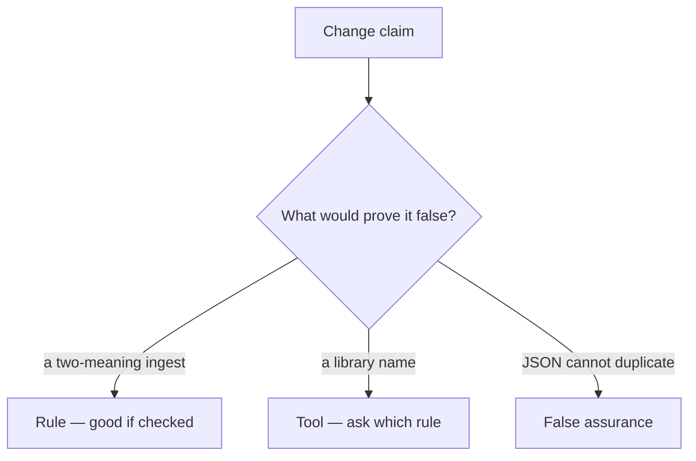

# Review of split JSON parsers

**Kind:** code-review
**Loop step:** Review

## What you are reviewing

Review `labs/2.1/2.1-parser-boundaries/vulnerable/` as a change to notes-app ingest. Reconstruct whether ACL and store still parse the same bytes twice.

Do not treat “JSON should not duplicate keys” as a green `test_duplicate_tenant_keys_are_one_meaning`.

## Picture: problems to find (name them yourself)

**`json.loads` used for store while ACL uses a different first-key scan**.

For each claim and each branch: label **rule**, **tool**, or **false assurance**.

Problems to find (name them yourself; do not open the keys file):

- `json.loads` used for store while ACL uses a different first-key scan
- Comment or belief that “JSON can’t have duplicate keys” (the spec recommends uniqueness; readers differ)
- No corpus check for duplicate keys
- Normalizing display names as a stand-in for company ids

Also reject: trusting the client; concatenating readers; Report-Only as enforcement; closing findings without re-running the repaired-files check; keys in learner notes.

## Common mix-ups

- Encoding is a crypto problem
- One reader is as good as another
- Validation equals canonicalization

## Use it somewhere new

GraphQL and REST both ingest the same note — two grammars. Validating JSON on only one path still leaves a two-meaning ingest. What would still make duplicate keys one meaning on both grammars?

## What this page is not doing

Do not merge because RFC 8259 says JSON should not duplicate keys. Should is not `test_duplicate_tenant_keys_are_one_meaning`.
