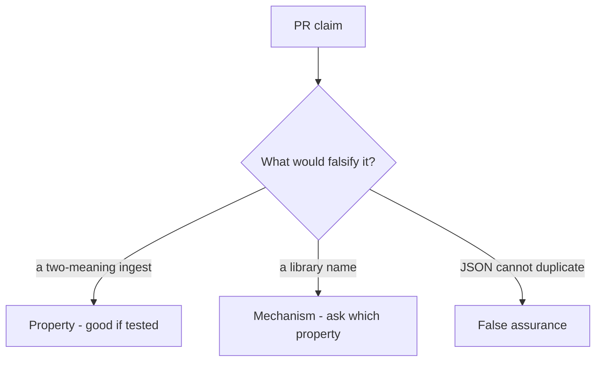

# 2.1-LO-08 — Review the split parse as a PR, not a slogan

**Kind:** code-review
**Loop step:** Review
**Standards:** OWASP ASVS 5.0.0 (final) `v5.0.0-1.1.1` and `v5.0.0-2.2.2`; RFC 8259 JSON (STD 90, final).

## Review the fixture as if it were SecureCollab ingest

Review `labs/2.1/2.1-parser-boundaries/vulnerable/` as a SecureCollab PR. Intended findings live only in `content/assessment/keys/2.1.md` — not here.

## Mental model: json.loads used for store while ACL uses a different first-key scan

Start with this seeded smell: **`json.loads` used for store while ACL uses a different first-key scan**. Label it property, mechanism, or false assurance before you accept the PR.

For each claim and each branch: label **property**, **mechanism**, or **false assurance**.

Seeded smells (label them yourself; do not open the keys file):

- `json.loads` used for store while ACL uses a different first-key scan
- Comment or belief that “JSON can’t have duplicate keys” (RFC 8259 recommends uniqueness; parsers differ)
- No corpus test for duplicate keys
- Normalizing display names as a substitute for tenant ids

Also reject: client trust, concatenating interpreters, Report-Only as enforcement, closing findings without retest, keys in lessons.

## Misconceptions

- Encoding is a crypto problem
- One parser is as good as another
- Validation equals canonicalization

## Practice

Write three review notes a peer could act on. Tie at least one note to `test_duplicate_tenant_keys_are_one_meaning`.

## Transfer

GraphQL and REST both ingest the same note — two grammars. A PR that “validates JSON” on only one path is an incomplete mediation review.
