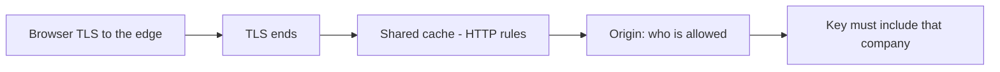
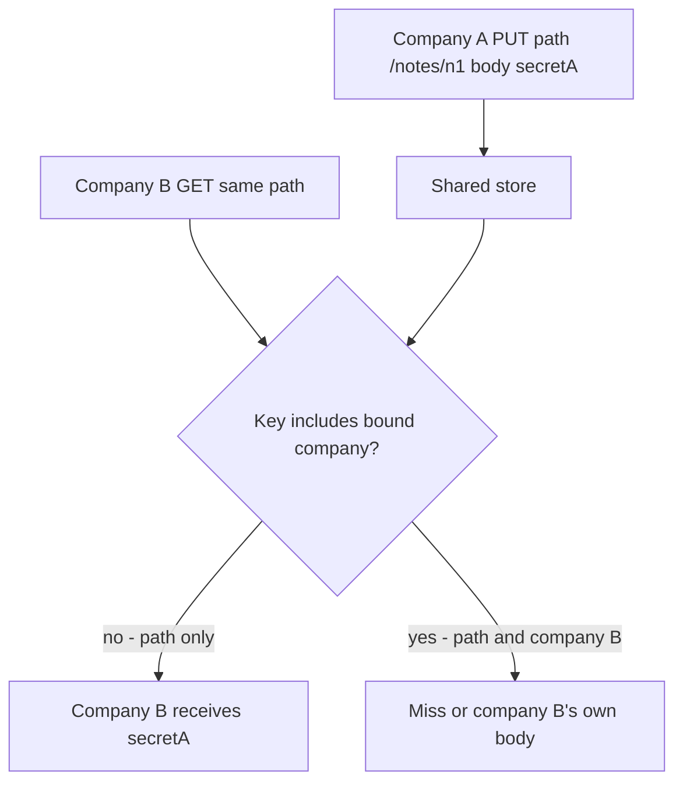

# TLS proves a hop; the cache key decides who reads

**Kind:** concept-model
**Loop step:** 1 Property

## The rule

The notes app still has a shared cache on the path: a CDN, a reverse proxy, or an in-process store that more than one company can hit. HTTPS on the browser hop does not write that key.

> For `GET /notes/n1` in the notes app, a cache hit may return a note body only when the key includes the **company the app already bound you to** — not a client `Host`, `X-Tenant`, or `X-Forwarded-*` field. Company B must not receive company A’s body for the same path. Missing or unknown company meaning is a miss (or a deny), not a shared entry. TLS 1.3 on one hop proves that hop. It is not the cache-key rule.

So what must not happen: **company B reads company A’s note from a shared cache**. The key was only the URL. Company A filled the slot. Company B’s later GET receives `tenant-A-note`. That is a secrecy failure caused by a **shared store**, not by a missing login.

HTTP rules say what may be cached and how `Vary` picks a representation. TLS 1.3 says how one hop proves itself. After the edge ends TLS, later hops and stores see HTTP the way you configured them. Neither rule puts the company into your key.

## Picture: hop proof is not object identity

Treat the hop and the key as two different questions.



Industry lists want TLS to the public HTTP service. That is needed and not enough. A neighbor on a company inspecting proxy, or company B on the same CDN node, never needed to break TLS to read a path-only entry.

**A tool is not the rule:** “We turned on HTTPS,” Next.js `fetch` cache defaults, FastAPI `HTTPException`, a CDN product name, or `Cache-Control: private` while the CDN is set to cache anyway.

## Picture: the key is the shared store

A store shared by two companies is a communication channel. A dict keyed only on `/notes/n1` *is* that channel.



The broken files’ `cache_put` ignores the company argument when storing. Company B does not guess ids; they reuse the URL. `X-Forwarded-Host` is not required for the failure.

Sensitive data in a load-balancer or application cache is one store. The browser’s `Cache-Control: no-store` is another. They are different stores. A correct origin `no-store` does not fix a CDN that keys on path. A correct CDN company key does not fix a browser that cached a note body.

Web cache deception — unexpected types, files that do not exist — is a later, harder topic. This week’s check is company disagreement on the same path, not a public CDN poison.

## Bound company versus forwarded identity

Header fields set by a proxy (`X-Forwarded-*`, `X-Real-IP`, `X-User-ID`) must not be overridable by the end user if the app uses them. The cache key must use the **same bound company** the who-is-allowed check used — not a label the client sent.

| Source | Use in the key? |
|---|---|
| Server-resolved membership company after the who-is-allowed check | Yes, if you cache at all |
| URL path `/notes/n1` | Necessary, never enough for notes |
| `Authorization` cookie bytes as `Vary: Cookie` | Fragile; cookies are not company ids; later cookies-and-sessions work |
| Client `X-Tenant`, `Host`, `X-Forwarded-Host` | No |

Default for note bodies: **do not cache** (`private` / `no-store`) unless a reviewable key tuple exists. Caching is an availability and cost choice that must not widen who can read a note.

## Why it happens, what it costs, how you stop it, how you notice, how you recover

A path-only shared cache fails because **the designers trusted the URL as identity**. Company B hitting the same path is a **result**, not the cause.

| Slice | For this rule |
|---|---|
| Why it happens | Shared cache keyed without the bound company |
| What has to be true first | Shared store; path-only key; company A filled the entry |
| Trigger | Company B `GET /notes/n1` while the entry is still live |
| What it costs | Secrecy: a cross-company read without guessing ids |
| How you stop it | Key = (bound company, route, representation); default no-store for notes |
| How you notice | Hit log with a company mismatch; never log the body |
| How you recover | Purge the prefix; treat escaped bodies as a secrecy incident |

## What the framework does vs what you still have to check

Next.js `fetch` cache and FastAPI defaults do not encode company. `Vary: Accept-Encoding` is a compression selector, not a company selector. Stale-while-revalidate can serve company A to company B if the key is still path-only. HTTP/2 push and URL normalization are later surfaces; they do not delete this sentence.

The app’s promise is: on **these** practice files, `cache_get("/notes/n1", "tB")` after a company A put is not `tenant-A-note`. The practice folder is the local check for that sentence. It is not a live CDN and not a public cache.

## What the tool cannot do

- `Cache-Control: private` fails if the CDN is set to cache anyway.
- TLS client certificates prove a hop; they are not a cache key.
- Encrypted Client Hello hides some handshake metadata; it does not bind company in a store.
- An operator can still drop the company dimension at the CDN. Record leftover risk and a purge playbook.

## Practice

Write the key tuple for `/notes/n1` before you run checks. Name which field is the bound company and which fields are hostile. Then run the local pair:

```text
python3 -m pytest labs/2.2/2.2-request-path/tests --impl vulnerable
python3 -m pytest labs/2.2/2.2-request-path/tests --impl fixed
```

The first command must fail. The second must pass. Tie the check to path-only sharing, not to “TLS is off.”

## Use it somewhere new

A clinic caches `GET /patients/me`. Authenticated RSS or a CSV export rides the same CDN. Which hop still has TLS, and which store still needs the bound patient or company in the key?

## What this page is not doing

Live CDNs, poisoning a public cache, DNS hijack labs, real patient charts, and “HTTPS means no cache bugs.” Answer keys are not on this site.
