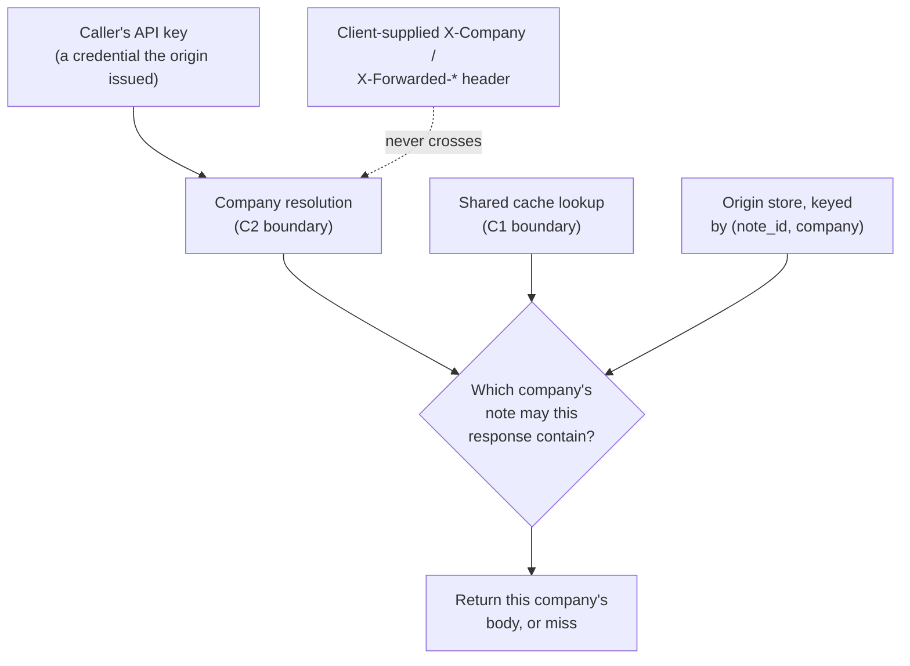

# A hop's certificate is not a company; a cache key is not a header

**Kind:** concept-model
**Loop step:** 1 Property
**Standards:** ASVS 5.0.0 v5.0.0-4.1.3, v5.0.0-12.1.1, v5.0.0-12.2.1, v5.0.0-12.2.2, v5.0.0-12.3.2, v5.0.0-14.2.2, v5.0.0-14.2.5, v5.0.0-14.3.2

## Two decisions, one shared mistake

SecureCollab's Phase 2 skeleton is a browser talking to an edge that terminates TLS, which forwards the request to an origin that answers from a shared cache or, on a miss, from its own store. That single sentence already contains two separate decisions a reviewer has to check, and the module's earlier version taught only one of them. The first decision is: **which company does this request belong to?** The second is: **does a cache hit for this path belong to that same company?** Confusing either question with "the connection used TLS" produces a real secrecy failure, and the two failures do not share a fix, because they live in different functions and depend on different facts.

Run this only inside `labs/2.2/2.2-request-path/`. The company names, note bodies, and API keys are synthetic fixture values, not production credentials.

Start with the first decision, because it is upstream of the second. SecureCollab's origin decides which company a caller belongs to by looking up the API key the caller presents — a **credential** (a value the origin itself issued and can verify) — against a table only the origin holds. That lookup is the only legitimate source of the company identifier. A request can also carry an `X-Company` header, an `X-Tenant` header, or a rewritten `Host` header, and none of them are credentials: they are strings the caller typed, indistinguishable at the wire level from a true claim and a false one. **Forwarded identity** — a value that names who or what a request is on behalf of, carried in a header rather than proven by a credential — is not evidence, because a client that can set one header can set any header. If the origin reads company identity from `X-Company` instead of from the API-key lookup, an attacker who holds only their own company's key can name a different company in that header and read that company's notes. Nothing about the browser-to-edge hop being TLS prevents this: TLS proves the browser reached the edge without an eavesdropper reading the bytes in transit, and says nothing at all about which header value the caller chose to send inside that encrypted connection.

The second decision is where the module's original property lived, and it is still true: a **cache key** (the identifier a shared store uses to decide whether two requests may share an answer) that omits the company lets one company's cached response answer another company's request for the same path. If company A's note at `/notes/n1` is cached under the key `"n1"` alone, company B's later request for `/notes/n1` matches that same key and receives company A's body — not because company B guessed anything, but because the store was never told that "the same path" and "the same request" are different claims once two companies share a path namespace. `Cache-Control: private`, a CDN's marketing claim of "HTTPS only," and Next.js's default `fetch` cache all leave this exact gap open, because none of them put a company into the key; they only decide whether to cache at all, and how long.

## Rejected alternatives

A competent engineer might reasonably believe **"we terminate TLS at the edge, so every hop after that is inside our own trusted network."** This fails here because trust inside a network boundary is a claim about who can reach a socket, not about who set which header on a request that already arrived; a compromised service two hops downstream, or a request that never left the origin's own process boundary, can still carry a forged `X-Company` value. Check instead what actually produced the value your authorization check reads, not which network segment it traveled through.

A second engineer might believe **"the cache respects `Cache-Control: private`, so it will never serve one company to another."** This fails because `private` is an instruction about whether a *shared* cache may store the response at all — many CDNs and reverse proxies cache anyway under their own defaults, and even a cache that honors the header faithfully still needs a key that names the company to avoid conflating two "private to the requester" bodies that arrived on the same path. Check what the key actually contains, not which header asked politely.

A third might believe **"our CDN only accepts HTTPS, so the cache is secure."** This fails because "accepts HTTPS" is a transport-layer property of the connection between a client and the CDN edge; it says nothing about how the CDN's own cache is keyed once the request is inside. Check the key, not the protocol.

## Picture: two boundaries feeding one decision



Two authority paths meet at that one decision box. The company-resolution boundary (left) must never let a client-supplied header cross it, and the cache boundary (right) must key on the same company the resolution boundary produced — not on the path alone. A diagram that shows only one of these boundaries, or that draws `X-Company` flowing straight into the decision, has already predicted a failure this module's lab exercises.

## Worked example: tracing one request through both boundaries

```python
# labs/2.2/2.2-request-path/vulnerable/app.py, abridged
def _resolve_company(api_key, x_company):
    if api_key not in API_KEYS:
        return None
    if x_company:          # forwarded header wins -- the C2 defect
        return x_company
    return API_KEYS[api_key]

def get_note(note_id, api_key, x_company):
    company = _resolve_company(api_key, x_company)
    cached = _CACHE.get(note_id)          # keyed on path alone -- the C1 defect
    if cached is not None:
        return cached
    ...
```

Trace a caller who holds `key-A` (bound to `companyA`) and sends `X-Company: companyB` for a note `companyB` already stored. `_resolve_company` returns `"companyB"` — not because the caller proved anything about company B, but because the function reads the header when present. The subsequent store lookup then honors that unproven claim. Separately, trace a caller with no header at all who asks for a path that company A already caused to be cached: `_CACHE.get(note_id)` returns company A's body regardless of which company the caller resolved to, because the key never recorded a company at all. Neither trace requires TLS to be broken, misconfigured, or absent — both fixtures deliberately leave TLS out of scope, because the point is that TLS being perfectly correct does not touch either bug.

## Counterexample: TLS succeeding is not "the right peer"

A hop-authentication check that only asks "did a certificate chain to a certificate authority I trust?" can be satisfied by a certificate that is completely valid — for the wrong hostname. Picture an edge node that, through a routing misconfiguration, connects to a backend that legitimately serves `billing-origin.securecollab.internal` while the caller meant to reach `notes-origin.securecollab.internal`. Both hostnames might share the same certificate authority; the handshake succeeds; every TLS-layer property this module cares about — confidentiality and integrity of the bytes in transit — holds. The peer is still wrong, because "the certificate authority trusts this certificate" and "this certificate was issued for the hostname I meant to reach" are two different checks, and a hop-authentication routine that runs only the first has proven nothing about which service actually answered.

## What the framework does and does not do

FastAPI, Next.js's `fetch` cache, and a CDN's TLS-only checkbox all leave company identity and cache-key company binding as decisions the application must make explicitly; none of them insert a company dimension by default, and none of them distinguish a forwarded header from a credential. TLS 1.3 (RFC 9846) authenticates the specific hop it runs on; it makes no claim about a header value, a cache key, or a hop it does not itself run on.

## Use it somewhere new

Authenticated RSS or a CSV export behind the same kind of edge raises the identical two questions: which credential resolved the requester's company, and does the cache key that serves that export include it? A cache key or identity check that only ever considered `/notes/{id}` has not yet been asked about `/export.csv`.

## What this page is not doing

Live CDNs, a real TLS handshake, DNS resolution, and "the framework handles this" are all out of scope here; a multi-hop chain past the edge (module claim C4) is named as a residual in `spec.md`, not solved on this page. Answer keys are not on this site.
