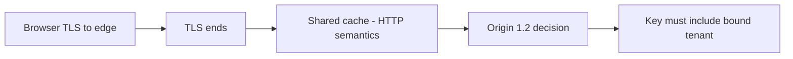
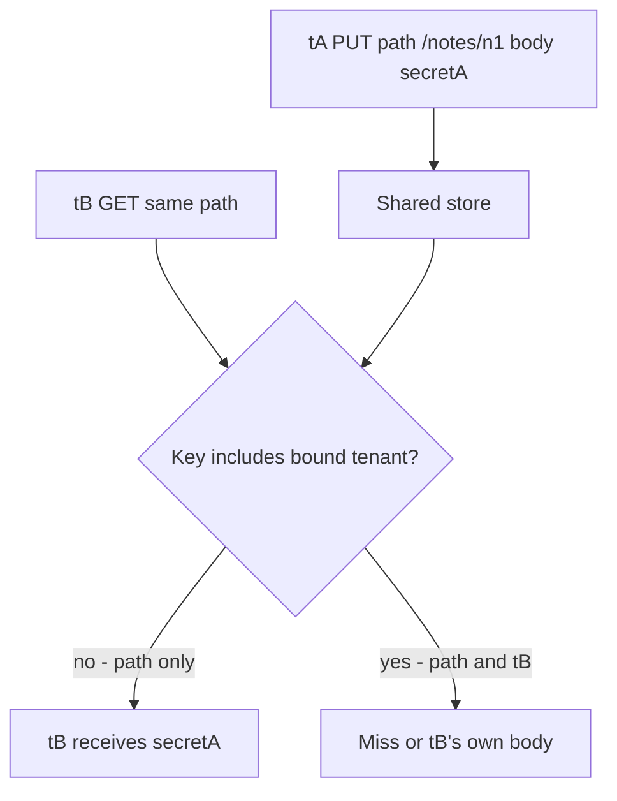

# 2.2-LO-01 — TLS authenticates a hop; the cache key decides who reads

**Kind:** concept-model
**Loop step:** 1 Property
**Standards:** Saltzer and Schroeder (1975, seminal), especially least common mechanism, complete mediation, and fail-safe defaults; IETF RFC 9110 HTTP Semantics (final) for cacheability and `Vary`; IETF RFC 9846 TLS 1.3 (final) for hop authenticity after termination; OWASP ASVS 5.0.0 (final) `v5.0.0-4.1.3`, `v5.0.0-12.2.1`, `v5.0.0-14.2.2`, and `v5.0.0-14.3.2`; `v5.0.0-14.2.5` is Level 3 web-cache-deception (labeled advanced, not the Phase 1 baseline).

## The claim this module owns

SecureCollab Phase 1 note bodies are tenant-bound. A shared CDN, reverse proxy, or in-process cache can still hand Tenant A’s body to Tenant B if the **key** is only the URL. HTTPS on the browser hop does not write that key.

> For a SecureCollab Phase 1 `GET /notes/n1`, a cache hit may return a note body only when the key includes the **bound** tenant from the 1.2 decision—not a client `Host`, `X-Tenant`, or `X-Forwarded-*` field. Tenant B must not receive Tenant A’s body for the same path. Missing or unknown tenant meaning is a miss (or deny), not a shared entry. TLS 1.3 on one hop is transport authenticity for that hop, not the cache-key property.

The forbidden outcome is **cross-tenant cache hit**: path-only key, Tenant A populated the entry, Tenant B’s later GET receives `tenant-A-note`. That is a 1.1 confidentiality failure caused by a **shared mechanism**, not by a missing login.

RFC 9846 specifies TLS 1.3. After the edge terminates TLS, later hops and stores see HTTP as the origin configured them. RFC 9110 says what may be cached and how `Vary` selects a representation. Neither RFC inserts `tenant_id` into your key.

## Mental model: hop authenticity is not object identity



ASVS `v5.0.0-12.2.1` wants TLS to the external-facing HTTP service. That is necessary and not sufficient. A neighbor on a corporate inspecting proxy, or Tenant B on the same CDN POP, never needed to break TLS to read a path-only entry.

**Mechanism (not the property):** “We enabled HTTPS,” Next.js `fetch` cache defaults, FastAPI `HTTPException`, Cloudflare / Fastly product names, or `Cache-Control: private` while the CDN is configured to cache anyway.

## Mental model: the key is the least common mechanism

Saltzer and Schroeder’s **least common mechanism** warns that a store shared by two tenants is a communication channel. A dict keyed only on `/notes/n1` *is* that channel.



The local lab’s vulnerable `cache_put` ignores the tenant argument when storing. Tenant B does not guess ids; they reuse the URL. `X-Forwarded-Host` is not required for the failure.

ASVS `v5.0.0-14.2.2` asks that sensitive data not sit in load-balancer or application caches, or that it be purged. `v5.0.0-14.3.2` is the **browser** anti-cache header (`Cache-Control: no-store`). They are different stores. A correct origin `no-store` does not fix a CDN that keys on path. A correct CDN tenant key does not fix a browser that cached a note body.

`v5.0.0-14.2.5` (Level 3) is web cache deception: unexpected content types and non-existent files. Label it advanced. This module’s oracle is tenant disagreement on the same path, not a public CDN poison.

## Bound tenant versus forwarded identity

ASVS `v5.0.0-4.1.3`: header fields set by an intermediary (`X-Forwarded-*`, `X-Real-IP`, `X-User-ID`) must not be overridable by the end user if the application uses them. The cache key must use the **same bound tenant** the 1.2 policy used—not a client-supplied label.

| Source | Use in the key? |
|---|---|
| Server-resolved membership tenant after 1.2 | Yes, if you cache at all |
| URL path `/notes/n1` | Necessary, never sufficient for notes |
| `Authorization` cookie bytes as `Vary: Cookie` | Fragile; cookies are not tenant ids; later 2.3 |
| Client `X-Tenant`, `Host`, `X-Forwarded-Host` | No |

Default for note bodies: **do not cache** (`private` / `no-store`) unless a reviewable key tuple exists. Caching is an availability/cost choice that must not enlarge confidentiality blast radius.

## Root cause vs impact vs prevention vs detection vs recovery

| Slice | For this property |
|---|---|
| Root cause | Shared cache keyed without the bound tenant |
| Preconditions | Shared store; path-only key; Tenant A populated the entry |
| Trigger | Tenant B `GET /notes/n1` in the TTL window |
| Impact | Confidentiality: cross-tenant read without guessing ids |
| Prevention | Key = (bound tenant, route, representation); default no-store for notes |
| Detection | Hit log with tenant mismatch; never log the body |
| Recovery | Purge the prefix; treat escaped bodies as a 1.1 incident |

## Framework defaults versus the origin guarantee

Next.js `fetch` cache and FastAPI defaults do not encode tenant. `Vary: Accept-Encoding` is a compression selector, not a tenant selector. Stale-while-revalidate can serve Tenant A to Tenant B if the key is still path-only. HTTP/2 push and URL normalization are later surfaces; they do not delete this sentence.

The application guarantee is: **this** fixture, `cache_get("/notes/n1", "tB")` after a Tenant A put, is not `tenant-A-note`. The oracle is `labs/2.2/2.2-request-path`. It is not a live CDN and not a public cache.

## Mechanism limits

- `Cache-Control: private` fails if the CDN is configured to cache anyway.
- TLS client certificates (`v5.0.0-12.1.3`) authenticate a hop; they are not a cache key.
- Encrypted Client Hello (`v5.0.0-12.1.5`, Level 3) hides SNI metadata; it does not bind tenant in a store.
- Operational error at the CDN remains: a later config can drop the tenant dimension. Record residual and a purge playbook.

## Practice

Write the key tuple for `/notes/n1` before you run tests. Name which field is the bound tenant and which fields are hostile. Then run the local pair:

```
python3 -m pytest labs/2.2/2.2-request-path/tests --impl vulnerable
python3 -m pytest labs/2.2/2.2-request-path/tests --impl fixed
```

The first command must fail. The second must pass. Map the assertion to path-only sharing, not to “TLS is off.”

## Transfer

A clinic caches `GET /patients/me`. Authenticated RSS or a CSV export rides the same CDN. Which hop still has TLS, and which store still needs the bound patient or tenant in the key?

## Non-goals

Live CDNs, poisoning a public cache, DNS hijacking labs, real patient charts, and “HTTPS means no cache bugs.” Gates 0–10 and milestones M0–M5 stay **not-attempted** without learner or product evidence. Answer keys are not in this file.
