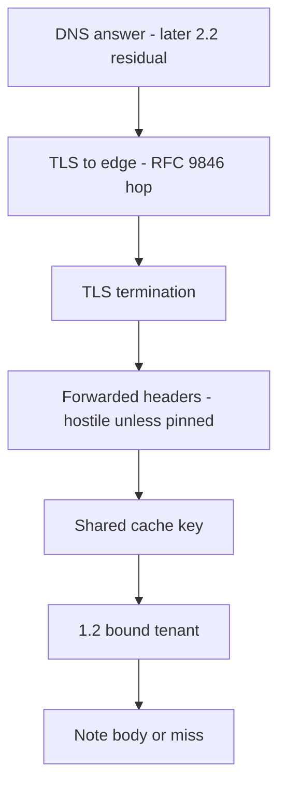

# 2.2-LO-02 — A request-path map a second engineer can key

**Kind:** design-exercise
**Loop step:** 2 Model
**Standards:** Saltzer and Schroeder (1975, seminal) least common mechanism; IETF RFC 9110 (final); IETF RFC 9846 TLS 1.3 (final); OWASP ASVS 5.0.0 (final) `v5.0.0-4.1.3`, `v5.0.0-14.2.2`, and `v5.0.0-14.3.2`.

## Can a second engineer name pytest cases from your map?

A boxes-and-arrows “browser → CDN → API” sketch is not this lesson. A request-path map names **where TLS ends**, **what the cache key contains**, and **which 1.2 tenant** that key is allowed to use.

SecureCollab Phase 1 freeze: tenants, notes, and a **local cache fixture**. No live CDN, no DNSSEC claim, no mTLS mesh, no HTTP/3 product.

## Mental model: every hop can change what is trusted

If the arrow from `Cache` to `Body` does not pass `Policy`, the map already predicts `test_other_tenant_does_not_receive_cached_body` will fail.

## Step 1: name principals, stores, and headers

| Piece | This system |
|---|---|
| Subjects | Tenant A member; Tenant B member; anonymous; ops purge role; cache node (greedy, not malicious in the lab) |
| Objects | Note body; cache entry; `Authorization` / session; `Host`; `X-Forwarded-*` |
| Actions | `cache_put`, `cache_get`, `purge-prefix`, `GET /notes/n1` |
| Channels | Browser TLS; HTTP after termination; in-process dict (lab stand-in for CDN POP) |
| TCB | Origin cache-key policy using the **bound** tenant; 1.2 decision that produced it |
| Untrusted | URL path alone; client `X-Tenant`; `Vary: Accept-Encoding` only; “HTTPS so it is private” |
| State / time | TTL window after Tenant A’s GET |
| 1.1 cell | Confidentiality via shared mechanism |

Open design: the client is hostile. The CDN is modeled as honest but greedy (it will cache what you let it). A later compromised POP is a residual, not this lab’s attacker.

## Step 2: write cells the lab can fail

| Subject | Object | Action | Decision |
|---|---|---|---|
| tA | `/notes/n1` | GET after own put | allow own body |
| tB | `/notes/n1` | GET after tA put | miss (`None`), never `tenant-A-note` |
| anon | `/notes/n1` | GET | deny at 1.2; must not become a public cache fill |
| ops | cache prefix | purge | allow; still 1.2-mediated in a real product |
| tB | client `X-Tenant: tA` | influence key | deny: not a key input |

A missing anonymous cell is how `Cache-Control: public` on `/notes/{id}` appears. Write the hole.

## Step 3: two caches, two headers

| Store | RFC / ASVS hook | Phase 1 treatment |
|---|---|---|
| Shared edge / app cache | RFC 9110 cacheability; `v5.0.0-14.2.2` | Lab: tenant in key or do not store |
| Browser cache | `v5.0.0-14.3.2` `no-store` | Deferred UI; still name it so “private” is not confused with CDN |
| Forwarded identity | `v5.0.0-4.1.3` | Not a key; origin must ignore client overrides |

## Practice

Draw the map so a second engineer could name pytest cases without opening the keys file. Point at `labs/2.2/2.2-request-path` file `cache.py`. Label path-only versus `(path, bound_tenant)`.

## Transfer

Authenticated RSS or a CSV export via CDN. Add a hop that sets `X-Forwarded-Proto`. The app still must not treat that header as the TLS property.

## Residual risk

Operational error at the CDN remains: a config change can drop the tenant dimension. Monitor and keep a purge playbook.

## Non-goals

Top 10 items as the definition of security. Keys stay out of lessons.
