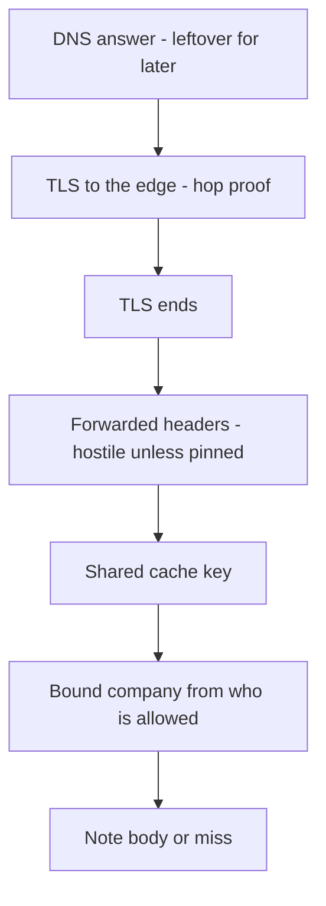

# A request-path map someone else can key

**Kind:** design-exercise
**Loop step:** 2 Model

## Could someone else name the checks from your map?

Keep **where TLS ends**, **what the cache key contains**, and **which bound company** that key is allowed to use; A boxes-and-arrows “browser → CDN → API” sketch is not that list.

Companies, notes, and a **local cache practice**. No live CDN, no DNSSEC claim, no mTLS mesh, no HTTP/3 product.

## Picture: every hop can change what is trusted

If the arrow from `Cache` to `Body` does not pass `Policy`, the map already predicts `test_other_tenant_does_not_receive_cached_body` will fail.

## Step 1: name people, stores, and headers

| Piece | This system |
|---|---|
| Who | Company A member; company B member; anonymous; ops purge role; cache node (greedy, not malicious in the practice) |
| What | Note body; cache entry; `Authorization` / session; `Host`; `X-Forwarded-*` |
| Actions | `cache_put`, `cache_get`, `purge-prefix`, `GET /notes/n1` |
| Paths | Browser TLS; HTTP after TLS ends; in-process dict (stand-in for a CDN node) |
| What you trust | Origin cache-key policy using the **bound** company; the who-is-allowed check that produced it |
| What you do not trust | URL path alone; client `X-Tenant`; `Vary: Accept-Encoding` only; “HTTPS so it is private” |
| Time | The window after company A’s GET while the entry is still live |
| Secrecy cell | Note bodies staying unreadable across companies via a shared store |

Open design: the client is hostile. The CDN is modeled as honest but greedy (it will cache what you let it). A later compromised node is leftover risk, not this practice’s attacker.

## Step 2: write cells the practice can fail

| Who | What | Action | Decision |
|---|---|---|---|
| Company A | `/notes/n1` | GET after own put | allow own body |
| Company B | `/notes/n1` | GET after company A put | miss (`None`), never `tenant-A-note` |
| Anonymous | `/notes/n1` | GET | deny at who-is-allowed; must not become a public cache fill |
| Ops | cache prefix | purge | allow; still who-is-allowed in a real product |
| Company B | client `X-Tenant: tA` | influence key | deny: not a key input |

A missing anonymous cell is how `Cache-Control: public` on `/notes/{id}` appears. Write the hole.

## Step 3: two caches, two headers

| Store | What the rules talk about | This week |
|---|---|---|
| Shared edge / app cache | HTTP cacheability; `Vary` as a selector | Practice: company in the key, or do not store |
| Browser cache | `no-store` | Later UI; still name it so “private” is not confused with CDN |
| Forwarded identity | Proxy headers the client can set | Not a key; origin must ignore client overrides |

`Vary` is how HTTP picks a representation. Putting the company in the key is how *you* keep company A’s body from company B. `Vary: Accept-Encoding` is compression. It is not a company selector.

## Practice

Look at `cache.py` under `labs/2.2/2.2-request-path`. Label path-only versus `(path, bound company)`.

## Use it somewhere new

Authenticated RSS or a CSV export via CDN. Add a hop that sets `X-Forwarded-Proto`. The app still must not treat that header as the TLS property.

## What can still go wrong

An operator can still drop the company dimension at the CDN. Watch it and keep a purge playbook.

## What this page is not doing

Answer keys are not on this site.
