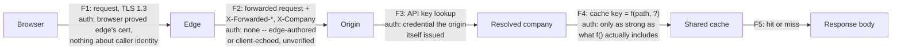

# Annotate every hop with what it authenticated, not what it encrypted

**Kind:** design-exercise
**Loop step:** 2 Model

## Encrypted is not the same claim as authenticated

A request-path diagram that draws one padlock on the arrow between the browser and the edge, and calls the whole path "secure," has answered a question nobody asked. Encryption on a hop tells you a third party watching the wire cannot read or alter the bytes in transit. It does not tell you which name the far end proved it controlled, whether a later hop repeated that proof, or whether the value your application reads out of a header actually came from a step that checked anything. `2.2 A hop's certificate is not a company; a cache key is not a header` derived two decisions — who resolved the company, and what the cache key contains — that a diagram has to make checkable, not decorative. This page builds that diagram for SecureCollab's Phase 2 skeleton: browser, DNS name, TLS to the edge, the edge's forwarded headers, the origin's company resolution, the shared cache, and the origin's own store.

The discipline this page borrows from [1.3 Trust boundaries and attack surface](../../../1/1.3/lessons/01-property.md) is to ask, at every arrow, what changed in what the receiving side may assume — not whether the arrow crossed a network. A TLS handshake between the browser and the edge is a real boundary for one question (did an eavesdropper read this?) and answers nothing about a second question (does the edge's own request to the origin carry a header the origin should trust?). Treating "TLS happened somewhere on this path" as a single fact that answers every downstream question is exactly the error this page's table exists to stop.

## Step 1: name every hop and what it proves

| Hop | What actually happens | What is authenticated here | What is *not* authenticated here |
|---|---|---|---|
| Browser → DNS | Browser resolves `securecollab.example` to an address | Nothing about identity; a name resolution is a lookup, not a proof | Whether the answer came from the real authoritative server. This fixture never performs a real DNS resolution and never will, by this course's own laboratory policy against live-network work, so DNSSEC-style answer authenticity stays an explicitly named open question rather than a silently assumed one |
| Browser → edge | TLS 1.3 handshake; edge presents a certificate for `securecollab.example` | The edge holds a private key matching a certificate a trusted CA issued for that hostname | Which company the browser's user belongs to; the edge has not yet looked at any application-level credential |
| Edge → origin | Edge terminates TLS and forwards an HTTP request, adding `X-Forwarded-*` headers | Whatever the edge's own deployment configuration is trusted to add correctly (out of this fixture's scope) | That any header value the edge adds, or passes through from the client unmodified, is safe for the origin to read as identity |
| Origin: company resolution | Origin looks up the caller's API key against its own table | The caller holds a credential the origin itself issued | Any `X-Company`, `X-Tenant`, or `Host` value the request carries — these are read, if at all, only as untrusted hints |
| Origin: cache lookup | Origin checks a shared cache keyed by some function of the request | Whatever the key actually encodes — nothing more | Company boundedness, unless the key was built from the resolved company, not the path |

Each row is a distinct claim. A diagram that merges "Browser → edge" and "Origin: company resolution" into one lock icon has erased the row that this module's C2 claim lives in.

## Step 2: draw the flow with authority annotations



Flow `F2` is the one a diagram most often draws as if it were still `F1` — same padlock, same "it's TLS so it's fine" caption — when in fact nothing about `F2` is authenticated at all; it is exactly the header channel `C2` names as untrustworthy. Flow `F4` is where `C1` lives: the annotation forces the question "what does `f()` actually include?" instead of leaving the cache as an unlabeled box.

## Step 3: what the model must be able to answer

A model built from Steps 1 and 2 should let a reviewer answer, without re-deriving anything: which flow could an attacker influence directly (F2, by setting a header), which flow depends on a value only the origin can produce (F3), and which flow's security depends entirely on a design choice not yet visible in any single line of code (F4, the cache key's actual composition). If a reviewer cannot answer these three questions from the diagram alone, the diagram has drawn topology without drawing authority, which is decoration.

This model is also the artifact a later revision has to update rather than redraw from nothing. SecureCollab's request path grows across the course: an account system adds a login step before F3, a database replaces the in-memory store behind F4, and a real CDN eventually sits where the edge box is today. Each of those changes invalidates specific rows in Step 1's table without invalidating all of them, and the whole point of naming rows instead of drawing one undifferentiated box is that a later change can be checked against exactly the row it touches. A design note that says "the request path is secure" cannot be revisited this way, because there is no row to re-examine — only a claim to either keep believing or abandon wholesale.

## Rejected shapes for this diagram

A model that draws **one shield icon covering the whole path** is rejected: it cannot distinguish F1 from F2, so it cannot show why C2 is a real defect — the shield implies every hop is equally proven, which flow F2's own row already contradicts.

A model that labels the cache simply **"CDN (secure)"** is rejected: "secure" names a vendor's marketing claim, not the key's actual composition, and cannot support the question Step 3 asks about F4.

A model that omits the DNS hop entirely on the grounds that "this fixture doesn't touch DNS" is close, but the right move is to keep the row and mark it explicitly out of scope (as Step 1's table does), not to delete it — deleting it would silently claim DNS name authenticity was never a question, when it is one this module's invariant prompts name directly and defer rather than answer.

## Worked example: re-deriving F2's annotation from the fixture

```python
# labs/2.2/2.2-request-path/vulnerable/app.py
x_company: str | None = Header(default=None, alias="X-Company")
...
company = _resolve_company(api_key, x_company)
```

FastAPI's `Header(...)` extracts whatever string a caller sent for `X-Company`; nothing in that extraction step checks who set it or whether an edge added it, forwarded a client-supplied value unchanged, or the field is entirely absent. The annotation on flow `F2` — "unverified, edge-authored or client-echoed" — is not a stylistic caption; it is a direct restatement of what `Header(default=None, alias="X-Company")` actually does, which is nothing more than read a string.

## Use it somewhere new

Add a reverse proxy that also sets `X-Forwarded-Proto` ahead of the existing edge. Redraw Step 2's diagram: a new flow appears between the proxy and the edge, and it needs its own authentication annotation — "none" is still the honest answer unless the origin's deployment can name a specific mechanism that pins which proxy is allowed to set that header at all.

## What this page is not doing

This model does not claim production networking, a real DNSSEC chain, or a deployed mTLS mesh; it is a design artifact built from the same fixture `01-property.md` uses. Do not use live targets to validate it. Answer keys are not on this site.
