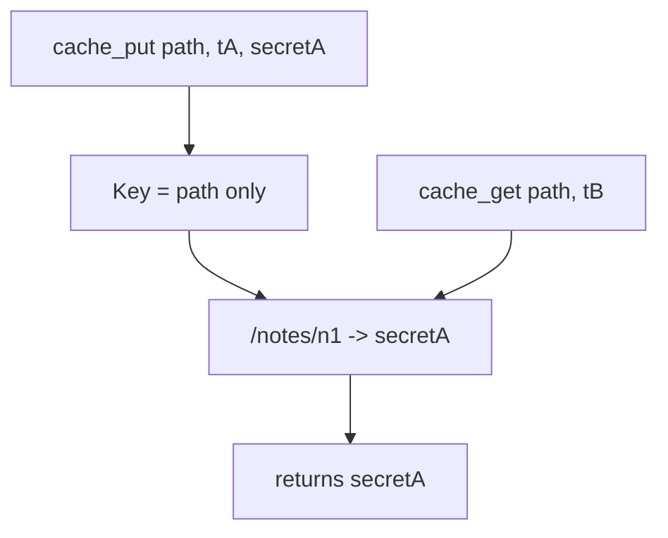

# 2.2-LO-03 — Observe the path-only key, do not trophy it

**Kind:** mechanism-lab
**Loop step:** 3 Break
**Standards:** Saltzer and Schroeder (1975, seminal) least common mechanism; IETF RFC 9110 (final); IETF RFC 9846 TLS 1.3 (final).

## Authorized scope

`labs/2.2/2.2-request-path` only. Do not target other hosts, public CDNs, or third-party sites. Do not paste cache-poison payloads.

**Forbidden outcome:** shared cache returns Tenant A’s body to Tenant B.

## Mental model: the tenant argument is ignored on store



The vulnerable tree demonstrates **cause** (shared store, incomplete key), not a trophy exploit. Preconditions: shared dict; path-only key; Tenant A populated the entry. Attacker capability: a Tenant B principal who can `cache_get` the same path after Tenant A’s put—no DNS hijack, no TLS break. Trust assumption: the origin’s 1.2-bound tenant is the only identity allowed in the key. TLS is not even in the fixture—on purpose. If the property needed TLS to be “off,” the lab would be teaching the wrong sentence.

## What to read in the fixture

`vulnerable/cache.py` accepts a `tenant` argument on put and get, then stores and looks up **only** `path`. Tenant B’s get returns Tenant A’s body. `X-Forwarded-Host` is not required.

Tests already bind:

- `test_same_tenant_cache_hit` — Tenant A still reads Tenant A.
- `test_other_tenant_does_not_receive_cached_body` — Tenant B must not receive `tenant-A-note` (must be `None`).

## Root cause vs impact

| Slice | Lab |
|---|---|
| Root cause | Key omitted the bound tenant; shared store |
| Preconditions | Path-only key; tA populated the entry |
| Impact | Cross-tenant read without guessing ids |
| Not the lesson | A scanner name, CWE mnemonic, or “TLS is broken” |
| Prevention | Key `(path, bound tenant)` or refuse to cache note bodies |
| Detection | Hit with mismatched tenant id; never log the body |
| Recovery | Purge the prefix; 1.1 incident if bodies already escaped |

## Framework defaults versus the cache guarantee

Next.js `fetch` cache, FastAPI in-process dicts, and a CDN “HTTPS only” checkbox do not insert `tenant_id`. RFC 9846 authenticates a hop. RFC 9110 says what *may* be cached. Neither writes your key.

## Practice

Run tests against `vulnerable/` (they **must fail** on the forbidden outcome). Record the test name `test_other_tenant_does_not_receive_cached_body`.

```
python3 -m pytest labs/2.2/2.2-request-path/tests --impl vulnerable
```

Do not “fix” the test to pass. The failure *is* the evidence that the property is currently false.

## Transfer

Authenticated RSS or export CSV via CDN. Predict a disagreement without running anything outside this directory.

## Non-goals

No live-target instructions. Synthetic data only.
