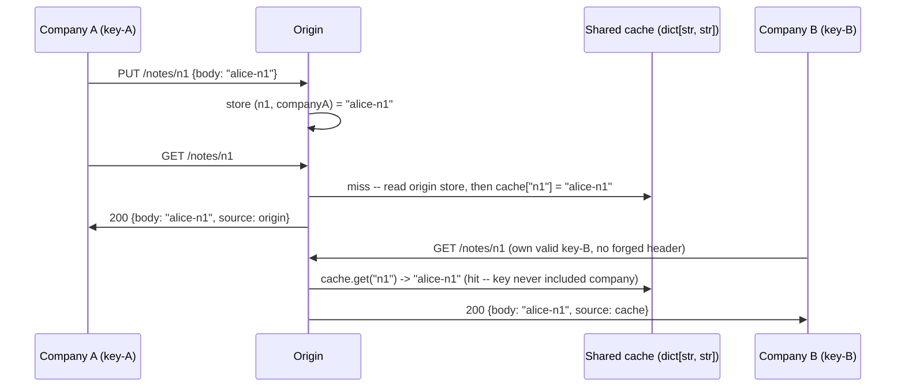
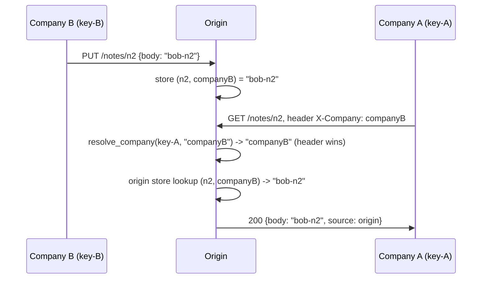

# Local fixture: a shared cache and a forwarded header both grant the wrong company

**Kind:** mechanism-lab
**Loop step:** 3 Break

## Two ways to reach the same wrong answer

`01-property.md` derived two decisions the origin has to get right, and `02-model.md` gave each one a row and a flow id. This page reproduces both failures in the local fixture, so the claims stop being sentences you take on trust and become a request you can trace yourself. Run this only inside `labs/2.2/2.2-request-path/`; the fixture is a real FastAPI application, exercised through `fastapi.testclient.TestClient`, not a live service — no traffic ever leaves this process, and every company, API key, and note body in it is synthetic.

The property under test, stated once so the two traces below both point back to it: a caller may read a note's body only when the company bound to that caller's own credential matches the company the note was stored under, and a cached response must not weaken that match. Two independent bugs in `vulnerable/app.py` each violate this on their own, without needing the other bug's help.

## Trace one: the cache doesn't know whose slot it filled



Five messages, one property failure at the last hit. Company B never guessed an id, never sent a forged header, and never touched company A's credential. Company B's own, entirely legitimate request for a path company A had already caused to be cached is enough, because `_CACHE` in `vulnerable/app.py` is a plain `dict[str, str]` keyed on `note_id` alone — the same object flow `F4` in `02-model.md` warned would happen if the key's actual composition were never checked.

## Trace two: a header outruns a credential



Four messages, and the note was never cached at all before this exchange — the cache is not involved in this trace, which is the point. Company A's caller holds only `key-A`, a real credential bound to `companyA`, and never obtains any credential for `companyB`. The forwarded `X-Company` header is enough on its own, because `_resolve_company` in `vulnerable/app.py` returns the header's value whenever one is present, ahead of the value the credential actually resolves to. TLS securing the connection between this caller and the origin — which this fixture does not model at all, on purpose — would not have closed this gap, because the header rides inside the encrypted connection exactly as written.

## Where to look, not what to hunt

Read `vulnerable/app.py` as a design note, the way `01-property.md`'s worked example did: `_resolve_company` accepts `x_company` as a parameter and returns it directly when it is truthy, before ever consulting `API_KEYS[api_key]`. `_CACHE` is declared as `dict[str, str]`, and both `get_note`'s read and its cache-fill line index it by `note_id` alone. Neither defect is a typo or an edge case a fuzzer would need to find; each is the direct, intended behavior of one function reading one variable in the wrong order, and each would look entirely reasonable to a reviewer skimming for syntax errors rather than tracing what each function actually returns for a specific, adversarially chosen input.

The checks already bind these two traces to names:

- `test_other_company_does_not_receive_cached_body` — must fail on `vulnerable`, matching trace one.
- `test_forwarded_company_header_cannot_grant_a_different_companys_note` — must fail on `vulnerable`, matching trace two.

## The two bugs do not need each other

It is worth tracing explicitly why these are two bugs and not one. Trace one never sends a forged header at all — company B's request is entirely honest about who it is, and the failure happens purely inside the cache. Trace two never touches the cache — the note it asks for has never been read before, so there is no cached entry for the lookup to hit, and the failure happens purely inside company resolution. A fix that repairs only one function therefore leaves the other trace exploitable exactly as before, because nothing about closing the header channel changes what the cache key contains, and nothing about keying the cache by company changes what `_resolve_company` reads. `labs/2.2/2.2-request-path/tests/test_cache_key.py`'s two anti-fake tests exist specifically to catch a repair that closes one function while leaving the other open — each uses a company pair and note id that neither forbidden-outcome test above ever writes, so a fix that only special-cased the literal values `n1`/`n2`/`companyA`/`companyB` cannot pass by memorizing them either.

## Why this is not "TLS is broken"

Both traces above deliberately never mention a certificate, a cipher suite, or a handshake, because neither bug is a transport-layer failure. A learner who reaches for "enable TLS everywhere" or "rotate the certificate" as a response to either trace has misdiagnosed the failure the same way `01-property.md`'s rejected alternatives warned about: the connection between every party in both sequence diagrams could use a perfectly valid TLS 1.3 handshake at every hop, and both traces would still end in the wrong body reaching the wrong company, because the defect sits in application logic that runs *after* TLS has already done its job correctly.

## Practice

Run the vulnerable variant and confirm both named tests fail for the reason traced above, not for an unrelated error:

```bash
python3 -m pytest labs/2.2/2.2-request-path/tests --impl vulnerable
```

For each failing test, write one sentence naming which trace above it matches and which line in `vulnerable/app.py` is the exact cause. Do not "fix" a test to make it pass — a passing `vulnerable` run means the tests stopped asserting the property, not that the property held.

## Use it somewhere new

An authenticated CSV export behind the same kind of edge invites the identical two traces: a shared cache keyed on the export's path alone, and an `X-Company` header a caller could set on the export request just as easily as on a note request. Predict which of the two sequence diagrams above applies before you would need to run anything.

## What this page is not doing

No live-target steps, no real company or user data, and no cache-poisoning payloads aimed at any system outside this directory. Do not "fix" either trace by deleting or loosening its test. Answer keys are not on this site.
