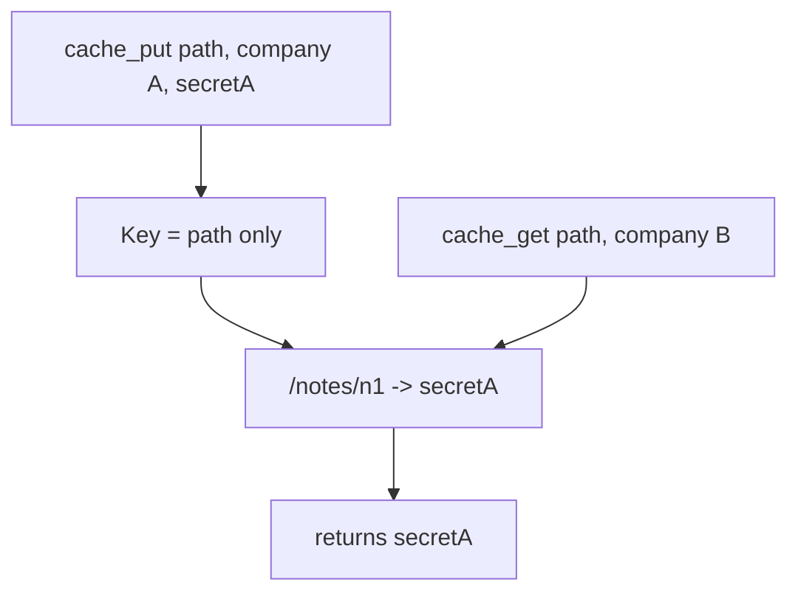

# Practice: a shared cache hands company A’s note to company B

**Kind:** mechanism-lab
**Loop step:** 3 Break

## Try it

The practice is not a website you attack. It is a tiny Python model of a shared cache. The failure is already in the object: the store keys only on path. That object is a **failed rule**, not a performance nit.

The rule:

> A cache hit may return a note body only when the key includes the company the notes app already bound you to. Company B must not receive company A’s body for the same path.

## Where you may practice

Only `labs/2.2/2.2-request-path/` is in scope. No live CDN, no public cache, no third-party site, no classmate deployment. Restore the broken and repaired folders from git when you are done. Fake data only.

Do not paste this exercise onto a public CDN, employer origin, or live clinic portal. Do not paste cache-poison payloads.

## Picture: the company argument is ignored on store



The broken files show **cause** (shared store, incomplete key), not a trophy exploit. What has to be true first: shared dict; path-only key; company A filled the entry. What the attacker can do: a company B person who can `cache_get` the same path after company A’s put — no DNS hijack, no TLS break. What is supposed to stop this: the origin’s bound company is the only identity allowed in the key. TLS is not even in the practice files — on purpose. If the rule needed TLS to be “off,” the practice would be teaching the wrong sentence.

## What to look at: the cause, not a trophy

Read `vulnerable/cache.py` in the broken files as a design note. It accepts a `tenant` argument on put and get, then stores and looks up **only** `path`. Company B’s get returns company A’s body. `X-Forwarded-Host` is not required.

Checks already bind:

- `test_same_tenant_cache_hit` — company A still reads company A.
- `test_other_tenant_does_not_receive_cached_body` — company B must not receive `tenant-A-note` (must be `None`).

## Why it happens vs what it costs

| Slice | Practice |
|---|---|
| Why it happens | Key omitted the bound company; shared store |
| What has to be true first | Path-only key; company A filled the entry |
| Trigger | Company B `cache_get` of the same path |
| What it costs | Cross-company read without guessing ids |
| Not the lesson | A scanner name, a famous-bugs code, or “TLS is broken” |
| How you stop it | Key `(path, bound company)` or refuse to cache note bodies |
| How you notice later | Hit with mismatched company id; never log the body |
| How you recover | Purge the prefix; secrecy incident if bodies already escaped |

## What the framework does vs what you still have to check

Next.js `fetch` cache, FastAPI in-process dicts, and a CDN “HTTPS only” checkbox do not insert the company. TLS 1.3 proves a hop. HTTP rules say what *may* be cached. Neither writes your key. `Vary` is a selector you configure; it is not a gift of the URL.

## Practice

Run checks against the broken files (they **must fail** on company B getting company A’s body). Record the check name `test_other_tenant_does_not_receive_cached_body`.

```text
python3 -m pytest labs/2.2/2.2-request-path/tests --impl vulnerable
```

Do not “fix” the check to pass. The failure *is* the evidence that the rule is currently false.

## Use it somewhere new

Authenticated RSS or export CSV via CDN. Predict a disagreement without running anything outside this directory.

## What this page is not doing

No live-target steps. No real people’s data. Do not “fix” the practice by deleting the check.
