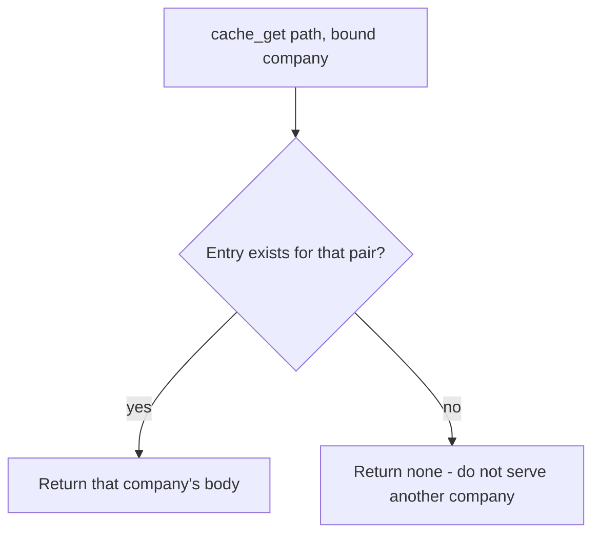

# Put the company in the key, or do not store

**Kind:** design-exercise
**Loop step:** 4 Build

## The rule

Dropping last week’s CDN header name does not pin the cache key. Hiding a scanner warning does not pin it. A “compliant CDN” badge is not enough.

Repair this: `cache_get` may return a body only when the lookup uses the same **bound company** as `cache_put`. The store actually partitions by that company — not `Cache-Control` theater, not a scanner suppression. You do not restore secrecy by turning TLS ciphers up.

## Picture: miss is fail-safe



The repaired files key `(path, tenant)`. Production may instead **refuse to cache** note bodies (`no-store`). Both restore secrecy. Serving company A because “the path matched” is not fail-safe.

Company in the key must be the company the who-is-allowed check already resolved, not `Host` or `X-Forwarded-*` from the client.

Do not accept `Cache-Control: private` as membership in the key. Next.js `fetch` cache defaults do not encode company. A CDN that keys on path will still serve company A’s note to company B. `Vary: Cookie` is not a company id. `cache_get("/notes/n1", "tB")` after a company A put is `None`.

Cached sensitive data has to stay isolated. This check covers path-only keys.

## What the repaired files must show

Do not treat `fixed/cache.py` as a production CDN.

| After the fix | Must be true |
|---|---|
| Company A put then company A get | body is `tenant-A-note` |
| Company A put then company B get | `None`, never `tenant-A-note` |
| Anonymous fill | not in this practice; still deny at who-is-allowed |

Fail closed: if the bound company is missing or unknown, do not share the slot. Uncertainty is a **miss**, not a yes because the path looked familiar.

## What this is not

- Next.js `fetch` cache defaults. They do not encode company.
- `Cache-Control: private` while your CDN is set to cache anyway.
- `Vary: Cookie` as a company id. That is a later cookies-and-sessions fight.
- More TLS ciphers. TLS still proves a hop, not who may read a cached body.

## Practice

Name who, what, action, and the check that must be true after the fix. Run:

```text
python3 -m pytest labs/2.2/2.2-request-path/tests --impl fixed
```

## Use it somewhere new

Authenticated RSS or export CSV via CDN. The fix is still “bound identity in the key, or do not store,” not “more TLS ciphers.”

## What can still go wrong

An operator can still drop the company dimension at the CDN. Keep a purge playbook. This practice is not a live edge config.
