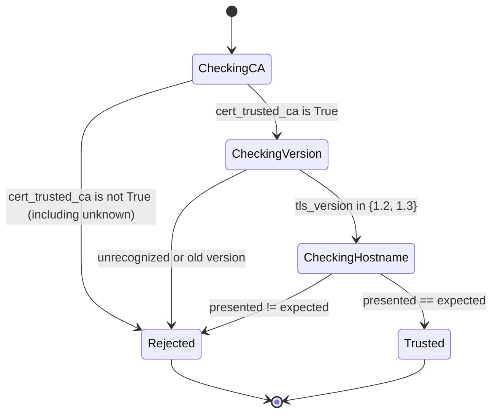

# Bind the cache key, ignore the header, check the whole certificate

**Kind:** design-exercise
**Loop step:** 4 Build

## Three repairs, and why each has to be structural

`03-break.md` traced two independent bugs to two specific lines: `_resolve_company` reading a header before a credential, and `_CACHE` keyed on `note_id` alone. This page derives the smallest change that removes each cause, plus a third repair — the hop-authentication check `01-property.md`'s counterexample named — that this module also builds, because a certificate check that only asks "did some CA sign this?" fails the identical shape of mistake: stopping at partial evidence and calling it proof.

A repair counts as **structural** here in a specific sense: after it, no execution path through the function can produce the forbidden outcome, for any input, rather than merely for the inputs a test happens to try. `fixed/app.py`'s `_resolve_company` does not add a check that rejects `X-Company: companyB` specifically; it removes the branch that reads `x_company` at all, so there is no longer a code path that returns a header value under any name that header might carry.

```python
# fixed/app.py
def _resolve_company(api_key, x_company):
    # x_company stays in the signature so both variants keep an
    # identical call shape, but no branch here ever reads it.
    if api_key not in API_KEYS:
        return None
    return API_KEYS[api_key]
```

The cache repair is the same shape of change applied to a different value: the key itself grows a field, rather than gaining a check that runs before the lookup.

```python
# fixed/app.py
_CACHE: dict[tuple[str, str], str] = {}   # was dict[str, str]

def get_note(note_id, api_key, x_company):
    company = _resolve_company(api_key, x_company)
    cached = _CACHE.get((note_id, company))   # was _CACHE.get(note_id)
    ...
```

A `dict[tuple[str, str], str]` cannot answer a lookup for `(note_id, companyB)` with a value that was only ever stored under `(note_id, companyA)` — the two keys are unequal as Python tuples, so there is no code path, no configuration flag, and no future caller that can make one satisfy the other. Compare this with a plausible but wrong repair: adding an `if company == "companyA" and note_id == "n1": deny` check ahead of the existing path-only lookup. That check would make `03-break.md`'s exact trace pass, because it special-cases the literal values that one trace happened to use, while leaving every other company pair exploitable through the same unmodified `dict[str, str]`. This is precisely the shape `labs/2.2/2.2-request-path/tests/test_cache_key.py`'s anti-fake tests are built to catch, using company and note-id values that never appear anywhere else in the file.

## The third repair: a certificate check needs all three facts at once

`01-property.md` named the counterexample: a certificate that validly chains to a trusted CA can still be the wrong certificate, if nobody compared its hostname to the hostname the hop meant to reach. The vulnerable version of this check, `cert_trusted_ca is True`, is a single boolean read — it cannot distinguish "the right peer" from "some peer with a valid certificate," because it never looks at the two other facts the property actually depends on.

```python
# fixed/app.py
_ACCEPTED_TLS_VERSIONS = {"1.2", "1.3"}

def hop_is_trustworthy(expected_hostname, presented_hostname, cert_trusted_ca, tls_version):
    if cert_trusted_ca is not True:
        return False
    if tls_version not in _ACCEPTED_TLS_VERSIONS:
        return False
    return presented_hostname == expected_hostname
```

Three conditions, each independently necessary and jointly sufficient, matching ASVS `v5.0.0-12.3.2` (a TLS client validates the certificate it receives) and `v5.0.0-12.1.1` (only currently recommended versions). `presented_hostname == expected_hostname` is exact string equality on purpose: a hostname comparison written as `presented_hostname.startswith(expected_hostname)` or `expected_hostname in presented_hostname` would both let an attacker-chosen hostname that merely contains or extends the real one pass the check — `notes-origin.securecollab.internal.attacker.example` starts with the real hostname, and `evil-origin.internal-mirror.example` contains `origin.internal` as a substring without being equal to it. Two of `labs/2.2/2.2-request-path/tests/test_tls_hop.py`'s tests exist to catch exactly these two plausible near-misses.

## Picture: the hop check as a state machine



Every state but `Trusted` reaches `Rejected`, including the state most repairs forget: an unknown trust value (`None`, not `False`) must not be read as "we haven't decided yet, so allow it" — it must fail exactly like an explicit `False`, because "we could not verify this" and "we verified this and it failed" are the same answer for a security decision, even though they are different answers for a debugging session. A checker that defaults an unrecognized trust state to `True` "to avoid breaking things while the certificate pipeline is flaky" has silently converted every future infrastructure outage into an authentication bypass, which is a strictly worse failure mode than the outage it was written to tolerate.

## Rejected repairs

**"Add a comment noting that TLS is required in production"** is rejected: a comment changes no code path, so it removes nothing the anti-fake tests would need to catch, and every one of the three defects above would still execute identically with the comment present.

**"Turn up the CDN's TLS cipher settings"** is rejected for the identical reason `01-property.md` rejected it: cipher strength is a property of the encryption on one hop, not of the cache key's composition or the header-resolution function's branch order, so tightening it changes none of the three functions this page repairs.

**"Raise the hostname check's threshold to require a fully-qualified match"** — meaning some rewritten version of a prefix or substring comparison, tuned to reject the one adversarial example a test happened to try — is rejected for the same reason a raised-but-not-removed threshold is rejected everywhere else in this course: tuning a comparison's strictness still leaves a comparison of the wrong shape in place, and a different attacker-chosen hostname, engineered against whatever specific threshold was chosen, will eventually satisfy it. Exact equality has no threshold to tune around, because there is no comparison left that admits a near miss at any distance.

## Practice

Confirm the fixed variant passes every test named in `spec.md`'s coverage-contract table, and name, for each of the three repairs above, the single line whose removal would reopen exactly one forbidden outcome:

```bash
python3 -m pytest labs/2.2/2.2-request-path/tests --impl fixed
```

## Use it somewhere new

The same three repair shapes apply to an authenticated CSV export behind a CDN: resolve the exporting company only from a credential, key any cached export by that company, and check a certificate presented by an upstream export service on all three facts together, not on CA trust alone.

## What this page is not doing

This page does not claim a production TLS stack, a deployed CDN configuration, or a real certificate authority; every repair above is verified only against the local fixture. Answer keys are not on this site.
