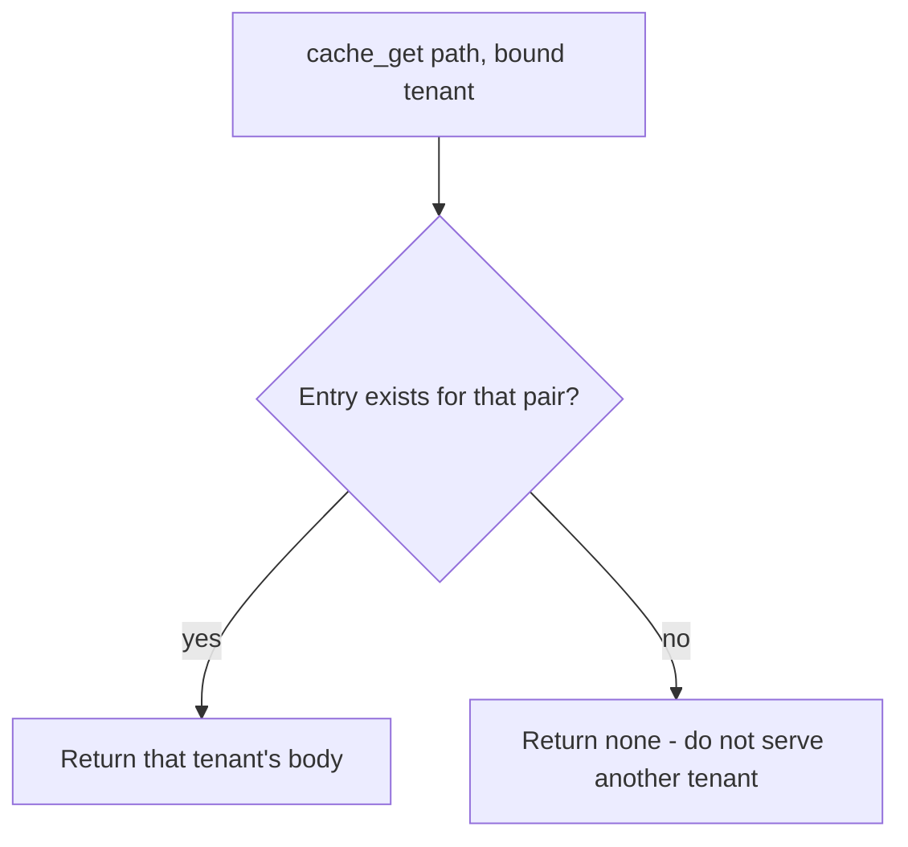

# 2.2-LO-04 — Put the bound tenant in the key, or do not store

**Kind:** design-exercise
**Loop step:** 4 Build
**Standards:** Saltzer and Schroeder (1975, seminal) fail-safe defaults; IETF RFC 9110 (final); OWASP ASVS 5.0.0 (final) `v5.0.0-14.2.2` and `v5.0.0-4.1.3`.

## Structural means the lookup is tenant-bound

`cache_get` may return a body only when the lookup uses the same **bound** tenant as `cache_put`. Structural means the store actually partitions by that tenant—not `Cache-Control` theater, not a scanner suppression, not “the CDN is PCI compliant.”

## Mental model: miss is fail-safe



The lab’s fixed tree keys `(path, tenant)`. Production may instead **refuse to cache** note bodies (`no-store`). Both restore the confidentiality cell. Serving Tenant A because “the path matched” is not fail-safe.

Tenant in the key must be the 1.2-resolved tenant, not `Host` or `X-Forwarded-*` from the client (`v5.0.0-4.1.3`).

## Why this restores the cell

| After the fix | Must be true |
|---|---|
| tA put then tA get | body is `tenant-A-note` |
| tA put then tB get | `None`, never `tenant-A-note` |
| Anonymous fill | not in this lab; still deny at policy |

## What this is not

Next.js `fetch` cache defaults do not encode tenant. `Cache-Control: private` still fails if your CDN is configured to cache anyway. `Vary: Cookie` is not a tenant id and is a later 2.3 fight.

## Practice

Name subject, object, action, and the predicate that must be true after the fix. Run `--impl fixed` (must pass):

```
python3 -m pytest labs/2.2/2.2-request-path/tests --impl fixed
```

## Transfer

Authenticated RSS or export CSV via CDN. The fix is still “bound identity in the key, or do not store,” not “more TLS ciphers.”

## Residual risk

Operational error at the CDN remains; a config can drop the tenant dimension. Keep a purge playbook.
