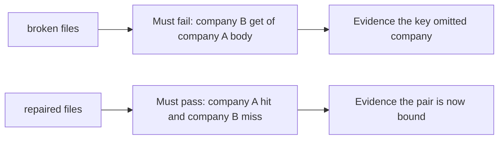

# A broken cache must fail the check

**Kind:** verification-lab
**Loop step:** 5 Verify

## Check it

On the happy path, HTTP 200 over HTTPS is not evidence. The check must be **false** on the broken files and **true** on the repaired files.

## Picture: a broken cache must fail the check

A check that only asserts HTTPS can still look green while the key remains path-only.



If both pass, you are not looking at the cross-company get.

## What the check has to show

| Mode | Must show for this topic |
|---|---|
| Normal | After company A put, company A get returns `tenant-A-note` |
| Wrong input / abuse | After company A put, company B get is not `tenant-A-note` and is `None` |
| When things break | Unknown company does not share the slot |
| Not claimed | Live CDN `Vary`; browser `no-store`; DNS authenticity |

The checks are `test_same_tenant_cache_hit` and `test_other_tenant_does_not_receive_cached_body`. They observe bodies, not HTTP 200. That check is there so a company B get of `tenant-A-note` does not pass as a cache hit.

Map each check to a rule from the request-path map. Do not paste keys. If the broken files do not fail the cross-company get, the practice files are miswired — fix the wiring, not the assertion.

TLS 1.3 on the browser hop is not this check. A check that only asserts HTTPS is a tool observation.

## What the checks do not prove

- Live CDN `Vary` behavior
- Browser `no-store`
- Forwarded-header pinning in FastAPI
- DNS authenticity

Record those as leftover or later work, not as silent passes.

## Practice

```text
python3 -m pytest labs/2.2/2.2-request-path/tests --impl vulnerable
python3 -m pytest labs/2.2/2.2-request-path/tests --impl fixed
```

Reject a “check” that only greps `Cache-Control` without calling `cache_get` as company B. 

## Use it somewhere new

Authenticated RSS or export CSV via CDN. A check that only asserts status 200 on `/export` is not cache-key evidence. A check against a live CDN is out of scope.

## What this page is not doing

Do not add live traffic. Do not log `tenant-A-note`. Answer keys are not on this site.
