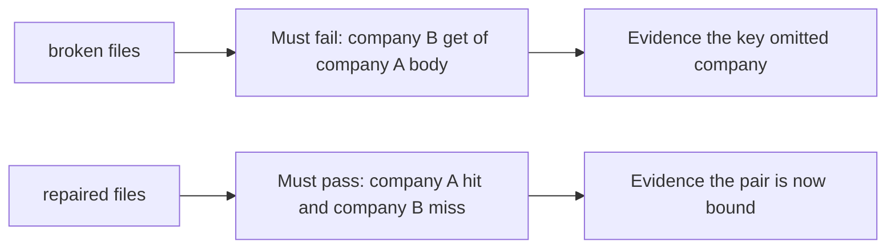

# A broken cache must fail the check

**Kind:** verification-lab
**Loop step:** 5 Verify

## If you cannot check it, it is still a slogan

Happy-path HTTP 200 over HTTPS is not evidence. The check must be **false** on the broken files and **true** on the repaired files.

## Picture: a broken cache must fail the check

A check that only asserts HTTPS can pass while the key remains path-only. Ask whether company B getting company A’s body still counts as a passing cache. Broken files must fail that question. Repaired files must pass it.



If both pass, the check is not looking at the cross-company get. If both fail, the fix is not structural or the check is wrong.

## Four modes, even for a dict

| Mode | Must show for this topic |
|---|---|
| Normal | After company A put, company A get returns `tenant-A-note` |
| Wrong input / abuse | After company A put, company B get is not `tenant-A-note` and is `None` |
| When things break | Unknown company does not share the slot |
| Not claimed | Live CDN `Vary`; browser `no-store`; DNS authenticity |

The file is `labs/2.2/2.2-request-path/tests/test_cache_key.py`. The checks are `test_same_tenant_cache_hit` and `test_other_tenant_does_not_receive_cached_body`. They observe bodies, not HTTP 200. That is a **what must not happen** pair: a company B get of `tenant-A-note` is not allowed to count as a passing cache.

Map each check to a rule from the request-path map. Do not paste keys. If the broken files do not fail the cross-company get, the practice files are miswired — fix the wiring, not the assertion.

TLS 1.3 on the browser hop is not this check. A check that only asserts HTTPS is a tool observation.

## What the checks do not prove

- Live CDN `Vary` behavior
- Browser `no-store`
- Forwarded-header pinning in FastAPI
- DNS authenticity

Record those as leftover or later work, not as silent passes.

## Practice

Run both this session:

```text
python3 -m pytest labs/2.2/2.2-request-path/tests --impl vulnerable
python3 -m pytest labs/2.2/2.2-request-path/tests --impl fixed
```

Write the fail/pass pair next to the cache-key row. Reject a “check” that only greps `Cache-Control` without calling `cache_get` as company B. Paste nothing from answer keys.

## Use it somewhere new

Authenticated RSS or export CSV via CDN. A check that only asserts status 200 on `/export` is not cache-key evidence. A check against a live CDN is out of scope.

## What this page is not doing

Do not add live traffic. Do not log `tenant-A-note`. Answer keys are not on this site.
