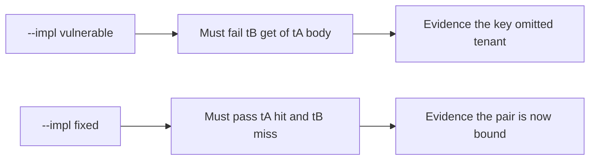

# 2.2-LO-05 — Evidence is a failing cross-tenant get, then a passing pair

**Kind:** verification-lab
**Loop step:** 5 Verify
**Standards:** IETF RFC 9110 (final); OWASP ASVS 5.0.0 (final) `v5.0.0-14.2.2`.

## An invariant that cannot fail a test is still a slogan

Happy-path HTTP 200 over HTTPS is not this module’s evidence (see 9.3). The oracle is the local pair against a named forbidden outcome.

## Mental model: vulnerable must fail: tB get of tA body

The failing observation on `--impl vulnerable` is **tB get of tA body**. A passing collection count is not this cell.



| Case | Must show |
|---|---|
| Normal | After tA put, tA get returns `tenant-A-note` |
| Negative / abuse | After tA put, tB get is not `tenant-A-note` and is `None` |
| Failure default | Unknown tenant does not share the slot |

Lab tests: `test_same_tenant_cache_hit` and `test_other_tenant_does_not_receive_cached_body` in `labs/2.2/2.2-request-path/tests/test_cache_key.py`.

```
python3 -m pytest labs/2.2/2.2-request-path/tests --impl vulnerable
python3 -m pytest labs/2.2/2.2-request-path/tests --impl fixed
```

Map each test to a matrix cell from LO-02. Do not paste keys.

## What the tests do not prove

- Live CDN `Vary` behavior
- Browser `no-store` (`v5.0.0-14.3.2`)
- Forwarded-header pinning in FastAPI (`v5.0.0-4.1.3`)
- DNS authenticity

Record those as residuals or later work, not as silent passes.

## Practice

Execute both implementations this session. If vulnerable does not fail, the lab is miswired—fix the wiring, not the assertion.

## Transfer

Authenticated RSS or export CSV via CDN. A test that only asserts status 200 on `/export` is not cache-key evidence.
