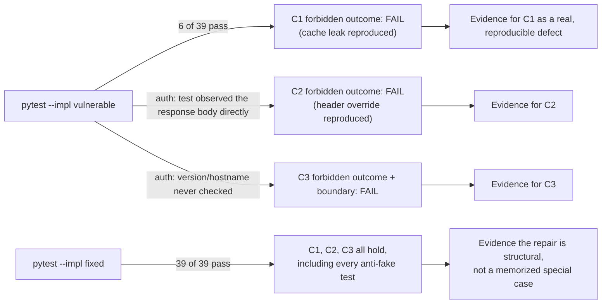

# A broken cache, header, or hop check must fail the check that names it

**Kind:** verification-lab
**Loop step:** 5 Verify
**Standards:** ASVS 5.0.0 v5.0.0-4.1.3, v5.0.0-12.1.1, v5.0.0-12.2.1, v5.0.0-12.3.2, v5.0.0-14.2.2, v5.0.0-14.2.5

## What "verified" has to mean here

A status code of 200 on a TLS connection proves the response arrived over an encrypted channel; it proves nothing about whether that response contained the right body. Verification for this module means: on `vulnerable/app.py`, each of `03-break.md`'s two traces produces its forbidden outcome and the matching test observes it; on `fixed/app.py`, every test in `labs/2.2/2.2-request-path/tests` passes, including one or more anti-fake tests per claim that a narrow, half-correct repair cannot satisfy by accident.

## Mapping tests to claims, not to files

| Claim | Normal case | Forbidden outcome | Boundary | Malformed / failure | Anti-fake |
|---|---|---|---|---|---|
| C1 (cache key) | `test_same_company_reads_its_own_note_after_caching` | `test_other_company_does_not_receive_cached_body` | `test_cross_company_lookup_is_scoped_even_before_any_cache_entry_exists` | shares C2's malformed case | `test_anti_fake_cache_key_with_fresh_never_elsewhere_used_company_and_note` |
| C2 (forwarded identity) | (shares C1's normal case; same resolution path) | `test_forwarded_company_header_cannot_grant_a_different_companys_note` | (shares C1's boundary case) | `test_unregistered_api_key_with_a_company_header_is_denied` | `test_anti_fake_forwarded_header_with_fresh_never_elsewhere_used_values` |
| C3 (hop authentication) | `test_matching_hostname_trusted_ca_current_version_is_trustworthy` | `test_hostname_mismatch_with_trusted_ca_is_rejected` | `test_tls_1_2_boundary_is_still_accepted_1_1_is_not` | `test_unknown_trust_state_fails_closed` | `test_anti_fake_hostname_prefix_match_is_rejected`, `test_anti_fake_hostname_substring_anywhere_is_rejected`, `test_anti_fake_hostname_suffix_without_boundary_is_rejected`, `test_anti_fake_hostname_unicode_confusable_is_rejected`, `test_anti_fake_hostname_zero_width_character_is_rejected`, `test_explicitly_untrusted_ca_is_rejected_even_with_matching_hostname_and_version`, `test_anti_fake_version_string_that_sorts_high_is_still_rejected`, `test_anti_fake_forward_compatible_allow_list_still_rejects_an_unaccepted_version`, `test_anti_fake_version_string_that_parses_in_range_is_still_rejected`, `test_anti_fake_version_string_with_incidental_whitespace_is_rejected`, `test_anti_fake_version_near_miss_sweep_is_rejected` (19 parametrized cases) |

Several cells share a case rather than each claim owning five distinct tests, and that sharing is itself a finding worth stating explicitly: C1 and C2 both resolve through the same normal-case request, because a caller reading its own note correctly is evidence that *both* the credential lookup and the cache lookup behaved, not evidence that either one specifically did. A single passing normal case is weak evidence for two claims at once; the forbidden-outcome and anti-fake rows are where each claim earns its own, non-shared proof.

## Picture: evidence flowing from a run to a claim



Each arrow's annotation names what the test actually inspected — a returned body, a status code, a rejected relay — not merely "ran successfully." A run that reports "6 passed" for `vulnerable` without checking *which* six would miss that the six passing tests are exactly the ones this module predicts should pass on the broken code (the shared normal case and the cases that do not depend on any of the three bugs), while the thirty-three that should fail do fail for the stated reason.

## Worked example: reading a failure for the reason it names

A test failing is not, by itself, evidence of the claim it was written for — it could be failing because of a typo in the test, a missing import, or an unrelated exception. The assertion message exists so a reviewer can check the *reason*, not just the outcome:

```text
$ python3 -m pytest labs/2.2/2.2-request-path/tests/test_cache_key.py::test_other_company_does_not_receive_cached_body --impl vulnerable
FAILED ... AssertionError: a cache entry filled by company A must never
answer company B's own, differently authenticated request for the same
path
assert 404 == <Response [200 OK]>.status_code
```

The `assert 404 == 200` line, on its own, is compatible with dozens of unrelated bugs — a missing route, a wrong status code convention, an unhandled exception FastAPI happened to translate into a 200. The assertion message, and the test's own docstring, are what tie this specific failure back to the specific claim: company B received a 200 with a body, when the property demands a 404, because the cache handed back company A's cached entry. A reviewer who reads only "8 failed" without reading which eight, and why, has not verified anything — they have counted.

## What would falsify a claim of "fixed"

If any test above passed on `vulnerable/app.py`, that test would not be asserting its claim — a passing vulnerable run means the suite stopped observing the forbidden outcome, not that the outcome stopped occurring. If any test failed on `fixed/app.py`, the repair in `04-build.md` would not be structural, and the failing test names exactly which of the three functions still has a gap. `spec.md`'s coverage-contract table records both directions so a reviewer can check this claim against the actual pytest output rather than against this page's prose describing it.

## Anti-fake tests are not decoration

`labs/2.2/2.2-request-path/README.md` documents thirteen constructed fakes verified against this suite before this module trusted it, each count checked by reconstructing the exact fake and running the real suite rather than incrementing an old number. A cache-only fix that leaves the header override open (two failures; 37 of 39 still pass). A header-only fix that leaves the cache keyed on path alone (two failures; 37 of 39 still pass). A hostname check using `.startswith()` (one failure; 38 of 39 still pass). A hostname check using `in` — caught by all three ASCII hostname anti-fake tests (three failures; 36 of 39 still pass). A hostname check using `.endswith()` (one failure; 38 of 39 still pass). A trust-state check using `is None` in place of `is not True` (one failure; 38 of 39 still pass). A hand-written `{"1.2", "1.3", "1.4"}` in place of `_ACCEPTED_TLS_VERSIONS` — one failure; 38 of 39 still pass, since none of the sweep's nineteen strings is `"1.4"`. A version check parsing `tls_version` to a `float` — caught by both dedicated tests plus twelve sweep cases, the fullwidth one among them, since `float()` accepts fullwidth Unicode digits, but NOT the zero-width case, since `float()` raises `ValueError` on it rather than silently accepting it (fourteen failures; 25 of 39 still pass). And a version check that strips incidental whitespace — caught by its one dedicated test plus four sweep cases, but reaching neither non-ASCII case, since `.strip()` removes neither a fullwidth digit nor a zero-width character (six failures; 33 of 39 still pass).

The lexicographic-lower-bound fake (`tls_version < "1.2"`) fails all four dedicated version anti-fake tests plus thirteen of the nineteen sweep cases — every ASCII near-miss that sorts at or above `"1.2"`, the fullwidth-digit case, AND the zero-width case, since `"1.2​"` shares every character `"1.2"` has and then adds one more, and a string that only extends another is never lexicographically smaller than it (seventeen failures; 22 of 39 still pass) — the same recompute-don't-increment pattern needed for every non-ASCII addition since this fake was first closed.

The eleventh fake, found in a sixth independent review round, was the first one this module's sweep test caught on its own before a dedicated test for it ever existed. It ALSO wrongly accepts the fullwidth case added later for an unrelated finding (`str.isdigit()` and `int()` both treat fullwidth digits the same as ASCII ones), but NOT the zero-width case, since a zero-width character is not a digit and this fake's own `.isdigit()` guard correctly rejects it. The fake fails exactly three sweep cases and none of the (now ten) dedicated anti-fake tests (three failures; 36 of 39 still pass) — unchanged from the prior round.

The twelfth fake, found in a seventh independent review round, is Unicode canonical-compatibility normalization before comparing — the first fake to affect both the version AND hostname checks with the same one-line change to each. It fails only the sweep's fullwidth case and the dedicated Unicode-confusable hostname test (two failures; 37 of 39 still pass) — NOT the zero-width case or its dedicated test, since NFKC normalization does not remove or fold Unicode category Cf characters at all: `unicodedata.normalize("NFKC", "1.2​") == "1.2​"`, unchanged.

The thirteenth fake, found in an eighth independent review round, is a third distinct technique — stripping every Unicode category-Cf (format, zero-width, bidi-control) character before comparing — and the second fake to affect both checks with the same one-line change to each, but one the twelfth fake's own fix does nothing against, and vice versa. It fails only the sweep's zero-width case and the new dedicated zero-width hostname test (two failures; 37 of 39 still pass) — NOT the fullwidth case or its dedicated test, since fullwidth digits/letters are categories Nd/Lo/Ll, not Cf, so Cf-stripping leaves them untouched. This is the module's own recorded stopping point for hand-picked Unicode-normalization-adjacent fakes: `spec.md`'s residuals section now names any further not-yet-constructed technique in this class as an accepted non-goal, since two independent, non-overlapping Unicode techniques found in two consecutive rounds is enough evidence this specific sub-space does not converge by one-category-at-a-time construction any better than the ASCII near-miss space already showed it didn't after round 4.

None of these thirteen fakes was constructed in response to the sweep test; the ten found before it existed were closed one at a time by a human reviewer across five independent review rounds, and the eleventh, twelfth, and thirteenth were each found in their own later round and closed by extending the sweep, the same "extend rather than isolate anew" pattern the eleventh fake established. `test_anti_fake_version_near_miss_sweep_is_rejected` (nineteen cases) asserts rejection across a systematically-chosen set of near-misses — whitespace, leading/trailing zeros, an extra version segment, a sign prefix, exponential notation, an embedded accepted-looking substring, a non-ASCII digit sequence, and a zero-width/format character — in one pass, and, as the counts above show, independently rediscovers several already-closed fakes from a different angle without having been told which fakes those were. Two further fakes, never constructed by any review round, confirm the sweep's value is not limited to shapes a human reviewer has actually found: a regex check would have passed every pre-sweep test but fails all fifteen ASCII-only sweep cases plus the zero-width case — since `"1.2"` is a literal substring of `"1.2​"` — not the leading-zero or fullwidth ones — plus two dedicated tests (eighteen failures total; 21 of 39 pass); and an unguarded `(major, minor)` integer-tuple parse fails ten sweep cases (the leading-zero pair and the fullwidth case, but not the zero-width case, since bare `int()` raises rather than silently accepting it) plus one dedicated test (eleven failures total; 28 of 39 pass). Neither counts toward the thirteen fakes above, since no review round ever constructed either one.

Each of these thirteen fakes would look complete to a reviewer who only read the diff and not the tests — every one changes real code in the right direction, and every one still leaves a specific, describable input that reaches the forbidden outcome. The three-ASCII-hostname-shape sequence (prefix, substring-anywhere, suffix-without-boundary) is the reason this page does not claim two hostname anti-fake tests are enough: each shape is a distinct fake that the other two do not catch, and the `in`-substring fake's failure against all three, discovered only once the third test existed, is why every count above was rebuilt from scratch rather than assumed stable across additions. The trust-state fake is also the reason this page does not claim "unknown trust state fails closed" and "untrusted CA fails closed" are the same test: a check that never completed and a check that completed and failed are different facts about the world, and a suite that only exercises the first has not verified the second. The four dedicated version-check fakes are the same lesson again, one signal over, four times: "not below the oldest accepted version," "a member of the accepted set," "numerically within the accepted range," and "the same string after discarding incidental whitespace" are four different claims, not one claim stated four ways. The fifth, sixth, and seventh version-check fakes — leading-zero normalization, Unicode canonical-compatibility normalization, and Unicode category-Cf stripping — never got a dedicated test of their own at all, and that is the point rather than an oversight: by the time a sixth review round found the first of the three, the module had already stopped enumerating claims by hand and started asserting the underlying property (exact membership in a two-element set, nothing looser, no matter how the input is parsed, normalized, or cleaned) against a broad, adversarially-chosen input space, so each was caught by a test written before anyone had stated it. The seventh finding is also this module's recorded stopping point for the class it belongs to: two structurally distinct, non-overlapping Unicode techniques (canonical normalization, Cf-stripping) found in two consecutive rounds — each one closing a gap the other's fix leaves completely open — is the same signal the ASCII near-miss space gave after its own fourth distinct fake, and `spec.md`'s residuals section now treats it the same way: an explicit, named non-goal for any further not-yet-constructed technique in this class, not an open-ended hunt. A fake's failure count against the CURRENT suite, not the suite that existed when it was first isolated, is the only count worth trusting — and a suite that keeps needing that recomputation is a suite that would have benefited from a broader test sooner, which is exactly what happened here once it did.

## What these checks do not prove

- A real TLS handshake, a real certificate authority, or a real DNS answer — `hop_is_trustworthy` is exercised through `POST /internal/relay` with values the test constructs directly, never a negotiated connection.
- Web cache deception (ASVS `v5.0.0-14.2.5`, Level 3 advanced): this fixture's failure is two authenticated companies sharing a slot, not an unauthenticated request tricking a cache into storing dynamic content under a static-looking path. Treating this module's Level 2 cache-key property as if it already covered Level 3 web cache deception would overstate what fourteen passing tests actually checked.
- Behavior of a real CDN, load balancer, or reverse proxy product — every claim here is verified against a local, single-process fixture.

Record these as residuals, the way `spec.md`'s "Known residuals" section already does, rather than as silent passes a reviewer might mistake for coverage. A residual named in prose and a gap covered by a passing test read identically in a status report that only counts green checkmarks; the difference only shows up to a reviewer willing to open `spec.md` and ask, for each named residual, whether any test in this suite could possibly have exercised it at all.

## Practice

Run both variants and, for the thirty-three tests that fail on `vulnerable`, name which row of the table above each one evidences (the nineteen parametrized near-miss-sweep cases all evidence the same row — treat them as one piece of evidence repeated nineteen ways, not nineteen independent findings):

```bash
python3 -m pytest labs/2.2/2.2-request-path/tests --impl vulnerable
python3 -m pytest labs/2.2/2.2-request-path/tests --impl fixed
```

## Use it somewhere new

For an authenticated CSV export, write the five-case table above from scratch — normal, forbidden outcome, boundary, malformed, anti-fake — before writing a single line of test code, and predict which cases the export's own normal case would share with its company-resolution claim, the way this module's C1 and C2 share one.

## What this page is not doing

This page does not add new traffic beyond the local suite above, does not log a note body under any circumstance, and does not claim coverage of web cache deception or a real TLS deployment. Answer keys are not on this site.
