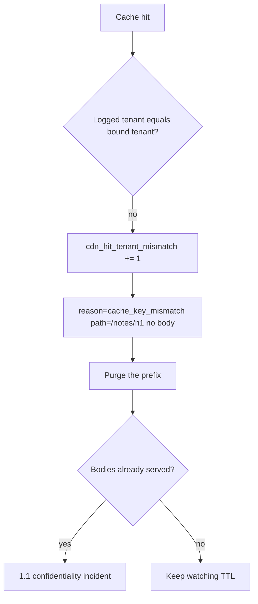

# 2.2-LO-06 — Detect a mismatched hit; purge without logging the body

**Kind:** operations-exercise
**Loop step:** 6 Operate
**Standards:** NIST CSF 2.0 (final) DE/RS/RC as *outcome labels*, not proof; OWASP ASVS 5.0.0 (final) `v5.0.0-14.2.2`; Module 3.1 / 5.1 privacy of logs.

## Prevention is not absolute

A CDN config change, a new POP, or stale-while-revalidate can reintroduce a path-only key. Pair detect and recover. Do not log note bodies.

## Mental model: signal, purge, then 1.1 if bodies escaped



| Outcome | This module |
|---|---|
| Detect | Hit with mismatched tenant id; never log the body |
| Signal | `cdn_hit_tenant_mismatch`; `path`; `bound_tenant`; `logged_tenant` |
| Revoke / recover | Purge the prefix; rotate if the leak included session cookies (later 2.3 / 4.x) |
| Residual | Operational error at the CDN remains; monitor |

CSF 2.0 Detect / Respond / Recover name *outcomes*. They do not prove ASVS. A SIEM product name is not the property. Certificate-failure drills belong to TLS deployment, not this cache-key sentence—keep them in a separate note so they do not replace purge.

Varnish, Fastly, and Next.js data cache will still hit on whatever key you configured. `Cache-Control` is a hint. The application guarantee is: **this** fixture, a tB get after a tA put is a miss, and the mismatch log never includes `tenant-A-note`.

Mechanism limits: purge without a prefix that includes tenant can widen availability harm. Stale-while-revalidate at a new POP is residual. Cookie leakage from a cached body is 2.3 / 4.x, not a SIEM green.

| Slice | This lab |
|---|---|
| Detect | `cdn_hit_tenant_mismatch` |
| Signal | path, bound tenant, logged tenant; never body |
| Recover | Purge the tenant-including prefix |
| Residual | CDN config drift; anonymous fill |

## Practice

Write one log line you would accept in review. Tie it to `labs/2.2/2.2-request-path`. Example shape (synthetic ids only):

```
cache_denied reason=tenant_mismatch path=/notes/n1 bound=tB logged=tA request_id=req_9f2e
```

Reject any line that includes `tenant-A-note` or a raw body.

## Transfer

Authenticated RSS or export CSV via CDN. Purge must name the **prefix including tenant** (or the whole sensitive class), not “purge `/notes/` for everyone” as the only tool if that widens availability harm without need.

## Non-goals

SIEM product names are not the property. Keys stay out of lessons.
