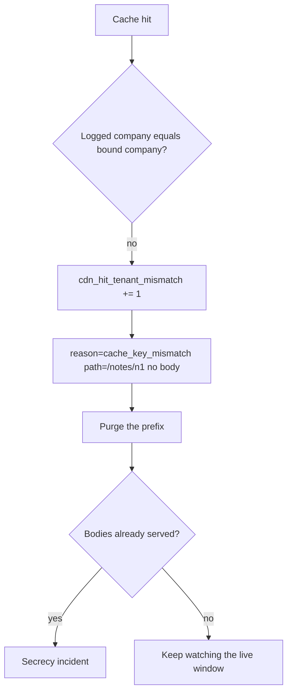

# Notice the wrong hit; purge without logging the body

**Kind:** operations-exercise
**Loop step:** 6 Operate

## Stopping it is not enough

Even after the key includes the company, someone can still leak a body: a CDN config change, a new node, stale-while-revalidate serving an old path-only entry. Running it for real is the rest of the loop: notice, contain, restore, and refuse to “help” by logging note bodies.

## Picture: signal, purge, then secrecy work if bodies escaped

A wrong hit is a notice-and-recover problem, not a licence to print the body into the log. Notice names the mismatch. Recover purges. Neither writes `tenant-A-note`.



Industry lists name detect, respond, recover. They do not pick a log product. They do not prove a checklist. Someone still has to own the leftover.

Certificate-failure drills belong to TLS deployment, not this cache-key sentence. Keep them in a separate note so they do not replace purge.

## Signals that do not become a second leak

| Outcome | This topic |
|---|---|
| Notice | Hit with mismatched company id; never log the body |
| What the line holds | `cdn_hit_tenant_mismatch`; `path`; bound company; logged company — **never** the note body |
| Respond | Purge the prefix that includes company; rotate if the leak included session cookies (later cookies-and-sessions work) |
| Recover | Prefix is gone; keep watching the live window |
| Leftover | Operator error at the CDN remains; this practice is not production telemetry |

Varnish, Fastly, and Next.js data cache will still hit on whatever key you configured. `Cache-Control` is a hint. The app’s promise is: on **these** practice files, a company B get after a company A put is a miss, and the mismatch log never includes `tenant-A-note`.

What the tool cannot do: purge without a prefix that includes company can widen who is down. Stale-while-revalidate at a new node is leftover. Cookie leakage from a cached body is later session work, not a log-product green.

| Slice | This practice |
|---|---|
| Notice | `cdn_hit_tenant_mismatch` |
| Signal | path, bound company, logged company; never body |
| Recover | Purge the company-including prefix |
| Leftover | CDN config drift; anonymous fill |

A log line a reviewer can accept looks like:

```text
cache_denied reason=tenant_mismatch path=/notes/n1 bound=tB logged=tA request_id=req_9f2e
```

Not: `tenant-A-note`, or a raw body.

## Practice

Write one log line you would accept in review (ids, reason, no body). Tie it to `labs/2.2/2.2-request-path`. Reject any line that includes `tenant-A-note` or a raw body.

## Use it somewhere new

Authenticated RSS or export CSV via CDN. Purge must name the **prefix including company** (or the whole sensitive class), not “purge `/notes/` for everyone” as the only tool if that takes everyone down without need.

## What this page is not doing

A log-product name is not the rule. Answer keys are not on this site.
