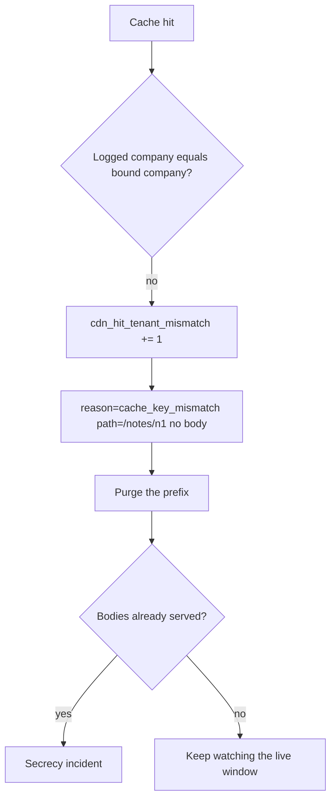

# Notice the wrong hit; purge without logging the body

**Kind:** operations-exercise
**Loop step:** 6 Operate

## Fixing it once is not enough

A CDN change, a new node, or stale-while-revalidate can still serve a path-only entry after the cache key includes the company. Purge that entry, restore the keyed slot, and do not log the body.

## Picture: signal, purge, then secrecy work if bodies escaped

A wrong cache hit must not write the body into the log. Name which companies collided. Then purge the entry. Do not write `tenant-A-note`.



A log pipeline does not put the company in the cache key.

Certificate-failure drills belong to TLS deployment, not this cache-key sentence. Keep them in a separate note so they do not replace purge.

## Signals that do not become a second leak

| Outcome | This topic |
|---|---|
| Notice | Hit with mismatched company id; never log the body |
| What the line holds | `cdn_hit_tenant_mismatch`; `path`; bound company; logged company — **never** the note body |
| Respond | Purge the prefix that includes company; rotate if the leak included session cookies (later cookies-and-sessions work) |
| Recover | Prefix is gone; keep watching the live window |
| Leftover | Operator error at the CDN remains; this practice is not production telemetry |

Varnish, Fastly, and Next.js data cache will still hit on whatever key you configured. `Cache-Control` is a hint. A company B get after a company A put is a miss, and the mismatch log never includes `tenant-A-note`.

What the tool cannot do: purge without a prefix that includes company can widen who is down. Stale-while-revalidate at a new node is leftover. Cookie leakage from a cached body is later session work, not a log-product green.

| Slice | This practice |
|---|---|
| Notice | `cdn_hit_tenant_mismatch` |
| Signal | path, bound company, logged company; never body |
| Recover | Purge the company-including prefix |
| Leftover | CDN config drift; anonymous fill |

```text
cache_denied reason=tenant_mismatch path=/notes/n1 bound=tB logged=tA request_id=req_9f2e
```

The sample still leaks if it carries `tenant-A-note` or a raw body.

## Practice

Draft a deny line with ids and a reason — never the body. Leave `tenant-A-note` and a raw body off that sketch.

## Use it somewhere new

Authenticated RSS or export CSV via CDN. Purge must name the **prefix including company** (or the whole sensitive class), not “purge `/notes/` for everyone” as the only tool if that takes everyone down without need.

## What this page is not doing

Answer keys are not on this site.
