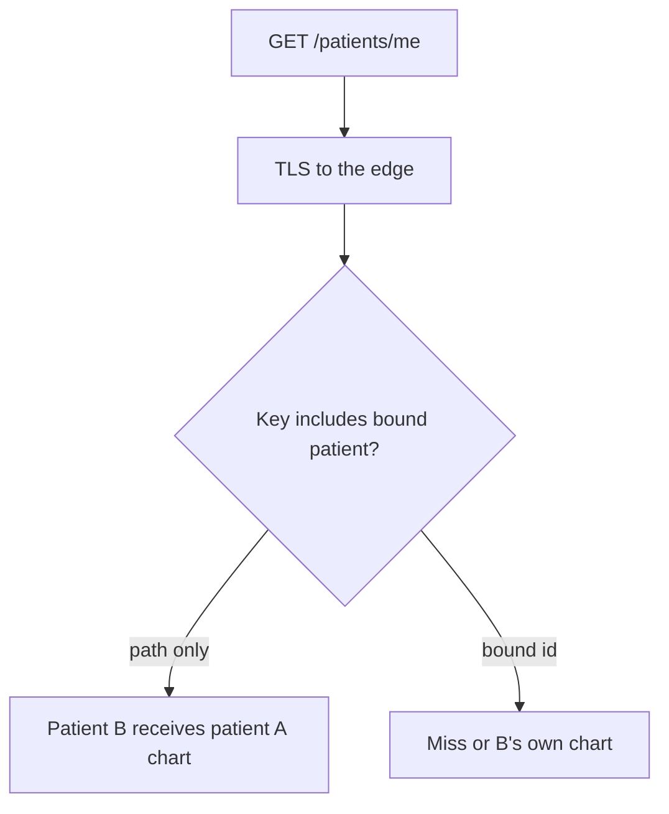

# Same idea on a clinic /patients/me cache

**Kind:** transfer-challenge
**Loop step:** 7 Transfer

## Use it somewhere new

The notes-app scaffolding goes away. You get a **clinic portal** that caches `GET /patients/me` at the edge, and authenticated RSS or a CSV export on the same CDN as a second sketch. TLS ends at the load balancer. A second patient’s GET must not receive the first patient’s chart. Your job is to rewrite the loop, not to name a bug-list code.

## Picture: `/me` is still a shared URL

Renaming “note body” to “chart” is not transfer. Person, object, path, and leftover change. TLS on one hop stays hop proof. The cache key still decides who reads.

| Notes app this week | Clinic sketch |
|---|---|
| Company A / company B members | Two patients on the same CDN |
| `GET /notes/n1` | `GET /patients/me` — same path string for everyone |
| Path-only key leaks `tenant-A-note` | Path-only key leaks patient A’s chart |
| Bound company in the key, or do not store | Bound patient or company in the key, or do not store |

`/me` looks personal. The path string is identical for every patient. Personalization that is not in the key is ambient secrecy failure.

## Prompt — clinic cache and the CDN export

Your answer must include:

- who can act (another patient on the same CDN; a neighbor on a TLS-inspecting proxy);
- what you trust (which hop is TLS; which store is greedy; the client is hostile);
- what must not happen (cross-patient cache hit, not “TLS stripped”);
- a check idea that would fail if the rule were false (local practice only);
- leftover risk (CDN config drift; `X-Forwarded-Proto` treated as the TLS property);
- whether a human path must meet the web accessibility baseline (only if a person must finish a control; a cache key itself is not that kind of problem).

A reverse proxy that sets `X-Forwarded-Proto` is an acceptable extra sentence: the app still must not treat that header as the TLS property.

## What is not good enough

| Reject | Why |
|---|---|
| A tool or famous-bugs-list name as the rule | You still have not named the outcome |
| “The framework caches safely” / CDN “HTTPS only” checkbox as the promise | You need a claim about this key |
| A live-target plan or real patient ids | Course rules |
| “Add `Vary: Cookie`” as the whole fix | Cookie is not a patient id; later session work |

## Practice

One page. No answer keys. The only running system you may break is `labs/2.2/2.2-request-path`.

## What this page is not doing

Real clinics, real patient charts, live CDNs.
