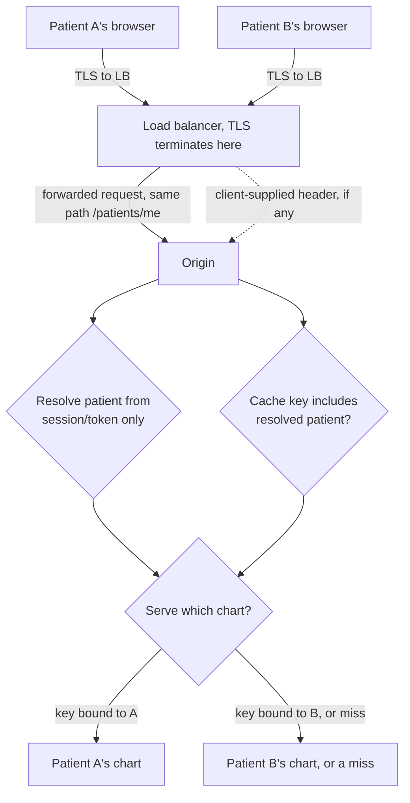

# Transfer: clinic /patients/me on a shared CDN

**Kind:** transfer-challenge
**Loop step:** 7 Generalize

## The same two decisions, a different noun

A clinic portal caches `GET /patients/me` at a shared edge, and a second patient's request for that exact path must never receive the first patient's chart. Nothing about `/me` makes the path unique per patient — it is the identical string for every caller, personalized only by whichever identity the origin resolves before it decides what to return. This is the same shape `01-property.md` derived for SecureCollab's notes: a company-resolution decision and a cache-key decision, applied here to patients instead of companies, and the same two questions — who resolved this identity, and does the cache key include it? — transfer without needing a new derivation.

## What changes and what does not

| SecureCollab notes | Clinic chart |
|---|---|
| `GET /notes/n1`, path shared across companies | `GET /patients/me`, path identical for every patient |
| Company resolved from an API key, never from `X-Company` | Patient resolved from a session or token, never from a client-supplied header |
| Cache key must bind `(path, company)` | Cache key must bind `(path, patient)` |
| TLS terminates at an edge before the origin sees the request | TLS terminates at a load balancer before the origin sees the request |
| Forbidden outcome: company B receives company A's note | Forbidden outcome: patient B receives patient A's chart |

The load balancer terminating TLS is exactly `01-property.md`'s F1 flow, restated: it proves the browser reached that load balancer, and proves nothing about which patient's session cookie or bearer token the request carries once it is inside. A team that reasons "the load balancer only accepts HTTPS, so the connection is secure" has answered the encryption question and left the identity question exactly as open as `02-model.md`'s row for flow F2 already named it.

## Picture: the boundary that must not move



Two authority paths — session resolution and cache-key composition — meet at the same decision box `01-property.md`'s diagram used for companies. A diagram for this transfer that draws only one box labeled "load balancer (secure)" has collapsed the same two rows `02-model.md`'s table kept separate, and would not let a reviewer tell whether the patient dimension made it into the cache key at all.

## Worked example: transplanting the fixture's own shape

The clinic's version of `_resolve_company` and `_CACHE` would keep the identical structure `04-build.md` repaired, with one renamed axis:

```python
# a clinic-fixture sketch, transplanting fixed/app.py's structure
PATIENT_SESSIONS: dict[str, str] = {"session-A": "patientA", "session-B": "patientB"}
_CHART_CACHE: dict[tuple[str, str], str] = {}  # (path, patient) -- not path alone

def resolve_patient(session_id, x_patient_header):
    # transplanted from _resolve_company: x_patient_header stays unread
    return PATIENT_SESSIONS.get(session_id)

def get_chart(path, session_id, x_patient_header):
    patient = resolve_patient(session_id, x_patient_header)
    if patient is None:
        return None
    return _CHART_CACHE.get((path, patient))
```

Nothing about this sketch is clinic-specific except the variable names; the structural claim — never read `x_patient_header`, always key on `(path, patient)` — is exactly `04-build.md`'s repair with `company` relabeled. That is what "transfers" means here: not that the two systems share code, but that the same two-function shape, verified once against SecureCollab's fixture, is the correct shape to re-derive for a different noun, rather than a coincidence that happens not to generalize.

## Write this for the clinic and for an authenticated export

A complete answer names, explicitly:

- **who might try:** another patient authenticated on the same portal, sharing the same CDN edge as patient A, with no need to guess a chart id;
- **what is trusted:** the load balancer's TLS termination (authenticates the browser-to-LB hop only) and the origin's own session lookup (authenticates the patient); explicitly not trusted: any header the load balancer or a client might set naming a patient directly;
- **what must not happen:** a cross-patient cache hit for the identical `/patients/me` path — not "TLS was stripped," which is a different, unrelated failure this transfer does not concern;
- **a local reproduction plan**, structured the way `labs/2.2/2.2-request-path` is: a fixture, not a live clinic system, with a cache keyed by `(path, patient)` and a session-only resolution function, verified the same way `test_other_company_does_not_receive_cached_body` verifies the notes case;
- **residual risk:** a CDN or edge configuration drift that silently reverts the patient dimension in the key, exactly as claim C5 names for SecureCollab, plus whichever browser-side storage or cross-origin behavior a shared CDN introduces — a question this module leaves to [2.3 Browser security model](../../../2/2.3/spec.md), since that module owns the browser's own trust decisions rather than the origin's;
- **whether a human-mediated control applies:** only if some step in the redesigned flow asks a person to notice and act on a warning; a cache key by itself is a machine-checked property with no human step to evaluate for usability.

## What is not good enough

**Naming a scanner finding or a Top 10 category as the answer** ("this is A01, Broken Access Control") is rejected: a category name is not a system-specific rule, and does not tell a reviewer what the cache key must contain or which credential the origin must trust.

**"The CDN only accepts HTTPS"** is rejected for the same reason `01-property.md` rejected it for SecureCollab: it answers the encryption question and leaves the identity question completely open.

**A real clinic, real patient charts, or a live CDN target** is rejected outright by this course's laboratory policy; every reproduction stays inside a local, synthetic fixture.

## A second transfer, briefer: state that outlives the request

If the clinic's session itself is held in a queue or a background worker — say, a nightly export job that re-reads a cached chart hours after the original request — the timing and concurrency questions that arise (can the patient dimension itself go stale between when a chart was cached and when a worker reads it?) belong to a different module's vocabulary than this one's. [2.4 State, time, concurrency, and distributed failure](../../../2/2.4/spec.md) is the right place to carry that specific question further; naming it here, without borrowing that module's own examples, keeps this transfer honest about where its own boundary sits.

## A counterexample this transfer must reject

Suppose the clinic's engineers respond by adding `Vary: Cookie` to the cached response, reasoning that the cache will now vary its stored representation per session cookie. This is a plausible-sounding fix that fails the identical way `01-property.md`'s rejected alternatives failed for SecureCollab: `Vary` tells a cache *which request headers to treat as part of the cache key when selecting among stored representations it already has*, not *which identity a representation is scoped to*. A CDN that respects `Vary: Cookie` will store one representation per distinct cookie value it happens to see, which can still leak across two patients whose sessions momentarily share an intermediary-rewritten cookie value, and does nothing at all for a patient who authenticates by bearer token instead of a cookie. The structural fix stays `(path, patient)` in the key, derived from session or token resolution — not a `Vary` header chosen because it sounds like it is about caching per-user content.

## Practice

Write the full answer above for the clinic scenario, then repeat it for an authenticated CSV or RSS export behind the same kind of edge, naming which parts of the answer are identical across both and which parts (the resolved identity's name, the export's content type) are not.

## What this page is not doing

No real clinics, no real patient charts, no live CDN targets, and no attempt to solve `2.3` or `2.4`'s own questions here — only to name where this module's boundary against theirs sits. Answer keys are not on this site.
