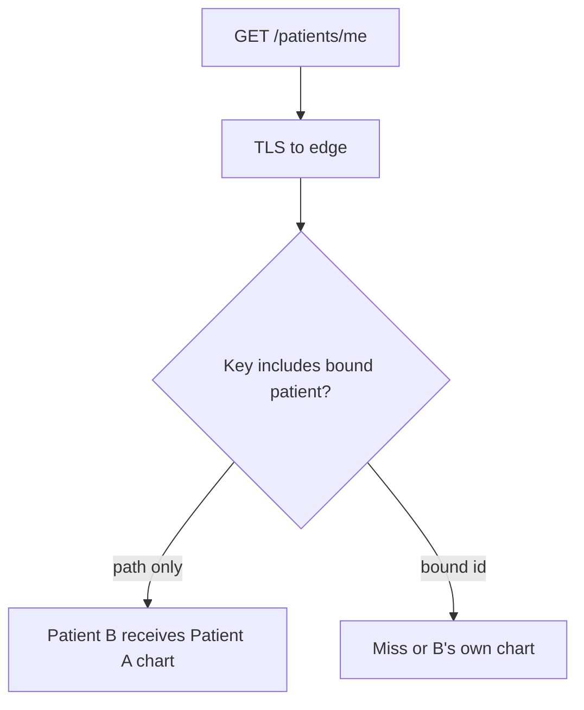

# 2.2-LO-07 — Transfer: `/patients/me` on a shared CDN

**Kind:** transfer-challenge
**Loop step:** 7 Transfer
**Standards:** IETF RFC 9110 (final); IETF RFC 9846 TLS 1.3 (final); OWASP ASVS 5.0.0 (final) `v5.0.0-14.2.2` and `v5.0.0-4.1.3`.

## Change the object; keep the hop-versus-key shape

Do not answer with a Top 10 / CWE Top 25 / scanner as the definition of security.

**Prompt:** Authenticated RSS or a CSV export via CDN.

**Product sketch:** Clinic portal. `GET /patients/me` is cached at the edge. TLS terminates at the load balancer. A second patient’s GET must not receive the first patient’s chart.

Rewrite the SecureCollab sentence for this product. Your answer must include:

1. attacker capabilities (another patient on the same CDN; a neighbor on a TLS-inspecting proxy);
2. trust assumptions (which hop is TLS; which store is greedy; the client is hostile);
3. a forbidden outcome (cross-patient cache hit, not “TLS stripped”);
4. a test idea that would fail if the cell were false (local fixture only);
5. residual risk (CDN config drift; `X-Forwarded-Proto` treated as the TLS property);
6. whether a human path must meet WCAG 2.2 (only if a person must complete a control; a cache key itself is not a WCAG problem).

## Mental model: `/me` is still a shared URL

`/me` looks personal. The path string is identical for every patient. Personalization that is not in the key is ambient confidentiality failure.

## What graders reject

| Reject | Why |
|---|---|
| Tool or awareness-list name as the property | 1.1 |
| Framework default as the guarantee | Next.js cache / CDN “HTTPS only” checkbox |
| Live-target plan or real patient ids | Lab policy |
| “Add Vary: Cookie” as the whole fix | Cookie is not a patient id; 2.3 |

## Practice

One page. No keys. The lab `labs/2.2/2.2-request-path` stays the only running system you may break. A reverse proxy that sets `X-Forwarded-Proto` is an acceptable extra sentence: the app still must not treat that header as the TLS property.
