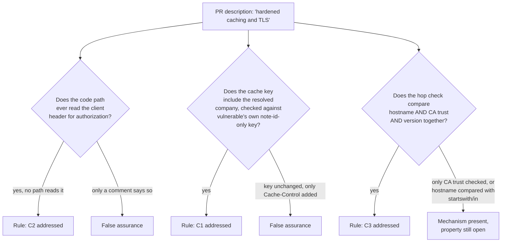

# Seeded review of a cache, a header, and a hop check that all stop too early

**Kind:** code-review
**Loop step:** 5 Verify

## What you are reviewing

A change proposal for SecureCollab's request path lands with a pull request description claiming "hardened caching and TLS." Your job is to reconstruct, from the diff and its own comments, whether each claim in that description is a **rule** (a falsifiable property about who may read what), a **tool** (a mechanism that may or may not implement the rule), or **false assurance** (a claim that sounds like a rule but checks nothing the property actually requires) — the same three-way sort `01-property.md`'s rejected alternatives used, applied here to someone else's change instead of to your own reasoning.

The diff you are reviewing changes three things at once, which is itself worth noticing before reading any single line: a cache module, a company-resolution function, and a hop-authentication check, bundled into one pull request under a single description. Reconstruct each claim separately before deciding whether the bundle, taken as a whole, closes every forbidden outcome `spec.md` names.

## Picture: sorting a claim before trusting it



Three separate questions, each requiring you to trace actual code rather than accept the description's own framing. A description that bundles three changes under one adjective ("hardened") is asking a reviewer to grant all three at once; the diagram above exists to stop that from happening by accident.

## Worked example: a diff that reads safer than it is

```diff
-def _resolve_company(api_key, x_company):
-    if api_key not in API_KEYS:
-        return None
-    if x_company:
-        return x_company
-    return API_KEYS[api_key]
+def _resolve_company(api_key, x_company):
+    if api_key not in API_KEYS:
+        return None
+    if x_company and x_company != "companyB":
+        return x_company
+    return API_KEYS[api_key]
```

A reviewer skimming for "does it still trust the header unconditionally" might see the new `!= "companyB"` clause and conclude the gap is narrowed, because the exact scenario `03-break.md`'s trace two describes — a caller sending `X-Company: companyB` — now falls through to `API_KEYS[api_key]` instead of returning the header. Trace what happens for `X-Company: companyZ` instead, sent by the identical caller: `x_company` is truthy, `"companyZ" != "companyB"` is `True`, so the branch still returns the header value unchanged. The diff closed the one literal string this file's own trace happened to use and left every other company name exploitable through the identical path — precisely the shape `labs/2.2/2.2-request-path/tests/test_cache_key.py`'s anti-fake test is built to catch, by sending `X-Company: companyQ` rather than `companyB`. A reviewer who re-runs the existing forbidden-outcome test against this diff would see it pass, and might stop there; the anti-fake test is what turns "passes the one test we already had" into "passes for every company, not only the one the first test happened to name."

## Problems to find, without opening the answer key

Reconstruct, from the diff alone, whether each of these is present, and name which claim (C1, C2, or C3) it would violate if it were:

- A cache module whose key composition you cannot determine without reading the actual dictionary type annotation, because the PR's own comment asserts "now company-scoped" without the diff showing a key change.
- A company-resolution function that still accepts an `X-Company` parameter, where "accepts" and "reads and returns" are not the same claim — a parameter kept in a signature for call-shape symmetry, as `04-build.md`'s fixed file does, looks identical at a glance to a parameter still being read.
- A hop-authentication check whose diff replaces `cert_trusted_ca is True` with a hostname comparison, but that comparison is `presented_hostname.startswith(expected_hostname)` rather than equality — a change that looks like exactly the right shape of repair and is not.
- A `Cache-Control: private` header added to the response, presented in the PR description as "fixes the cross-company caching issue," where the header changes whether a *shared* cache is instructed to store the response at all, and says nothing about what key a cache that ignores the instruction, or a cache the deployment does not fully control, would use.
- A comment reading `# TLS 1.3 required in prod` sitting above the unchanged `cert_trusted_ca is True` line, presented as evidence the hop-authentication gap is closed.

This is why `spec.md`'s coverage contract insists on the anti-fake row specifically, rather than trusting a claim that "the existing tests pass": the existing tests were written against the module's own first, most obvious example, and a diff author who reads those tests before writing a fix has every incentive, deliberate or not, to satisfy exactly what they measure.

## Also reject

Closing the review because `test_other_company_does_not_receive_cached_body` is "probably fine" without re-running it against the diff's actual code; a ticket that says "will tighten the hostname check later" in place of a test that currently passes; treating a `Vary: Cookie` addition as a substitute for a company- or patient-bound key, the way `07-transfer.md`'s counterexample rejected it; and accepting a PR that references a Top 10 category name as its own justification, rather than naming which of C1, C2, or C3 it addresses.

## Common mix-ups this review should catch

- "We use HTTPS everywhere" offered as evidence the cache or the header-resolution function is fixed — encryption and the two application-level decisions this module teaches are answers to different questions.
- A parameter that is *accepted* mistaken for a parameter that is *read* — the single most reviewable difference between `vulnerable/app.py` and `fixed/app.py`'s `_resolve_company` signatures, and one a diff viewer that only highlights signature changes, not body changes, can hide.
- A hostname comparison that looks stricter than a bare boolean but is not exact equality, mistaken for the repair `04-build.md` actually specifies.
- `v5.0.0-14.2.5` (web cache deception, Level 3) cited as though it covers this module's Level 2 company-in-the-key property, when the two are different failures with different mechanisms.

## Use it somewhere new

Apply the same three-question sort to a PR touching an authenticated export's caching and identity resolution: does the export's company-or-patient resolution ever read a client-supplied header, does its cache key include the resolved identity, and does any hop-authentication check in its path compare a hostname exactly rather than approximately?

## What this page is not doing

This review works only against the local fixture's own diff shape; it is not a review of a real pull request against production infrastructure, and it does not supply the intended findings — those live only in `content/assessment/keys/2.2.md`, not here. Answer keys are not on this site.
