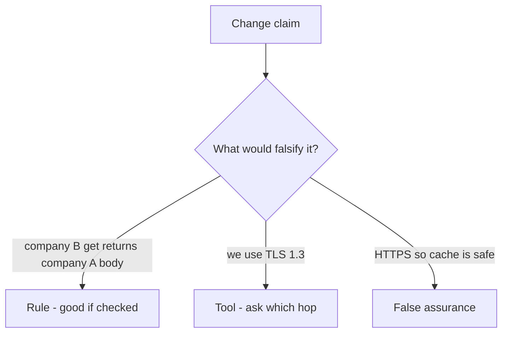

# Review of path-only cache keys

**Kind:** code-review
**Loop step:** Review

## What you are reviewing

This review is about a notes-app edge cache. Your job is to label each claim **rule**, **tool**, or **false assurance**, and to say which outcome (company B reading company A’s body) breaks if they ship. Start at the store key, not at a scanner color or an HTTPS checkbox.

Treat the files in `labs/2.2/2.2-request-path/vulnerable/` as the pull request. Reconstruct whether the store still keys only on path. Compare that with the rule. Write changes a developer can verify. You already ran `test_other_tenant_does_not_receive_cached_body` — that is the rule. A comment “will add Vary later” is not.

## Picture: problems to find (name them yourself)

**`Cache-Control: public` on `/notes/{id}`**.

For each claim and each branch: label **rule**, **tool**, or **false assurance**.

Problems to find (name them yourself; do not open the keys file):

- `Cache-Control: public` on `/notes/{id}`
- Key is path only
- Comment “TLS so cache is safe”
- Purge API not in the incident runbook

Also reject: client `X-Tenant` as key input; `Vary: Cookie` as forever; Report-Only as enforcement; closing findings without re-running `test_other_tenant_does_not_receive_cached_body`; keys in learner notes; live-target CDN work.

## Common mix-ups

- HTTPS means no cache bugs
- CDNs are only a performance layer
- `Vary: Cookie` is enough forever
- TLS 1.3 is the cache key
- Next.js `fetch` cache defaults encode company

## Practice

Write the review that would block this change. Name `test_other_tenant_does_not_receive_cached_body`.

## Use it somewhere new

Authenticated RSS or export CSV via CDN. A change that “turns on HTTPS” on only the browser hop is an incomplete check-every-path review. Name the independent falsehood that would still stop company B from receiving company A’s body.

## What this page is not doing

Do not merge by adding a comment “will add Vary later.” That comment is leftover risk without an owner.
