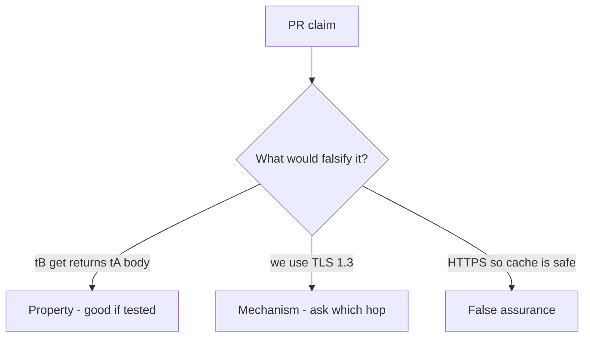

# 2.2-LO-08 — Review the path-only cache as a PR, not a slogan

**Kind:** code-review
**Loop step:** Review
**Standards:** IETF RFC 9110 (final); IETF RFC 9846 TLS 1.3 (final); OWASP ASVS 5.0.0 (final) `v5.0.0-14.2.2`.

## Review the fixture as if it were SecureCollab edge cache

Review `labs/2.2/2.2-request-path/vulnerable/` as a SecureCollab PR. Reconstruct whether the store still keys only on path, compare that with the module invariant, and write changes a developer can verify.

Intended findings live only in `content/assessment/keys/2.2.md` — not here. Do not open the keys file until your review has been evaluated.

## Mental model: Cache-Control: public on /notes/{id}

Start with this seeded smell: **`Cache-Control: public` on `/notes/{id}`**. Label it property, mechanism, or false assurance before you accept the PR.

For each claim and each branch: label **property**, **mechanism**, or **false assurance**.

Seeded smells (label them yourself; do not open the keys file):

- `Cache-Control: public` on `/notes/{id}`
- Key is path only
- Comment “TLS so cache is safe”
- Purge API not in the incident runbook

Also reject: client `X-Tenant` as key input, `Vary: Cookie` as forever, Report-Only as enforcement, closing findings without retest of `test_other_tenant_does_not_receive_cached_body`, keys in lessons, live-target CDN tests.

## Misconceptions this module refuses

- HTTPS means no cache bugs
- CDNs are only a performance layer
- `Vary: Cookie` is enough forever
- RFC 9846 TLS 1.3 is the cache key
- Next.js `fetch` cache defaults encode tenant

## Practice

Write three review notes a peer could act on. Each note: observation, property or false assurance, suggested structural change, residual you will **not** delete. Tie at least one note to `test_other_tenant_does_not_receive_cached_body`.

## Transfer

Authenticated RSS or export CSV via CDN. A PR that “turns on HTTPS” on only the browser hop is an incomplete mediation review. Name the independent falsehood that would still stop Tenant B from receiving Tenant A’s body.

## Non-goals

Do not merge by adding a comment “will add Vary later.” That comment is a residual without an owner.
