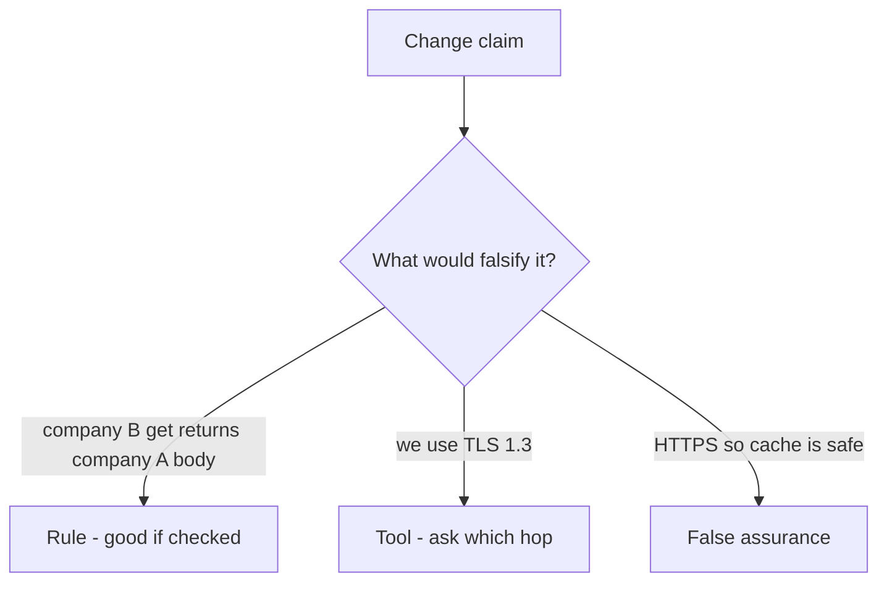

# Review of path-only cache keys

**Kind:** code-review
**Loop step:** Review

## What you are reviewing

This edge-cache review starts at the store key. Mark each claim **rule**, **tool**, or **false assurance**, and say whether company B can read company A’s body if they ship. An HTTPS checkbox is the wrong starting place.

Reconstruct whether the store still keys only on path. Compare that with the rule. Write changes a developer can verify. `test_other_tenant_does_not_receive_cached_body` still has to fail. A ticket that says “will add Vary later” is not that fail.

## Picture: problems to find (name them yourself)

**`Cache-Control: public` on `/notes/{id}`**.

For each claim and each branch: label **rule**, **tool**, or **false assurance**.

Problems to find (name them yourself; do not open the keys file):

- `Cache-Control: public` on `/notes/{id}`
- Key is path only
- Comment “TLS so cache is safe”
- Purge API not in the incident runbook

Also reject: client `X-Tenant` as key input; `Vary: Cookie` as forever; Report-Only as enforcement; closing findings without re-running `test_other_tenant_does_not_receive_cached_body`; keys in learner notes; live-target CDN work.

## Common mix-ups

- HTTPS means no cache bugs
- CDNs are only a performance layer
- `Vary: Cookie` is enough forever
- TLS 1.3 is the cache key
- Next.js `fetch` cache defaults encode company

## Use it somewhere new

Authenticated RSS or export CSV via CDN. HTTPS on only the browser hop does not check every cache path. What still has to be in the cache key so B cannot read A’s body over HTTPS?

## What this page is not doing

Shipping a path-only cache key plus “will add Vary later” leaves the cached body unowned.
