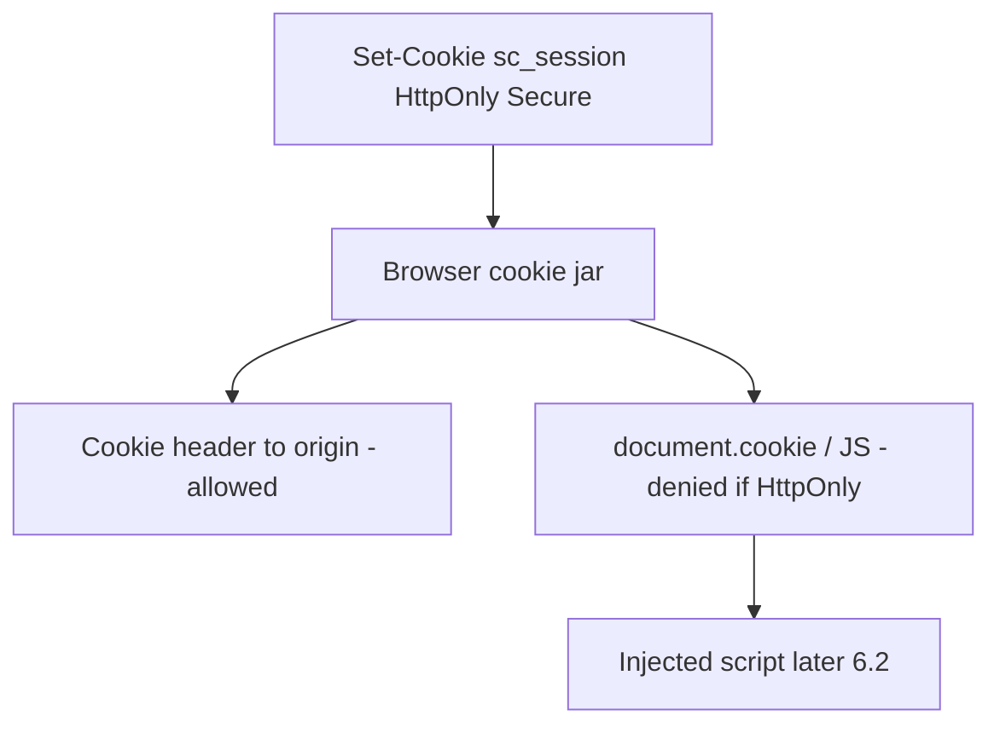
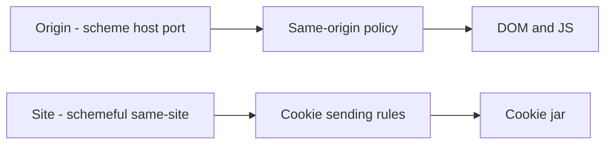

# 2.3-LO-01 — HttpOnly is a browser cell, not an XSS guarantee

**Kind:** concept-model
**Loop step:** 1 Property
**Standards:** Saltzer and Schroeder (1975, seminal), especially least common mechanism and complete mediation; HTML Living Standard cookies (living); RFC 6265bis remains **draft** if cited; OWASP ASVS 5.0.0 (final) `v5.0.0-3.3.4` and `v5.0.0-3.3.1`; `v5.0.0-3.3.2` SameSite is a related L2 cookie purpose control, not this lab’s oracle; W3C CSP3 and Trusted Types are **Working Drafts** (see pins), not this property.

## The claim this module owns

SecureCollab’s session cookie `sc_session` is a bearer of 1.2 authority. If page script can read it, an injected script (later 6.2) steals the session. Marking the cookie HttpOnly is a **browser** mediation: the cookie jar may send the Cookie header to the origin and must not expose the value to `document.cookie`.

> For a SecureCollab Phase 1 session cookie marked HttpOnly, script in the origin cannot read the session value. The browser cookie jar is trusted to honor the flag. The application must actually set it. This cell is not “XSS is impossible,” not CSP3, and not Trusted Types. Missing HttpOnly on a session token is a confidentiality failure against script. TLS (`Secure`) is a different cell against the network.

The forbidden outcome is **script-readable session**: `js_read_session` returns `synthetic-session` for a cookie whose `httponly` flag is true.

ASVS `v5.0.0-3.3.4` (Level 2): if the value is not meant for client-side scripts (session token), HttpOnly must be set and the value must travel only via `Set-Cookie`. `v5.0.0-3.3.1` requires `Secure` (and `__Secure-` / `__Host-` naming rules). This lab’s oracle is HttpOnly readability, not the full cookie catalog.

## Mental model: two interpreters of the same cookie



The jar is a shared mechanism between navigation, subresource loads, and script. HttpOnly removes the script interpreter from that share. It does not remove XSS: the script can still call APIs as the user, rewrite the DOM, and exfiltrate **note bodies** the page already loaded. That is why “HttpOnly means no XSS” is false assurance.

**Mechanism (not the property):** Next.js `cookies()` defaults, “HttpOnly is on in staging for one cookie,” CSP3, Trusted Types, SameSite, or `__Host-` prefixes. Prefixes and SameSite are real later rows; they are not this pytest.

## Mental model: origin, site, and the jar



Origin vs site will matter for third-party iframes and CSRF (ASVS `v5.0.0-3.5.*`, later 2.3 transfer and 6.x). This lab does not prove CORS. Do not attack third-party sites.

CSP3 (`v5.0.0-3.4.3` wants a CSP header in ASVS; the **CSP3 specification** remains a Working Draft in this snapshot) is a browser load/execute policy. Report-Only is detection, not this HttpOnly cell. Trusted Types is a Working Draft sink policy. Label both **draft**. Neither substitutes for encoding (6.2) or for HttpOnly.

## Root cause vs impact vs prevention vs detection vs recovery

| Slice | For this property |
|---|---|
| Root cause | Session value presented to the script interpreter |
| Preconditions | Cookie without HttpOnly (or a fixture that ignores the flag); script runs |
| Trigger | `js_read_session` on `sc_session` |
| Impact | Session confidentiality against script; thief then acts under 1.2 |
| Prevention | Set HttpOnly; only `Set-Cookie` carries the value |
| Detection | Staging scan: `Set-Cookie` without HttpOnly; never log the value |
| Recovery | Rotate the session; treat as credential leak if script could have read it |

## Framework defaults versus the cookie you set

“Next.js cookies are httpOnly by default” is not true for every cookie you set manually, for a second analytics cookie, or for a WebView bridge (transfer). FastAPI `Response.set_cookie` will emit whatever flags you pass. The application guarantee is: **this** `sc_session` object in the lab is unread by `js_read_session` when `httponly` is true. Oracle: `labs/2.3/2.3-browser-policy`. No real browser exploit pages.

## Mechanism limits

- Malicious or curious extensions can still read cookies the browser exposes to them. Residual; not this TCB.
- Physical access / debugger. Residual (1.4 coercion shape).
- `localStorage` is not “safer”; it is always script-readable. Do not move the session there.
- SameSite is not complete CSRF defense (`v5.0.0-3.3.2` still wants purpose-appropriate SameSite; 3.5.1 is the CSRF row).
- HttpOnly does not bind tenant (1.2) and does not set the cache key (2.2).

## Practice

Name which interpreter (jar vs script) must not see `sc_session`. Then run the local pair:

```
python3 -m pytest labs/2.3/2.3-browser-policy/tests --impl vulnerable
python3 -m pytest labs/2.3/2.3-browser-policy/tests --impl fixed
```

The first command must fail. The second must pass. Map the assertion to script readability, not to “XSS is fixed.”

## Transfer

A clinic patient portal session cookie, or a React Native WebView cookie bridge. Which interpreter is new, and which residual (extension, WebView injection) must be written rather than deleted?

## Non-goals

Live sites, XSS payloads, copy-paste gadget chains, attacking third-party origins via CORS or CSRF. Gates 0–10 and milestones M0–M5 stay **not-attempted** without learner or product evidence. Answer keys are not in this file.
