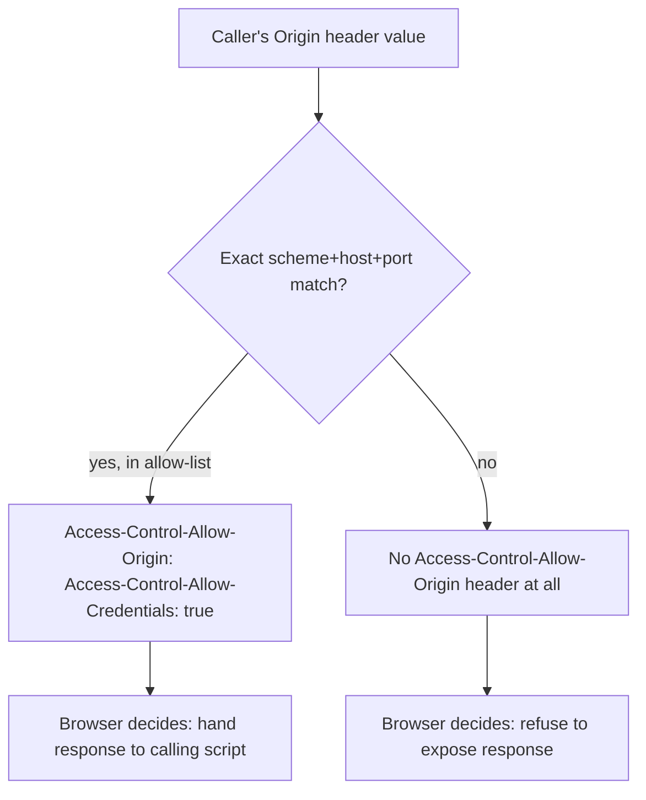

# The browser enforces some rules; the server enforces the rest

**Kind:** concept-model
**Loop step:** 1 Property
**Standards:** OWASP ASVS 5.0.0 v5.0.0-3.3.4 (HttpOnly), v5.0.0-3.3.1 (Secure), v5.0.0-3.4.2 (CORS `Access-Control-Allow-Origin`). W3C Content Security Policy Level 3 (`csp3`, Working Draft).

## What has to stay true

SecureCollab's web client keeps a signed-in member's session in a cookie named `sc_session`, and answers a member's own notes at `/notes`. Start with one sentence you can prove false:

> For a `/login` response this week, page script running in `https://app.securecollab.example` cannot read the value of `sc_session` through `document.cookie`, a script running at any other origin cannot get a credentialed answer from `/notes` unless that exact origin was checked first, and a policy that only asks the browser to report a violation is not the same claim as a policy that asks the browser to block one.

That sentence is really three separate claims wearing one paragraph, and each can fail independently of the other two. A team can get the cookie flag exactly right and still leak every member's notes to any page on the web, because the cookie's secrecy and the API's willingness to answer a cross-origin, credentialed request are enforced by two different mechanisms, checked by two different pieces of code, and broken by two different mistakes. Confusing them is not a rounding error; it is the reason a security review can tick "cookies: HttpOnly, done" and still ship a CORS misconfiguration that makes the cookie's secrecy beside the point.

Two words carry most of the weight in that sentence, and they are worth pinning down before anything else: **origin** and **enforce**. An **origin** is the exact triple of scheme, host, and port a browser uses to decide whether two pieces of content came from "the same place" — `https://app.securecollab.example`, `http://app.securecollab.example`, and `https://app.securecollab.example:8443` are three different origins, not one origin written three ways, even though a person reading them aloud would call all three "the SecureCollab app." To **enforce** a rule means some specific piece of software actually refuses the disallowed action when it happens, not merely that a document somewhere describes the rule. A `Set-Cookie` header can carry `HttpOnly`; the browser's cookie jar is the thing that enforces it by refusing `document.cookie` a value. A `Content-Security-Policy` header can carry a script-source allow-list; the browser's document loader is the thing that enforces it by refusing to run a disallowed script. Neither the application's own code, nor a code reviewer reading the header, is the enforcement mechanism — the browser is, and only for the exact header the server actually sent.

## Origin and site are not the same word

The habit of collapsing origin into a coarser, more human notion of "the app" is not a one-off mistake; it is the specific gap that lets CORS misconfigurations pass a casual read. A **site** is the registrable domain plus scheme (`https://securecollab.example`, ignoring subdomain) that cookie `SameSite` rules and some browser groupings use — the "schemeful same-site" grouping. `https://app.securecollab.example` and `https://billing.securecollab.example` are the same site (they share the registrable domain) but different origins (they differ in host). This distinction earns its keep exactly at the boundary this module's lab exercises: a server that checks "does the caller's `Origin` header end in `securecollab.example`?" is checking site, on the mistaken belief that it is checking origin. If `billing.securecollab.example` is a different, less-trusted service — a third-party support portal on a subdomain the security team does not fully control, for instance — that check just handed it the same credentialed access as the first-party app, because "ends in the right domain" is a weaker claim than "is the exact origin we meant."



The diagram's branch is the whole property: everything upstream of it (TLS, authentication, a pretty allow-list variable name) is decoration if the branch itself compares the wrong thing. A server can present a beautifully documented `ALLOWED_ORIGINS` set and still fail this property, if the comparison inside that branch is `origin.endswith("securecollab.example")` instead of exact set membership — the variable name promises an allow-list; the comparison delivers a domain-suffix filter, which is a materially weaker claim wearing the first claim's name.

## Four headers, four different promises

The module's objective hierarchy promises cookies, CORS, and CSP as first-class content, not as three restatements of one flag check, so it is worth listing the four response headers this module actually turns on and naming, for each one, who enforces it and what a missing or wrong value costs.

| Header | Who enforces it | What "wrong" costs |
|---|---|---|
| `Set-Cookie: sc_session=...; HttpOnly` | The browser's cookie jar refuses `document.cookie` a value it holds `HttpOnly` | Page script (including script that arrived through an unrelated injection bug) can read and exfiltrate the session value |
| `Access-Control-Allow-Origin: <origin>` | The browser refuses to hand a cross-origin script the response unless this header names that script's exact origin | A cross-origin page can read data meant only for the first party, once this header names (or reflects) it |
| `Access-Control-Allow-Credentials: true` | The browser refuses to attach cookies to a cross-origin request, or refuses to expose a credentialed response, unless this header is present alongside a specific (not wildcard) allow-origin | Paired with a reflected origin, this converts "any page can ask" into "any page can ask *as the signed-in member*" |
| `Content-Security-Policy` vs `Content-Security-Policy-Report-Only` | The former: the browser refuses to load or execute what the policy disallows. The latter: the browser only sends a report; it changes nothing about what loads | Shipping only the Report-Only variant and calling it "CSP" gets a status dashboard that looks identical to the enforcing case until the day a real payload runs anyway |

Reading that table against SecureCollab's own `/login` and `/notes` handlers is exactly what [`lessons/02-model.md`](02-model.md) asks you to do next, row by row, for the specific fixture this module's lab uses. A worked trace makes the table concrete. Suppose a browser tab open to an unrelated origin, `https://evil.example`, runs `fetch("https://app.securecollab.example/notes", {credentials: "include"})` — a page the member never asked to trust, using the ambient cookie the member's own browser is holding for `app.securecollab.example`. The request goes out with `sc_session` attached automatically, because that is what a cookie is for; nothing about the request itself is malformed or forbidden. What decides whether `evil.example`'s script ever sees the notes in the response body is entirely the response headers SecureCollab's server chose to send back:

```text
HTTP/1.1 200 OK
Access-Control-Allow-Origin: https://evil.example
Access-Control-Allow-Credentials: true
Content-Security-Policy-Report-Only: default-src 'self'
```

Read against the table above, this exact response is a forbidden outcome twice over: `Access-Control-Allow-Origin` names the caller's own origin back to it — not because `evil.example` was checked against anything, but because the server reflects whatever `Origin` header arrives — and it is paired with `Access-Control-Allow-Credentials: true`, which together tell the browser this cross-origin, cookie-carrying response may be handed to the calling script. The third line changes nothing about that outcome: a Report-Only policy does not gate whether the browser exposes this response: it governs script *execution* and *resource loading* inside the document, an entirely separate decision from whether `fetch` may read a response body, so its presence here is not even the right kind of control for this failure. The fix is not a fourth header; it is deleting the reflection and replacing it with a comparison against a fixed, exact set of trusted origins, which is the subject of [`lessons/04-build.md`](04-build.md).

## Rejected alternatives

A competent engineer might reasonably believe **"we already validate the request, so CORS is a formality."** That fails here because request validation (is this body well-formed JSON? does this field parse?) answers nothing about who is allowed to read the *response*; CORS headers govern the response side of the exchange, and a perfectly valid request from an attacker's origin is still an attacker's origin.

A second plausible belief is **"HTTPS means the cookie can't be read in transit, so the remaining flags are optional polish."** `Secure` and TLS answer a network-eavesdropping threat; `HttpOnly` answers a completely different threat — a same-origin script, however it got there — and satisfying one says nothing about the other, which is the worked counterexample in [`lessons/03-break.md`](03-break.md): the practice fixture's vulnerable cookie can be served only over HTTPS and still be fully readable to `document.cookie`, because `Secure` and `HttpOnly` are independent flags enforced by independent checks in the same browser.

## Practice

Before opening the next lesson, write down, for `https://app.securecollab.example`, `https://staging.securecollab.example`, and `http://app.securecollab.example`, which pairs are the same origin, which are the same site but a different origin, and which are neither — then predict which of the three a naive `origin.endswith("securecollab.example")` check would wrongly accept.

## Use it somewhere new

A third-party analytics widget embedded on the notes page introduces a fourth origin this table has not yet named. Before [`lessons/07-transfer.md`](07-transfer.md), predict which of the four rows above that widget's script would need to satisfy to read anything at all, and which row protects SecureCollab even if the widget's own code is later compromised.

## What this page is not doing

Do not use live sites, third-party CORS probing, or copy-paste exploit payloads. This page names four headers and who enforces each; it does not itself run any code. The local, authorized fixture for all four is [`labs/2.3/2.3-browser-policy`](../../../../../labs/2.3/2.3-browser-policy/README.md). Answer keys are not on this site.
